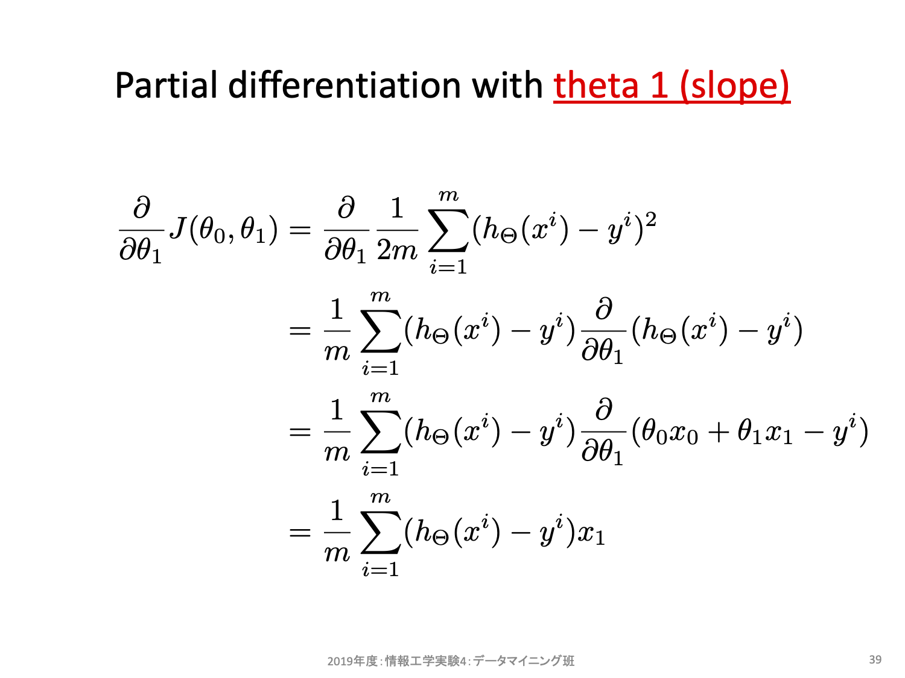

# 機械学習の中身を覗いてみよう

## モデルと学習
> **モデルとは？**
>
> "ある事象について、諸要素とそれら相互の関係を定式化して表したもの。「計量経済モデル」"
>
> by [デジタル大辞泉](https://kotobank.jp/word/モデル-142529)


機械学習における「**{index}`学習<がくしゅう-学習>`**」とは、用意したデータセットにおける入出力関係をうまく表現できるようなモデルを用意し、そのモデルにおける適切なパラメータを学習アルゴリズムにより獲得することを意味する。用意したサンプルから、その事象に関する入出力関係をうまく表現できるモデルを獲得できたならば、その学習済みモデルは未知のサンプルに対しても適切な予測結果を出力できる（だろう）。

例えば、$h(x) = ax + b$ というモデルを考えたとしよう。ここで$x$を入力、$a, b$を任意の実数を取るパラメータ（変更可能なパラメータ）、$h(x)$を予測結果とする。$a, b$が定っていない状態では予測結果を算出することはできないが、$a, b$に特定の実数を与えてやると、（妥当性はさておき何かしらを）予測可能なモデルになる。

パラメータが定まっていない状態、今回の例における $h(x) = ax + b$ を **{index}`parameterized model`** と呼ぶ。これが **{index}`モデル<もでる-モデル>`（{index}`学習器<がくしゅうき-学習器>`）** である。これに対しパラメータが定まった状態、例えば $a=1, b=2.5$ だとすると $h(x) = x + 2.5$ となるが、これを **{index}`predictive model`** と呼ぶ。これが学習結果である。すなわち、*機械学習とはこのようなパラメータ付き数式で表現されたモデルにより、データセットをうまく説明できるパラメータを獲得する一連の流れを含む処理* といえる。

```{admonition} Check your understading
1. データセットとして2つのサンプル $(x_1, y_1), (x_2, y_2)$ が与えられたとする。$x$は入力、$y$は出力でありどちらも実数とする。このとき、このデータセットにおける入出力関係をうまく説明する「モデル」として何を用意したら良いだろうか？
2. 上記で用意したモデルにおいて最適（と考えられる）パラメータはどのようにして算出したら良いだろうか？
3. データセットが3つ以上のサンプルで構成されており、一本の直線状には存在していないサンプルがある状況を考えてみよう。このようなとき、1で用意したモデルにおいて最適（と考えられる）パラメータはどのようにして算出したら良いだろうか？
```

---
(linear-model)=
## {index}`線形回帰モデル<せんけいかいきもでる-線形回帰モデル>`
あるモデルAに対し異なる学習アルゴリズムがN個あることも珍しくないし、その逆に、ある学習アルゴリズムZを、異なるモデルへ適用することもある。例えば演習1における線形回帰モデルの例では、[sklearn.linear_model.LinearRegression](https://scikit-learn.org/stable/modules/generated/sklearn.linear_model.LinearRegression.html)を利用しており、アルゴリズムは plain Ordinary Least Squares ([scipy.linalg.lstsq](https://docs.scipy.org/doc/scipy/reference/generated/scipy.linalg.lstsq.html), 最小二乗法) が使われている。

```{note}
[線形回帰モデル](https://ja.wikipedia.org/wiki/線形回帰)とは、目的変数を「説明変数の線形和（線形結合）」で予測・説明するモデルのことである。[{index}`線形和<せんけいわ-線形和>`](https://ja.wikipedia.org/wiki/線型結合)とは、説明変数（スカラーもしくはベクトル）の定数倍とそれらの和のことを指す。

先ほど例に上げたモデル $h(x) = ax + b$ は、線形回帰モデルの例である。説明変数がxであり、a倍（スカラー倍）して定数(b)を足し合わせただけの変換になっており、この手続きによる写像を線形和と呼んでいる。

説明変数が1個の場合を単回帰、2個以上の場合を重回帰と呼び分けることがあるが授業ではどちらも単に「線形回帰」と呼ぶこととする。
```

- 線形回帰モデル（Linear Regression）
  - 

---
## {index}`最小二乗法<さいしょうじじょうほう-最小二乗法>`
最小二乗法とは、残差平方和 $\sum_{i}^{N}(y_i - h_\theta(x_i))^2$ が最小となるようなモデル $h_\theta(x)$ を求める手法である。大別して逆行列に基づく導出と[統計に基づく導出](https://sci-pursuit.com/math/statistics/least-square-method.html)、またこれらとは異なる反復法に基づくアプローチもある。ここでは逆行列による導出を眺めてみよう。

下図は一般化のため説明変数xをM次元、サンプル数をN個とした場合のパラメータθ、教師データyをそれぞれ行列（縦ベクトルもここでは行列と呼ぶことにする）として定義した。これらの変数を用いて「各パラメータの偏微分値が0」となるように式を立て、それをθについて求めている様子を示している。

- 最小二乗法（Ordinary Least Squares, OLS）
  - 
  - 

```{note}
残差を $d$ とすると、その平方 $d^2$ は誤差を1辺として見た場合の面積（すなわち$d^2$）に相当する。残差平方の和とは、データセットすべての点における残差面積の合計値であり。総合面積が小さくなるようなパラメータを探すのがOLSである。
```

```{tip}
- データセットに極端な外れ値のような例外がほぼないことを想定。
  - 外れ値が大きすぎると、その外れ値に対する誤差の影響が強くなりすぎるため、数式的には残差平方和が最小となるモデルであっても全体としては不適切なモデルになってしまうことが多い。（極端な外れ値を設定して確認してみよう）
- 計算機資源の問題。
  - OLSはとても強力な手法だが、一方で大規模な行列式演算が求められる。数学的には解ける問題であっても、コンピュータ性能の面で現実的な時間では求められないこともある。（ただし年々性能向上しているため、問題にならないことも多くなってきた）
- 後でサンプル数が増えた場合、全体を計算し直す必要がある。
  - OLSはバッチ処理しかできないのに対し、反復法ベースのアプローチの多くはミニバッチ処理が可能。ミニバッチ型アルゴリズムだとサンプル自体を後から追加削除といった編集がしやすい。
  - 参考: [Batch, Mini Batch & Stochastic Gradient Descent](https://towardsdatascience.com/batch-mini-batch-stochastic-gradient-descent-7a62ecba642a)
```

---
## {index}`最急降下法<さいきゅうこうかほう-最急降下法>`
先程述べた[反復法](https://ja.wikipedia.org/wiki/反復法_(数値計算))の例として、古典的（代表的）な勾配法の一つ **[最急降下法（gradient descent）](https://en.wikipedia.org/wiki/Gradient_descent)** を眺めていこう。

---
### 考え方
**{index}`反復法<はんぷくほう-反復法>`** の基本的な考え方は、(1)任意に初期値を決め、(2)終了条件に達するまで指定手順で値を更新し続けるというものである。**最急降下法** における指定手順（パラメータ更新式）は以下の通りだ。


更新式は2項からなる。1項目は今の$\theta$そのものだ。2項目はコスト関数の$\theta$に対する偏微分、すなわち傾きを求め、学習率$\alpha$を掛けたものになっている。ここで単純な微分の意味として、もし傾きが正の値ならばより小さなコストをとり得るパラメータは負の方向にあることを思い出そう。便宜上重み$\theta_0 = 0$と固定し、重み$\theta_1$を横軸、コスト$J$を縦軸とする2次元空間を考えてみよう。$\theta_1$を変更するとそれに対するコスト$J$を算出することができる。


同様に$\theta_1$を変更しながら確認してみると、以下のような曲線となる。


話をもとに戻すと、もし傾きが正の値ならばより小さなコストをとり得るパラメータは負の方向にある。反対に傾きが負の値ならばより小さなコストをとり得るパタメータは正の方向にあることが上図からも分かるだろう。最急降下法とはこの傾きの正負を利用することでより小さなコストの場所を手探りで探そうとするアルゴリズムである。出発点はランダムに決めて良く、一度決めればその座標における傾きを求めることができ、その傾きから移動方向を決める。

```{note}
- 更新式の「現在の場所を基準とし、傾きにマイナスを掛けた方向に移動する」ことでこの方針を盛り込んでいる。
- $alpha$は正の値を取る小さな値であり、「どのぐらい移動するか」を調整するためのハイパーパラメータである。
- **ハイパーパラメータ (hyper parameters)** とは、人手でチューニングする必要があるパラメータのことを指す。最急降下法では重みは自動チューニングしてくれるが、学習率$alpha$はしてくれない。
```

---
### 実装に向けた定式化
先程は具体例を用いて勾配の利用方法をみた。これを一般化するために$h_\theta(x)$として$\theta_0$に対する偏微分と$\theta_1$に対する偏微分を式展開した様子を示す。




ほとんど類似しており、それぞれ上記の式により傾きを求めることができる。上記は説明変数が1個（重みが2個）の場合しか考慮していないが、説明変数がN個に増えても考え方は一緒であり、一般化すると以下のようになる。ただし $x^0 = 1$ とする。


最急降下法によりパラメータを探索するには、この式を実装し、終了条件を設定して反復処理することになる。終了条件は例えば繰り返し回数を設定したり、移動幅がある値より小さくなることをもって十分近似できたと考えて終了することが多い。[具体的な実装については別資料](gradient_descent.md)で示す。

---

## モデルの自由度（複雑度）と過学習
### 自由度の高いモデルの例：特徴量の多項式拡張
- [sklearn.preprocessing.PolynomialFeatures](https://scikit-learn.org/stable/modules/generated/sklearn.preprocessing.PolynomialFeatures.html#sklearn.preprocessing.PolynomialFeatures)
  - 多項式以外でも、三角関数や平方根等、「生の特徴量そのままに比例するのではなく、特定の処理を施した値に比例する」と思うのなら、自由に追加して構わない。拡張項目を導入する都度、そのモデルで表現できる自由度（複雑度）が増す。

```{admonition} Check your understading
1. モデルで表現できる自由度（複雑度）が増すとはどういう意味だろうか？
2. 自由度が増すことの利点は何か？
3. 自由度が増すことの欠点は何か？
```

---

### モデルの自由度（複雑度）と過学習
> **過学習（overfitting)とは？**
>
> Overfitting is a modeling error which occurs when a function is too closely fit to a limited set of data points. Overfitting the model generally takes the form of making an overly complex model to explain idiosyncrasies in the data under study.
> In reality, the data often studied has some degree of error or random noise within it. Thus, attempting to make the model conform too closely to slightly inaccurate data can infect the model with substantial errors and reduce its predictive power.
>
> by [What Is Overfitting?](http://www.investopedia.com/terms/o/overfitting.asp)

データセットは学ぶべき教師データであるはずだが、記録ミスや測定ミス、ノイズ等を含むことが一般的である。このため、データセットを過度に信用しすぎたモデルは、そのデータセットに対しては高性能に動作するが、未知のデータに対しては性能が落ちやすくなってしまうことがしばしばある。このような状況を **{index}`過学習<かがくしゅう-過学習>`（{index}`over-fitting`）** と呼ぶ。もしくは **{index}`過適合<かてきごう-過適合>`** と呼ぶことも多く、こちらの方が実態を適切に表した表現でり、過剰に学習データに適合しすぎたために新規データに対してはうまく予測できない状態を指す。

[Underfitting vs. Overfitting](https://scikit-learn.org/stable/auto_examples/model_selection/plot_underfitting_overfitting.html)も参考にしよう。ここでは「事象を表す真のモデル」が分かるものと仮定し、それを True function として定義している。実際のサンプルは blue dot で表示されており、True function 上にある（＝適切に観測できた）ものもあれば若干上下にずれた（＝何らかの要因で誤差が生じた）ものもある。機械学習の目標は、青い点の集合から True functionを見積もることである。データセットの散らばり具合からは一本の直線で入出力関係を表現するのは困難だが、辛うじて全体としては右下がりの傾向にあるというパターンを得ることができたとみえなくもない（左図: Degree 1）。これに対し自由度の高いモデル（Degree 15）では、左側のサンプルは綺麗に点を通るような関係性を獲得しており実際の値と予測値との誤差が殆どみられない。しかしながら True function とは大きくかけ離れている。これは青い点に対する誤差が小さくなることを強く意識しすぎる（＝信用しすぎる、重用しすぎる）があまり、自由度の範疇で可能な限りの「最適パラメータの獲得」を目指してしまったために起きた結果である。

---

### 過学習したモデルにありがちな傾向の一つ
- （再掲）[Underfitting vs. Overfitting](https://scikit-learn.org/stable/auto_examples/model_selection/plot_underfitting_overfitting.html)
    - Degree 15の図を眺めてみると、左側のサンプルに対しては「学習サンプル（青い点）に対しては全てを誤差なく予測できているが、その近辺では極端に予測結果が上下している状態」になっている。こうなっている理由は、学習により獲得したパラメータの値が大きすぎることが要因であることが多い。
    - 例えば2次の項〜5次の項を含む線形モデルにおいて、パラメータの大小が予測結果に及ぼす影響を観察してみよう。
      - 参考: [機械学習はじめよう 第9回　線形回帰［後編］](http://gihyo.jp/dev/serial/01/machine-learning/0009?page=1)
- ここまでの問題点と、機械学習における基本的なスタンスをまとめると、、
  - 学習対象は、複雑な事象（入出力関係）になっている。この複雑さを数式で表現できるなら、それを元にモデル選択することも可能だが、一般的には分からない。
  - 複雑な事象を学習させるためには、複雑な（自由度の高い、記述粒度が高い）モデルを用意できるに越したことはないように思える。しかし、そもそもデータセットは「真の事象」からするとほんの僅かしか用意できず、また、様々な要因でノイズを含む。
  - ノイズを含む相対的少数なデータセットに対し、「誤差がきっちりゼロとなるように学習」してしまうと、未知のサンプルに対しては的外れの予測をする「過学習したモデル」になってしまう。
  - これらを踏まえて、「<u>データセットを過度に信用せず、ある程度の推測誤差を許容したモデルを構築することで、未知データに対する頑健性を担保する</u>」ことを目指す。

---

## そもそも「過学習しているか否か」はどう判断したら良い？
### **学習データに対する評価と、テストデータに対する評価を比較する。**
まずは学習前に、データセットを「学習用データセットとテスト用評価セット」に分けよう。特に理由がない場合には学習用に8割、テスト用に2割で分けることが多い。このように固定して分割したデータセットで評価する方法を **{index}`ホールドアウト法<ほーるどあうとほう-ホールドアウト法>` ({index}`hold-out`)** と呼ぶ。もし学習データに対する評価が、テストデータに対する評価よりも良いならば、過学習している可能性がある。

```{tip}
深層学習ライブラリでは「{index}`学習用データ<がくしゅうようでーた-学習用データ>`(train)・{index}`バリデーション用データ<ばりでーしょんようでーた-バリデーション用データ>`(validation)・{index}`テスト用データ<てすとようでーた-テスト用データ>`(test)」の3つに分けることが多い。学習時にtrainで学習しつつ、そこで得られたモデルの良し悪しをvalidationで観測する。この観測結果が良くなってる間は「未知データに対しても良くなる方向に学習が進んでいる、すなわちまだ学習が継続しているだろう」と解釈することが多い。逆に、train精度が向上している状況でvalidation精度が下がる状況ならば、それは過学習に陥っている可能性が高い。

なお、validation は development ({index}`開発用データ<かいはつようでーた-開発用データ>`) と表記されることもあり、どちらも同じ用途で用いられる。
```

```{admonition} Check your understading
train/testとで評価を比較することが必ずしも過学習を判断できるとは限らない。「モデル自体は知り得ないテストデータ」を用いて評価することに、どういう問題があるだろうか？
```
---

### **単純なモデルから始め、それをベンチマークとして利用する。**
もし、その後の相対的に複雑なモデルの評価が悪くなるようであれば、それは過学習している可能性がある。より自由度の少ないモデルから試してみよう。

---

## 過学習させない方法、もしくは和らげる工夫はないのだろうか？
### 評価を用いた工夫
#### {index}`k分割交差検定<kぶんかつこうさけんてい-k分割交差検定>`（{index}`k-fold cross validation`）


データセットをk個のグループに分割する。1グループをテストセットに、残りを学習セットに割り当てて学習させ、評価する。これをk回繰り返すとk個の評価が得られる。この平均を評価値として用いたり、ばらつき具合を観察するために用いることで、モデルの改善を目指す指標とする。より一般には、[ハイパーパラメータのチューニングを交差検定で行う](https://scikit-learn.org/stable/modules/grid_search.html)ことも多い。

---

#### 学習を早めに止める（{index}`early stopping`）。
類似方法として、データセットを「tarin/test/validation」の3グループに分け、学習時にvalidation setに対する評価の上下を眺めることもある。validation setはモデルから見ると未知データだが、そのモデルを構築しようとしている利用者（貴方自身）はその結果を眺めることができる。学習回数が増えるにつれtraining setに対する評価が改善しているとして、同時にvalidation setに対しても改善しているなら、おそらくそのモデルは過学習していない。逆にいえば、training setに対する評価が改善している状況下で、validation setに対しては収束しているか劣化しているならば、それは過学習している可能性がある。

参考: [Plotting Validation Curves](https://scikit-learn.org/stable/auto_examples/model_selection/plot_validation_curve.html#sphx-glr-auto-examples-model-selection-plot-validation-curve-py)

---

#### {inddex}`LOO` ({index}`Leave One Out`)
交差検定の極端な場合で、k=N、つまり1個をテストセットにし、残りを学習用にするやり方。サンプル数が少ない場合に用いることが多い。また、「どのサンプルで失敗したか」を判断しやすいため、失敗要因分析にも利用しやすい。

---

### データの工夫
- データセットの質の改善や量を増やす。
- 特徴選択（[feature selection](https://scikit-learn.org/stable/modules/feature_selection.html)）してみる。
- データそのものを加工（**前処理、特徴量エンジニアリング**）する。
  - [Clustering](https://scikit-learn.org/stable/modules/clustering.html)のデータセットとクラスタリング結果の例を眺めてみよう。
  - 6パターンのデータセット（2次元ベクトル空間）があり、各データセットに対するアルゴリズム10種によるクラスタリング結果が図示されている。たかだか2次元のベクトル空間においてもデータセットの分布は多様である。ここで問題となるのが「そもそもデータセットは、学習タスクにとって適切なベクトル空間に写像されているのか？」という点である。
  - 例えば[ImageNet（物体認識データセット）](http://www.image-net.org)において、用意された写真をそのまま使う以外に何か工夫の余地はないだろうか？
  - => **特徴量エンジニアリング**
    - 本授業における主題の一つ。既に数値化されてるデータ、そうではないデータに対する工夫の仕方を体験しよう。
- 別例：[Underfitting vs. Overfitting](https://scikit-learn.org/stable/auto_examples/model_selection/plot_underfitting_overfitting.html)の多項式特徴を導入しているのも、（モデルの拡張というよりも）前処理の一つとみなすこともできる。

---

### モデルやアルゴリズムの工夫
- 正則化（Regularization）する。
    - 以下のような「モデルの表現能力に対する制約」を導入することで、モデルが学習データセットにマッチしすぎないようにすることの総称。
      - 線形回帰モデルに重みに対する正則化項（＝ペナルティ項）を導入。
      - アンサンブル学習（e.g., DNNにDropout）を導入。
      - 決定木学習に枝刈りを導入。
  - ここでは深入りしない。

#### （例）パラメータに対するペナルティの導入（{index}`正則化<せいそくか-正則化>`）
[Underfitting vs. Overfitting](https://scikit-learn.org/stable/auto_examples/model_selection/plot_underfitting_overfitting.html)における右図のようにモデルの予測結果が乱高下しやすい状況というのは、（経験論的には）モデルが獲得したパラメータの絶対値が大きすぎることが多い。例えば $h(x) = 100.0 * x_1 + 10.0 * x_2 + 1.0 * x_3 + 50$ というモデルでは、$x_3$の値が1変化しても予測結果に1しか差が生じないが、$x_1$においては100の差を生じてしまう。

また、適切なモデルの自由度を見積もること自体がそもそも困難であることから、本来必要とする自由度よりも相対的に複雑なモデルを用意してしまう可能性が圧倒的に高い。更には、元々データセットには様々な理由からバイアスが含まれていることを思い出そう。

これらの状況を踏まえ、データセットからその背後にある真のモデルを獲得するためには、乱高下するようなモデル（鋭敏なモデルとも表現する）を避け、滑らかなモデルとして表現することが望ましいだろうという仮定をおくことが多い。この滑らかさを数値として算出するためのアプローチが **重みに対する{index}`ペナルティ<ぺなるてぃ-ペナルティ>`** である。**正則化 ({index}`regularization`)** と呼ばれ、様々な実装が提案されている。

先に示した線形回帰モデルにおいてはコスト関数が **残差平方和（residual sum of squares, RSS）** に基づいて定義されており、単純に誤差が小さくなるようなパラメータを求めるように動作する。これに対しペナルティとして **L2-norm（L2ノルム）** を加えたモデルをリッジ回帰モデルと呼ぶ。


L2ノルムとは各パラメータの二乗和のことであり、1を超える場合にはより大きなコストとなる。

```{tip}
L2-normにおけるnormは、元々は[幾何学的ベクトルの長さ](https://ja.wikipedia.org/wiki/ノルム)を表す。ペナルティとしてはL1, L2のどちらかを導入することが多い。ペナルティとしての意味合いはどちらも同じだが、得られるパラメータは異なる。興味のある人は[幾何学的性質](https://ja.wikipedia.org/wiki/ノルム#幾何学的性質)を踏まえて実際に観察してみよう。
```

---

## 復習
以下の解説記事の前編を読み、自分なりに疑問点等気になる事柄を整理せよ。疑問等は、次回授業の前日までに、別途用意するフォームに入力すること。

- 怪奇!! 次元の呪い - 識別問題、パターン認識、データマイニングの初心者のために： [前編](http://id.nii.ac.jp/1001/00064233/) | [後編](http://id.nii.ac.jp/1001/00064252/)

<hr>

## 予習：特徴量スケーリングの重要性
特徴量のスケーリングについて概説している[Importance of Feature Scaling](https://scikit-learn.org/stable/auto_examples/preprocessing/plot_scaling_importance.html)を読み、自分なりに疑問点等気になる事柄を整理せよ。

疑問等は、次回授業の前日までに、別途用意するフォームに入力すること。
