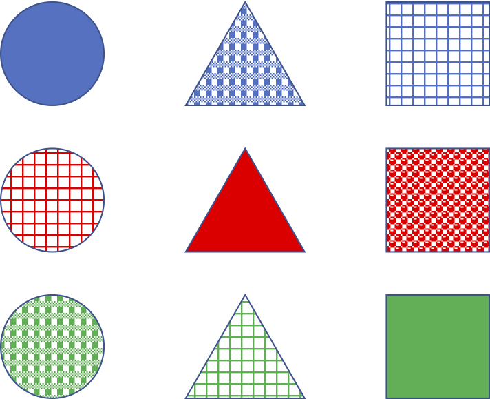

# 特徴ベクトルと数値データ
- 参考
  - [機械学習のための特徴量エンジニアリング――その原理とPythonによる実践](https://www.oreilly.co.jp/books/9784873118680/)
  - [5.3. Preprocessing data](https://scikit-learn.org/stable/modules/preprocessing.html)

---
## 達成目標
- 同じデータセットであったとしても、タスク毎に適切な特徴量は異なることを理解する。
- 数値データに対する前処理の意義を理解する。
- 前処理のいくつかの手法を適用し、特徴空間の可視化による比較や、学習結果の比較から前処理の妥当性について検討することができる。

---
(feature-vector)=
## そもそも特徴ベクトル（データ）とは何か
- Twitterが持つデータを全て利用できると仮定して検討してみよう。
  - 全利用者を「似たようなユーザ群、例えばゲームに興味があるといった趣味を主体としたクラスタ」に分けるには、どのような特徴が有効に機能するだろうか？
  - あるユーザの年齢層を推定するには、どのような特徴が有効に機能するだろうか？
- クラスタリングタスクの検討例
  - 下記9サンプルからなるデータセットを与えられたとき、どう特徴ベクトルを設計するとよいだろうか？
  - 
    - 「図形の形」でクラスタを作らせたい？
    - 「図形の色」？
    - 「着色パターン」？
- サマリ
  - **特徴ベクトル（feature vector）** とは、その名の通り特徴量で構成されたベクトルのこと。一つのサンプルは、N次元ベクトル空間における1点として表されることになる。近い点は類似しているサンプルになっていることが理想的だが、「似ている」といっても多面的であり、特徴量の用意の仕方や、距離もしくは類似度の尺度等、はたまたデータセット自体に含まれるミス・ノイズ等、多様な要因により必ずしもその通りになるとは限らない。
  - 一般的には、生のデータは多様な情報が複雑に絡みあっており、そのままでは利用しづらいことが多い。そのため、解決したい問題を機械学習しやすいタスクとして設計し、そのタスクに有効に機能する **{index}`特徴量<とくちょうりょう-特徴量>`（{index}`feature`）** を用意してやる必要がある。 **{index}`特徴量エンジニアリング<とくちょうりょうえんじありんぐ-特徴量エンジニアリング>`（{index}`feature engineering`）** とは、与えられたデータ、モデル、タスクに適した特徴量を作り上げるプロセスのこと。
    - [Feature engineering](https://en.wikipedia.org/wiki/Feature_engineering)
      - Feature engineering is the process of using domain knowledge of the data to create features that make machine learning algorithms work.

---
### 特徴ベクトルの定式化
より一般的には、**{index}`特徴ベクトル<とくちょうべくとる-特徴ベクトル>`** による表現とは「入力xを、実数値を要素とするベクトル $\boldsymbol{x} \in \mathbb{R}^d$ で表現する」ことを意味し、次のような写像を考えることに相当する。なお、$d$ はベクトルのサイズであり、$\mathbb{R}^d$ はサイズが$d$の任意の実数値ベクトルの集合である。

```{math}
:label: feature_vector
x \mapsto \boldsymbol{x} \in \mathbb{R}^d
```

````{hint}
特徴ベクトルによる表現を踏まえ、前述した図形の例で設計＆表現してみよう。図形の形でクラスタを作りたい状況ならば、例えば以下のような3つの特徴量を考える（$\mathbb{R}^{d=3}$への写像を考える）ことができそうだ。
- 1次元目は、図形の形が丸なら1、それ以外なら0。
- 2次元目は、図形の形が三角なら1、それ以外なら0。
- 3次元目は、図形の形が四角なら1、それ以外なら0。

このように1つの次元で一つの特徴量を表現することを特徴量設計と呼ぶ。またこのように各次元の特徴量を数値表現に置き換える部分は **{index}`特徴量関数<とくちょうりょうかんすう-特徴量関数>`** や **{index}`素性関数<そせいかんすう-素性関数>`** と呼ぶことが多い。関数として書き直すと以下のようになる。なお、$f_1(x)$は入力$x$の1次元目の特徴量関数である。

```{math}
:label: feature_function
f_1(x) = \left\{\begin{array}{ll}
1 & (xの図形の形が丸であるとき)\\
0 & (上記以外のとき)
\end{array}
\right.
```

同様に2次元目、3次元目についても$f_2(x), f_3(x)$ として設計したとしよう。これらの特徴量関数群により入力$x$を3次元の数値に変換し、ベクトルとしてまとめたものがベクトル表現となる。
```{math}
:label: vector_function
x \mapsto \boldsymbol{x} = (f_1(x), f_2(x), f_3(x))^T
```

目的タスクに有効に機能する特徴量を設計することを特徴量エンジニアリングと呼ぶ。
````

---

(estimator=)
### 検討：特徴ベクトルに基づく推論
式{eq}`vector_function` で表現された入力が与えられたとして、それを正しいカテゴリに分類する方法を検討することにしよう。

素朴なアプローチの一つは、特徴ベクトルの各特徴量を頭から最後まで走査し、その値に応じて判断するモデルを構築することだろう。先程の画像から形状を推定するモデルを構築したいならば、例えば次のようなものを考えることができる。なお、$\hat{y}$はベクトル$\boldsymbol{x}$が与えられた場合の推論結果であり、その出力値は1が丸、2が三角、3が四角、0はそれ以外（形状を判断できなかった）であるとする。

```{math}
:label: model_example
\hat{y} = f(\boldsymbol{x}) = \left\{\begin{array}{ll}
1 & (f_1の値が1であるとき)\\
2 & (f_2の値が1であるとき)\\
3 & (f_3の値が1であるとき)\\
0 & (上記以外のとき)
\end{array}
\right.
```

このように機械学習や数学における **{index}`モデル<もでる-モデル>`({index}`model`)** とは、ある入力が与えられたときの予測結果を返すものであり、一般的にはパラメータ付き数式により表現することが多い（ただし上記例はパラメータがない例になっている）。

---
### 振り返り：線形回帰モデルに基づく推論
[線形回帰モデル](linear-model)を振り返ってみると、ここでいうモデルとは以下のように定式化される。

まず、特徴ベクトルと同じサイズの実数値ベクトルである **{index}`重みベクトル<おもみべくとる-重みベクトル>`({index}`weight`)** を考える。重みベクトルを $\boldsymbol{w} \in \mathbb{R}^3 = (w_1, w_2, w_3)$ と表記したとすると、特徴ベクトルと重みベクトルの線形結合した値（厳密にはバイアスも加算する）を求め、この値を予測値として用いるのが線形回帰モデルである。

```{math}
:label: linear_model
\hat{y} = f(\boldsymbol{x}; \boldsymbol{w}) = \sum_{i=1}^{3}w_i x_i + b
```

ここで、$f(\boldsymbol{x}; \boldsymbol{w})$のように f(変数1; 変数2, 変数3) として書き分けているのは、セミコロンの前（変数1）は変更できない値であり、セミコロンの後ろ（変数2, 変数3）は変更可能な値であることを表現している。変更できないというのは、特徴量関数により求めた値のように既に前処理済みの入力データを指している。セミコロン以降はデータとは独立したパラメータであり、データから学習して欲しい調整可能な値である。{ref}`linear-model`で説明した当時の書式に習うと $\hat{y} = f_\boldsymbol{w}(\boldsymbol{x})$ となる（文献により様々な書き方があるため代表的な書き方を例示している）。

上記では$b$がパラメータに含まれていないように見えるが、実際には$b$も次のように表現し直し、パラメータの一部として捉えることが一般的である。ここで$x_0$は常に1を取る定数とする。i=0のときは$x_0 \times w_0$を求めることになるが、$x_0$が常に1であるため$w_0$がそのまま残る形になる。この$w_0$を$b$として利用している。

```{math}
:label: linear_model2
\hat{y} = f(\boldsymbol{x}; \boldsymbol{w}) = \sum_{i=0}^{3}w_i x_i
```

上記の線形回帰モデルの式で例えるならば、何かしら$\boldsymbol{w}$を設定すると、入力$\boldsymbol{x}$との線形結合により予測値$\hat{y}$を求めることができる。モデルの目標は、教師データと予測値との誤差の2乗和が最小となるパラメータ$\boldsymbol{w}$を求めることとなる。
```{math}
:label: linear_model_loss
loss = \sum(y - \hat{y})^2 = \sum(y - (\sum_{i=1}^{3}w_i x_i + b))^2
```

繰り返しになるが、重み$\boldsymbol{w}$はデータから学習して欲しい **{index}`パラメータ<ぱらめーた-パラメータ>` ({index}`parameters`)** である。線形回帰モデルならば最小二乗法で求めることも可能だし、行列が大きすぎて（データセットが巨大すぎて）行列演算できない状況ならば、最急降下法により近似解を求めることも可能である。

このように、**機械学習ではあるモデルを仮定し、その重みベクトルをパラメータと見なし、学習データに合うようにパラメータを求める問題として捉える。すなわち {index}`パラメータ推定<ぱらめーたすいてい-パラメータ推定>`により解くことを目指す**。

```{tip}
2017年頃から広まってきた大規模言語モデルは、その時点でパラメータ数が数百万〜数億個のモデルであった。現在は7B〜120B（70億〜1200億）個のパラメータを持つモデルも増えてきている。

参考
- [日本語に強い大規模言語モデル「Swallow」を公開](https://www.titech.ac.jp/news/2023/068089), 2023年12月19日。
```

---
## 数値データ
### カウントデータ
Twitterにおける1ユーザの、1日あたりの投稿数やlike数。もしくはfollowerの多いユーザ数等、日常には様々な「カウントデータ」が存在する。カウントデータは、「実在する店舗における入客数」「在庫数に伴う販売上限」のように実世界における数である場合には上限が定まることもあるが、物理的な障壁がない場合、例えばYouTubeにおける動画再生数等のような場合には天井知らずである。このため、基本的には「カウントしたデータ」は上限がなく、**{index}`外れ値<はずれち-外れ値>`**（極端に大きい数値）が出現しやすいものとして扱うほうが良いことが多い。

- そもそも外れ値とは？
  - [Wikipedia: 外れ値](https://ja.wikipedia.org/wiki/外れ値)
  - 「統計学において、他の値から大きく外れた値」
  - 同ページにある外れ値検定の手法例についても参照。
- 外れ値があるとどういう問題がある？
  - 極端に大きな数値をそのまま扱うと、例えば、[線形回帰モデル](https://ja.wikipedia.org/wiki/線形回帰)で構築したモデルが外れ値に引きずられすぎてしまい、真のモデルからズレたモデルとなる可能性がある。
    - ここで「外れ値に引きずられる」とは、外れ値に対する誤差を縮めようとすることを指す。外れ値以外のサンプルに対しても同様に誤差が小さくなるように調整するが、サンプル数が少なかったり、それを上回る程の大きな数値の場合には外れ値の影響が強くなってしまう。
    - e.g., Amazon CloudWatch Anomaly Detection: [Amazon CloudWatch、機械学習により異常値（アノマリー）を自動検出できる新機能](https://www.publickey1.jp/blog/19/amazon_cloudwatch.html) | [AWS News Blog](https://aws.amazon.com/jp/blogs/aws/new-amazon-cloudwatch-anomaly-detection/)
- どう対応すると良いのか？
  - 外れ値をデータセットから除外する。
    - 目的達成のために不要であれば、除外するのが最もシンプル。ただし、外れ値判定に注意。どのようなケースでも適している「銀の弾丸」は存在しないため、タスクに応じて検討することになる。
    - e.g., 動画再生数100回未満はあまりにも少ないので、無視しよう（データセットから除外しよう）。
    - 単純に除外してしまうと除外されたデータに対して何も実行しない意思決定に繋がったり、もしくは、未知データが外れ値かどうかを判断できないため「外れ値だと気づかずにそのまま外れ値を知らないモデルで処理する」こともある。このような状況を避けるため、より実践的には無視するのではなく、データセットを「外れ値を除いたもの（通常データ）」「外れ値のみ」に分割する方策を定め、通常データと外れ値データとで異なる方法で処理することも少なくない。
  - 特徴空間、もしくは特徴ベクトル空間を調整（別空間に写像）する。
    - [Importance of Feature Scaling](https://scikit-learn.org/stable/auto_examples/preprocessing/plot_scaling_importance.html#sphx-glr-auto-examples-preprocessing-plot-scaling-importance-py)
    - 特徴量のスケール調整（feature scaling）とも呼ばれる。（下記例に続く）

---
### 説明変数毎の大きさの違い
1週目に例示した[血液検査](https://www.jpm1960.org/exam/exam06.html)における検査項目は、数値で表されている項目に限定すると、すべての項目が数値で表されているため、多次元空間上の点としてプロット可能である。その一方で、属性ごとの値の意味や高低の基準は不揃いであり、ASTが30U/L, 総コレステロールが150mg/dLのように桁が異なる数値が並んでしまうと扱いにくくなることが多い。例えば $y = x_0 + a*x_1 + b*x_2$ という線形モデルで何かを検討することを考えてみよう。説明変数$x_1$がASTであり、$x_2$が総コレステロールである。このとき、パラメータ$a$が1ずれた場合の出力$y$に与える影響はたかだか30なのに対し、パラメータ$b$が1ずれた場合の影響は150にもなる。

このように数量的に意味合いや度合いが異なる特徴量を上手く取り扱うための前処理は **[{index}`スケーリング<すけーりんぐ-スケーリング>`（{index}`scaling`）](https://aiacademy.jp/texts/show/?id=555)** と呼ばれており、特に **{index}`正規化<せいきか-正規化>`（{index}`z-score normalization`）** や **{index}`標準化<ひょうじゅんか-標準化>`（{index}`standalization`; {index}`min-max normalization`）** が良く用いられる。正規化は最小値を0、最大値を1となるように調整する。これに対し標準化は平均が0、標準偏差が1となるように調整する。

```{tip}
どちらのケースも省略して normalization と書いていることがある。前後の文脈から正規化のことか標準化のことか読み分けるようにしよう。
```

````{note}
標準化では変数$x$を平均$\mu$と標準偏差$\sigma$を用いて、以下の式に基づいて値を変換します。

```{math}
:label: z-score normalization
z = \frac{x - \mu}{\sigma}
```

変換された新しい値を **{index}`z値`** と呼ぶことがあります。変換後の確率変数は「平均0、標準偏差1」となるように変換されます。言い換えると、z値は「平均からの距離が標準偏差で何個分あるかを表す」ようになります。

例えばあるサンプルのz値が0.0ならば、これは平均と全く一緒になるため「珍しくないサンプルである」ということが言えるでしょう。これは、[統計的な意味](https://ja.wikipedia.org/wiki/正規分布#統計的な意味)のx軸が0の部分に相当し、最も頻出する値を意味しています。

別サンプルのz値が+1.5である（平均から1.5σ離れている）ならば、「平均から1.5σだけ離れた場所にあることを意味しており、分布の散らばり具合からはやや外れている少し珍しいサンプルである」と言えるでしょう。何故ならば、正規分布に従うならば±1σ範囲に約68%のサンプルが含まれるはずですが、+1.5σはそれよりも離れた場所にあるからです。

もし、標準化前の元データが正規分布に従う場合、標準化後の値を[統計的な意味](https://ja.wikipedia.org/wiki/正規分布#統計的な意味)に沿って解釈することができます。

元データが正規分布に従わない場合には、正規分布を前提とした解釈はできなくなってしまいますが、平均値からの離れ具合としての目安としては利用できます。このため、異なる単位単位を持つ値同士を間接的に比較することがやりやすくなります。
````

---
### 相対的な値
これまで見てきた観点とは異なり「方角」「緯度経度」のような毛色の異なる数値がある。何が異なるかというと、例えば北を基準方向として時計回りに角度を設定する場合を想像してみよう。北は0度、東90度、南180度、西270度である。このとき数値だけを見ると $北 - 東 = -90度$ なのに対し、$北 - 西 = -270度$ となってしまう。これは直感的な「差」や「距離」と一致しているだろうか。

このように相対的な（ここでは更に周期性をもつ）説明変数は取り扱いが難しい。あらゆる変数に対し画一的に利用できる手法というものは残念ながら無いため、ここでは基本的な考え方を述べるに留める。

距離として利用したいのであれば、距離を測定できる形に写像しよう。前述した方角の場合には $\theta = \theta + 360度$ となる周期性のあるモデルで表現するのが一つの手です。つまり、周期性があり、かつそれが0から始まり360でもとに戻るようなモデルです。わかりやすい例は $cos(\theta)$ でしょう。

---
## 数値データに対する前処理コード例
ここまで見てきた前処理の実例を眺めてみよう。

- [preprocess_numerical.ipynb](./preprocess_numerical.ipynb)
  - 特徴量に対する前処理例
    - 手法1：バイナリ化(binarization)
      - （例えば）平均値を閾値とし、それを超えるか否かの2値に変換する。これにより大まかに2グループに分けている。
    - 手法2：アドホックな離散化(ad-hoc discretization)
      - （例えば）数値データを一定の値（例：10,000 など）で割り、さらに小数点以下を切り捨て（floor）ることで離散化する。これにより各データが「どの範囲に属しているか」を大まかにグループ分けする効果がある。
    - 手法3：統計的な離散化
      - 代表的には[四分位数(Quartile)](https://en.wikipedia.org/wiki/Quartile)により、第一四分位〜第四四分位の4グループに分割する。等分割できる点が手法2との大きな違い。
    - 手法4：ログスケール化(log-scaling)
      - 対数変換。極端に大きな値を持つ場合で、かつ、それぞれの大小関係を保存するように変換したい場合に取るアプローチ。
    - 手法5：標準化(standardization)
      - zスコアへの変換。[正規分布](https://ja.wikipedia.org/wiki/正規分布)になるとは限らないが、平均0、標準偏差1の分布に変換しているため「0より小さい値は平均値より小さい」「標準偏差と指定している1を基準とすることで±2σの範囲外ならややレアだ」といった相対位置を把握しやすい。
    - 手法6：min-maxスケーリング(Min-Max scalering)
      - 0〜1の範囲内に調整するため、ある特定範囲内の納めたい場合に便利。
    - 手法7：正規分布への写像(Mapping to a Gaussian distribution)
      - データを正規分布に近い形へ写像する。分布の歪みを緩和しやすい。
  - 特徴ベクトルに対する前処理例（列単位ではなく、行単位でやる例）
    - 手法8：正規化(normalization)
      - ベクトルのL2ノルムが1となるように正規化している例。ベクトル全体の割合として特徴を考慮したい場合に有効。

```{note}
このように数値データ分布を扱いやすい分布に変換する前処理には様々な手法がある。任意のタスクにおいて適切に機能する最適解としての前処理は存在せず、タスク依存である。例えば、、、
- 「ViewCountではトップ陣とそれ以外を区別することができれば十分」なケースならば、実は前処理する必要自体がないかもしれない。
- 「ViewCountで上位5%、それ以下〜上位20%、それ以外」のように何か想定している目安があるならば、「手法2：アドホックな離散化」「手法3：統計的な離散化」が向いているかもしれない。
```

---
(report2)=
## 課題レポート2：前処理してみよう　or 演習
課題レポート1で取り上げたデータセットについて、以下のことに取り組め。

### Level 1: 前処理の適用。（30分想定）
Level 1. [preprocess_numerical.ipynb](./preprocess_numerical.ipynb)を参考に、何か一つ以上の特徴に対して前処理を施せ。なお、選択理由についても検討すること。
- 例えば、2値化（binarization）を選んだのであれば、その理由は何故か？

レポートには、(a) 適用しようと考えた前処理、(b) それを選んだ理由の2点について100〜200字程度で述べよ。

### Level 2. 特徴量の変化。（1時間想定）
適用前と適用後の値（ベクトルを構成する各要素）がどのように変わっているか、確認しやすいように可視化せよ。可視化の手法は問わない。

### Level 3. 新しい条件による実験。
前処理後のデータを用い、分類タスクを実行せよ。課題レポート1の結果（前処理なしでの結果）と比較し、考察せよ。
なお、前処理後のデータを用いる際には、前処理した特徴を置き換える形で利用することを想定しているが、何か理由があって「前処理前のデータと前処理後のデータを同時に特徴量として扱いたい」のであれば、その理由を述べた上で使おう。

特徴量以外の条件は実験1と同一とすること。

レポートには、(a) レポート1の結果と比較できるように2つの実験結果を併記し、(b) 良し悪しを踏まえて前処理が性能向上に寄与したかどうかを述べること。

```{note}
レポート2では前処理を適用し、比較することを目的としています。性能向上しなかったから減点するということはありません。ありのまま報告してください。
```

---
## 予習：カテゴリデータの前処理
- カテゴリデータに対する前処理（特徴として扱うための方法）について概説している[5.3.4. Encoding categorical features](https://scikit-learn.org/stable/modules/preprocessing.html#encoding-categorical-features)を読み、自分なりに疑問点等気になる事柄を整理せよ。
  - 疑問等は、次回授業の前日までに、Teamsに入力すること。
