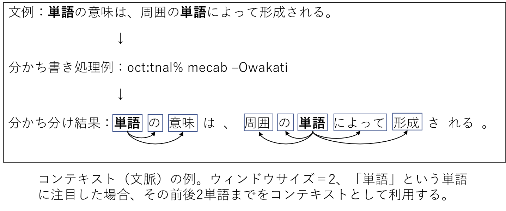
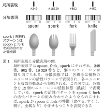

# 特徴量設計1：シソーラス、カウントと推論に基づいた設計
- 参考文献
  - [機械学習のための特徴量エンジニアリング : その原理とPythonによる実践](https://www.oreilly.co.jp/books/9784873118680/)
  - [自然言語処理 (放送大学教材)](https://www.amazon.co.jp/dp/4595319584/)
  - [ゼロから作るDeep Learning ❷ ――自然言語処理編](https://www.oreilly.co.jp/books/9784873118369/)
  - [自然言語処理の基本と技術](https://www.shoeisha.co.jp/book/detail/9784798128528)
  - NLTK: [Natural Language Processing with Python – Analyzing Text with the Natural Language Toolkit](https://www.nltk.org/book/)
- 全体の流れ
  - 達成目標
  - 自然言語処理の難しさ
  - アプローチ1: シソーラス
  - アプローチ2: カウントベースの手法
  	- Bag-of-Words（BoW）
  	- Bag-of-n-grams
  	- 代表的な前処理、後処理
  - アプローチ3: 推論ベースの手法
  	- 分布仮説（distributional hypothesis）
  	- 分布仮説に基づいた単語のベクトル化
  	- ベクトル間類似度による単語間類似度の測定
  - 相互情報量による分散表現の高度化
  - 次元削減
  	- 特異値分解による次元削減
  - 課題レポート3：自然言語処理してみよう

---
## 達成目標
- 代表的なテキストのコーディング方法（カウントベースと分散表現）を理解し、その特性に応じて使い分けられるようになる。
- 自然言語処理を含む機械学習モデルの実装と評価を実践できる。

---
## 自然言語処理の難しさ
- 自然言語処理とは
  - 自然言語（私たちが普段使っている言葉）をコンピュータに理解させるための処理。ここでいう理解とは、特定タスクの達成に寄与すること全般を指す。例えば、ある映画レビューがポジティブに評価しているのか、ネガティブに評価しているのかを文章から判断することができれば、このタスクにおいては理解しているとみなす。
- [自然言語処理 (放送大学教材)](https://www.amazon.co.jp/dp/4595319584/)1章より
  - 言語の働きと特徴、その難しさ
    - 言語の根本的な働きは、 **ものごとに名前をつけ、その関係を示す** ことである。これによってコミュニケーション・思考・記録の道具としての働きが生まれる。ここで、言語の特徴をコンピュータ処理を意識しつつ整理しておこう。
    1. ものごとへの名前の付け方は恣意的である。名前そのものの恣意性に加えて、言語が異なれば、ものごとをどのように切り出して名前をつけるかということも異なり、これが翻訳の難しさにつながる。
    2. 言語は社会の慣習であり、その用法は、論理的に説明できるものだけでなく、慣習であるとしか説明できないものも少なくない。少数の規則で扱えるものでないため、コンピュータが大規模なテキスト集合から言語の用法を学ぶことが必要になる。
    3. 言語の語彙、用法は時代によって変化する。また、専門分野によって語の使い方が異なったり、頻繁に新語が生まれる分野もある。コンピュータもそれらに柔軟に対応し、追随する必要がある。
    4. 言語で伝えようとする意味内容は、ものごとの間の複雑な関係であり、いわばネットワーク構造を持つ。しかし、音声言語も書かれた文章も1次元の音や文字の並びである。人はその間の変換を柔軟に行うが、これがコンピュータにとっては難しい処理となる。
    5. 表現（語・句・文など）と意味との対応は多対多である。すなわち、ある表現が複数の意味を持ち（多義性・曖昧性）、また逆に、ある意味を持つ複数の表現がある（同犠牲）。曖昧性のある表現の解釈は文脈に依存する。人間は文脈を考慮して言語を柔軟に解釈できるが、これをコンピュータで実現することは簡単ではない。
- 補足
  - 1の恣意性や2の慣習について。
    - [「いただきます」「ごちそうさま」って英語でなんて言うの？](https://www.qqeng.com/blog2/study/column313.html)
  - 3の語彙・用法の変化について。
    - 「やばい」
    - [コーパスを利用した言葉の意味・用法の変化の研究 ―「敷居が高い」を例に―](https://www.ninjal.ac.jp/event/specialists/project-meeting/files/JCLWorkshop_no4_papers/JCLWorkshop_No4_01.pdf)
    - [「変わりゆく日本語の実態」調査結果 発表](https://www.atok.com/camp/30th/kodawari/)
  - 4の関係について。
    - 
- この難しさにどう取り組むか？
  - 「単語の意味」を表現するためのアプローチ
    - シソーラスによる手法
    - カウントベースの手法
    - 推論ベースの手法

---
## シソーラス
### シソーラスとは
- [Wikipedia：シソーラス](https://ja.wikipedia.org/wiki/シソーラス)
  - シソーラス (英: thesaurus) は単語の上位 / 下位関係、部分 / 全体関係、同義関係、類義関係などによって単語を分類し、体系づけた類語辞典・辞書。どこまでの関係を扱うか、具体的な中身は定義者によりまちまち。
  - 異表記：ゴーヤーと苦瓜。
  - 同義語：琉球大学と琉大。
  - 類義語：コンピュータとPC。
  - 上位下位関係：家電と電子レンジ。
  - 部分全体関係：ラーメンと麺。
  - 意味カテゴリ関係：沖縄、東京といった都道府県。
  - 属性関係：當間と、當間が受け持つ授業。
- シソーラスの例
  - WordNet: [ [英オリジナル](https://wordnet.princeton.edu) | [日本語版](http://compling.hss.ntu.edu.sg/wnja/) ]
    - 語を類義関係のセット (synset)でグループ化し、簡単な定義（説明文）と、他の同義語との関係が記述されている。
  - [日本語評価極性辞書](http://www.cl.ecei.tohoku.ac.jp/index.php?Open%20Resources%2FJapanese%20Sentiment%20Polarity%20Dictionary)
    - 用言を中心に収集した評価表現約5千件について、極性（ポジティブorネガティブ）をまとめたデータセット。
- シソーラスの特徴
  - 利点
    - 用意したデータについては **比較的** 正しい判断を下すことが可能。
  - 欠点
    - **矛盾なく、整合の取れた綺麗なシソーラスを構築するのはコストが高すぎる**。
    - 言葉の意味は時代とともに変化する。
    - 細かいニュアンスを表現することが難しい。
- 語彙知識の獲得に向けた取り組み
  - **分布類似度仮説（Distributional Similarity）**
    - 「意味の類似している語は、使われている文脈も類似している」という仮説に基づき、同義語や類義語を自動獲得する考え方。例えば、以下の文（[授業評価アンケート](https://r.st.ie.u-ryukyu.ac.jp/assessment/2019a/result/evaluation.php?kamoku=e114&ex=1)から抜粋）における「○○」と「難しい」のそれぞれの **文脈** を用意し、その文脈間の類似度を比べることで、間接的に語彙の類似度を推測できる。勿論誤りもよくあるし、そもそも「文脈が似ている」だけであり、似ているの定義は困難である。例えば「好き」と「嫌い」は真逆の意味ではあるがどちらも感情表現としては似ているため類似度が高くなることもある。
      - ``○○課題でしたが、プログラミングができる人と少しは繋がれた気がします。``
      - ``○○かった課題も今では解き甲斐のある楽しい課題と感じるほど成長を感じられて嬉しいです。``
  - 語彙統語パターン
    - 「AのようなB」という[語彙統語パターン](https://www.jstage.jst.go.jp/article/jnlp/17/1/17_1_1_141/_article/-char/ja/)を使うと、AはBの下位概念であることが多い。このような語彙統語パターンを利用することで単語間の意味関係を抽出する。
- コード例
  - [nlp1_code.ipynb](./nlp1_code.ipynb) => シソーラスの例

---
### 類似アプローチ
- オントロジー（ontology）、知識ベース（knowledge base）
  - [Freebase](https://developers.google.com/freebase/)
    - [YAGO](https://en.wikipedia.org/wiki/YAGO_(database)), [browse YAGO](https://www.mpi-inf.mpg.de/departments/databases-and-information-systems/research/yago-naga/yago/demo/)
      - Wikipediaを中心としたコーパスから、知識の自動抽出により構築した知識ベースの例。
  - [DBpedia](https://wiki.dbpedia.org)
    - Wikipediaから、[DBpedia Information Extraction Framework (DIEF)](https://github.com/dbpedia/extraction-framework/wiki/The-DBpedia-Information-Extraction-Framework)と呼ばれるデータ抽出プログラムにより構築した知識ベース。
  - [Linked Open Data](https://ja.wikipedia.org/wiki/Linked_Open_Data)
    - 2017, [DBpediaの現在：リンクトデータ・プロジェクト](https://www.jstage.jst.go.jp/article/johokanri/60/5/60_307/_pdf)
    - データをWeb上に流通させるための4原則 by Linked Data
      - 1. 事物の名前づけにURIを使う。
        - URIは、厳密にはIRI（Internationalized Resource Identifier: 国際化資源識別子）。
      - 2. HTTP URIを使うことでそれをWeb上で調べられるようにする。
      - 3. 誰かがURIを引いたときには標準技術を使って有益な情報を提供する。
      - 4. 他のURIへのリンクを含むことで、人々がより多くの事物を発見できるように支援する。
    - DBpediaで歌川広重に紐付けられているデータの例（[DBpediaの現在：リンクトデータ・プロジェクト](https://www.jstage.jst.go.jp/article/johokanri/60/5/60_307/_pdf)から転載
    - から転載](./figs/dbpedia.png)
  - [Wikipedia 構造化データ「森羅」構築に向けて - 言語処理学会](https://anlp.jp/proceedings/annual_meeting/2018/pdf_dir/P7-3.pdf)
    - [森羅2019データ配布](http://liat-aip.sakura.ne.jp/森羅/森羅wikipedia構造化プロジェクト2019/森羅2019データ配布/)

---
## カウントベースの手法
- 背景
  - シソーラスの構築は高コストである。これをどうにかできないか、もしくは別アプローチがないだろうか。
  - 別アプローチ
    - 大量のテキストデータ（**コーパス(corpus)**）を用意し、そこから単語の意味等を抽出することができないだろうか。
    - 文章群だけから試みる場合もあるし、Webのようにリンク情報を利用できたり、ハッシュタグのような補足情報を利用できるケースもある。

---
### Bag-of-Words（BoW）
- [Bag-of-Words](https://en.wikipedia.org/wiki/Bag-of-words_model)とは
  - 単語の意味を表現するのではなく、「テキストを数値ベクトルで表現」するための手法。
- アルゴリズム
  - step 1: コーパス中に現れる全ての単語を集める。この際にどの文書で、どの単語が、何回出現したかをカウントする。
  - step 2: 単語を特徴とみなし、出現回数を特徴量とすることで文書を特徴ベクトルに変換する。
- BoWの特徴
  - 利点
    - 単語の区分が明確ならば、どの言語にも適用できる（汎用性が高い）。
  - 欠点
    - 単語の順序情報は保持できない。
      - "Alice likes Bob." <-> "Bob likes Alice." を区別できない。
      - 対応例
        - 後述の Bag-of-n-grams。
    - 特徴空間が非常に大きく、スパースになる。
    - 日本語のように単語区分が明確でない言語では、その前処理が必要。
      - [形態素解析](https://ja.wikipedia.org/wiki/形態素解析)、分かち書き。
        - 日本語形態素解析器例: [mecab](https://taku910.github.io/mecab/), [Juman](http://nlp.ist.i.kyoto-u.ac.jp/index.php?JUMAN), [KyTea](http://www.phontron.com/kytea/index-ja.html), [Janome](https://mocobeta.github.io/janome/), [まとめサイト例](https://www.mlab.im.dendai.ac.jp/~yamada/ir/MorphologicalAnalyzer/)
        - 品詞情報、活用形などがわかることも。ソフト次第。
        - 一般的には「ツール＋解析用辞書」で構成されることが多く、辞書のカスタマイズ次第で処理結果を調整することも可能。
          - [Neologism dictionary for MeCab](https://github.com/neologd/mecab-ipadic-neologd)
    - 表記ゆれを吸収するには工夫が必要。
      - dog <-> dogs, play <-> playing, do <-> done
      - ある程度は前処理できる。
        - stemming（正規化）。形態素解析で対応できる部分も。
        - subword（部分語）。単語を「連続した文字情報（character n-grams）」として処理し、その組み合わせで単語を表現しようとする試み。未知語への対応がそれなりにできる一方で、characterの繋がりに偏りすぎた判断を下してしまうことも。
          - [Enriching Word Vectors with Subword Information](https://arxiv.org/abs/1607.04606)
          - [Subword Neural Machine Translation](https://github.com/rsennrich/subword-nmt)
    - 意味は理解していない。
      - 同上。
- コード例
  - [nlp1_code.ipynb](./nlp1_code.ipynb) => Bag-of-Words

---
### Bag-of-n-grams
- 概要
  - BoWの拡張。BoWでは単語単位で出現回数をカウントしていた。カウントする単位を「n-grams」でやる。
  - n-gramsは、「n個の連続した単語（≒フレーズ）」のこと。例えば2-gramのBoWなら、「2個連続した単語」を単位としてカウントする。
- Bag-of-n-gramsの特徴
  - 利点
    - BoWと比べるて、より豊富な表現が可能。連続情報も含まれるため、より詳細な処理が可能。
  - 欠点
    - （BoWですら特徴空間は大きいが）特徴空間が非常に大きく、スパースになる。
- コード例
  - 省略（BoWをキャラクタ単位で実装するだけ）

---
### 代表的な前処理、後処理
- **ストップワード(stop words)による単語除去**
  - 「です」「ます」、記号、絵文字など、予め不要だとわかりきっている単語一覧（＝ストップワード）を用意し、それらを前処理なり、特徴量としてカウントするタイミングで除去する。何が不要単語かはタスク依存。例えば、感情分析の際には絵文字や文末表現も加味したほうが良いかもしれない。
- **頻度や頻度傾向に基づく単語除去、重みの調整**
  - どの文書にも共通して現れやすい高頻度単語（です、ます）や、逆にどの文書にも殆ど出現しない低頻度単語の一覧を用意し、それらを除去する。何が不要単語かはタスク依存。
  - 重みの調整の例
    - [TF-IDF](https://en.wikipedia.org/wiki/Tf–idf)
      - 表記上は「TFからIDFを引く」ように見えるが、これはただの略語である。正式名称は team frequency-inverse document frecuencuy. 処理場は「TFとIDFにより調整する」ように動作する。
      - TF = Term Frequency。単語の出現頻度のことで、出現頻度が高いほど大きな特徴量とする。
      - IDF = Inverse Document Frequency。多くの文書に出現する単語（e.g., 「私は」「ます」）は出現頻度が高くなりやすいが、これを重要な特徴として捉えても意味がないことが多い。これを避けるため、「多くの文書で出現する単語の重要度を下げ、特定文書にしか出現しない単語の重要度を上げる」ように調整する。
- **ステミング（語幹処理; stemming）**
  - do, does, doingといった活用語等の「変化する語」に対して、語幹（＝変化しない部分、もしくは原型）に変換する処理のこと。
    - e.g., [nltk.stem package](https://www.nltk.org/api/nltk.stem.html)
- ストップワード、ステミング、TF-IDFの実装例
  - [nlp1_code.ipynb](./nlp1_code.ipynb)
    - ストップワード、ステミングは既に実装済み。
    - TF-IDFによる調整 => BoWとTF-IDFを使った例。

---
## 推論ベースの手法
### 分布仮説（distributional hypothesis）
「単語の意味は、周囲の単語によって形成される」という仮説のこと。対象とする単語の「コンテキスト（文脈）」によって、単語の意味が形成されるという考え方。コンテキストとは、対象となる単語の前後にある単語のこと。ウィンドウサイズが1のときは前後1単語のみをコンテキストとして扱う。ウィンドウサイズが2のときは前後2単語までをコンテキストとして扱う。下図のようにウィンドウサイズ範囲内に単語がない場合には、それを示すための専用単語（専用トークン）を用意して、それに置き換えて処理することが一般的。

- [Distributional Hypothesis](https://aclweb.org/aclwiki/Distributional_Hypothesis)
- 

---
### 分布仮説に基づいた単語のベクトル化
シソーラスやカウントベースのように各概念（≒単語）に対し個別のIDを割り当ててて表現する方法を **局所表現（local representation）** と呼ぶ。これに対して複数概念から参照される形で表現する方法を **分散表現（distributed representation）もしくは単語埋め込み（word embedding）** と呼ぶ。

局所表現と分散表現の概念図として[言語処理における分散表現学習のフロンティア](https://jsai.ixsq.nii.ac.jp/ej/index.php?action=pages_view_main&active_action=repository_action_common_download&item_id=2107&item_no=1&attribute_id=22&file_no=1&page_id=13&block_id=23)より抜粋した下図を眺めてみよう。
- 

実用的な分散表現は後日取り扱うとして、今回はこのような分散表現を得るための基礎を身につけるため、分布仮説に基づいた最もシンプルな単語のベクトル化手法を眺めていこう。

- コーパス例
  - 文1: The cat sat on the mat.
  - 文2: The dog stood on the mat.
- ボキャブラリ（単語集合）
  - 大文字小文字を揃え、ピリオドを除去すると、、
  - the, cat, sat, on, mat, dog, stood
  - 上記7ワード。
- ウィンドウサイズを1とした場合のコンテキストに出現した単語をカウントすると、
  - theの、文1のコンテキストはcat, on, mat。文2のコンテキストはdog, on, mat。
  - catの、文1のコンテキストはthe, sat。文2のコンテキストはなし。
  - 以上のカウント情報を、ボキャブラリを特徴とするベクトルとして表現すると以下のようになる。（**共起行列**）

|target word|the|cat|sat|on|mat|dog|stood|
|---|---|---|---|---|---|---|---|
|the|0|1|0|2|2|1|0|
|cat|1|0|1|0|0|0|0|
|sat|0|1|0|1|0|0|0|
|on|2|0|1|0|0|0|1|
|mat|2|0|0|0|0|0|0|
|dog|1|0|0|0|0|0|1|
|stood|1|0|0|0|0|0|0|

- コード例
  - [nlp1_code.ipynb](./nlp1_code.ipynb) => 共起行列に基づいた単語のベクトル化

---
### ベクトル間類似度による単語間類似度の測定
- 共起行列の作成により各単語をベクトルで表現することができたので、そのまま数値ベクトルとして扱うことで例えばユークリッド距離により「距離の近い単語」を探すことも可能。しかし、単語のベクトル表現に対しては「ベクトルのサイズは無関係であり、方向が重要である」ことが多く、方向に重きをおいた類似度として **[コサイン類似度（cosine similarity）](https://en.wikipedia.org/wiki/Cosine_similarity)** が使われることが多い。
  - 同じ方向にあるなら +1、真逆に位置するなら -1。0のときは直交している。
  - マイナスの値を取り得るため、「距離」ではない点に注意。
- 特徴ベクトル間類似度を定義したので、その定義に基づいて「最も類似した単語」「類似度上位N件の単語」といった処理を実装可能。
- コード例
  - コサイン類似度実装済み。
  - [nlp1_code.ipynb](./nlp1_code.ipynb) => 共起行列に基づいた単語のベクトル化

---
## 相互情報量による分散表現の高度化
- ここまでの流れ
  - 単語や文の表現方法として、Bag-of-Words、共起行列を眺めてきた。
  - BoWは単語出現頻度だけで生成するシンプルな特徴ベクトルだが、タスクによってはこれで十分であるケースがある。
    - Q：BoWが十分に機能しそうなケースとはどのような状況だろうか？　そう考える理由は何だろうか？
  - 分布仮説に基づいた共起行列は、単語の概念を分散表現として記述した特徴ベクトルで構成されており、BoWと比べると頑健性に優れていることが多い。
    - Q：BoWと比べて頑健性が高い（ことが多い）のは何故だろうか？
- 上記を踏まえた新たな問い
  - BoWや共起行列に問題点は無いか？もしくはよりベターな表現方法はないだろうか？
- 共起行列に対する問題の一例
  - BoWではTF-IDFによる重み調整があった。これは the などの出現しやすい単語の重みを下げたり、逆に cosine similarity のような専門語（＝特定文書に偏って出現しやすい語＝特徴のある語）の重みを上げるといった効果を期待した手法である。
  - BoWにおけるTF-IDFのようなものを、共起行列に対しても行えないだろうか？　そうしないと、the, a などと出現しやすい単語というのがそれらとの重みを高くしてしまいがちであるが、それは本質的ではないはずだ。これを避けるにはどうしたら良いだろうか？
  - 解決例：相互情報量の利用
- **相互情報量（Pointwise Mutual Information; PMI）**
  - [Wikipedia: PMI](https://en.wikipedia.org/wiki/Pointwise_mutual_information)
    - 一般的な定義（情報理論、統計学）
      - 2つの離散確率変数（サイコロのように離散的な値を取る確率変数）について、同時出現割合と独立出現割合から関連度合いを求める。
    - 自然言語処理では、「単語」を離散確率変数とみなすことで、2単語についてその関連度合いを、同時出現割合と独立出現割合から求めることに利用している。
    - $P(x)$：単語xが出現する確率。（individual distribution）
    - $P(y)$：単語yが出現する確率。
    - $P(x, y)$：単語xと単語yが同時に出現する確率。（joint distribution）
    - $pmi(x;y) = log\frac{P(x,y)}{P(x)*P(y)}$：単語xと単語yの相互情報量。分母が大きく分子が小さい時、すなわち単語x,yそのものの出現確率が低いが共に出現しやすい場合には総合情報量が大きくなる。
  - 例外対応
    - 数式の性質上、同時出現確率が0の場合、PMIの値が -∞ になってしまう。このため、``Positive PMI = max(0, PMI(x,y))`` として利用することも。この場合、マイナス値は全て0に丸めることになる。
      - 実際に算出したり、[前述Wikipediaでの例](https://en.wikipedia.org/wiki/Pointwise_mutual_information#Applications)を参照してもわかるが、PMIの値は小さなマイナス値を取ることも多い。
- コード例
  - [nlp1_code.ipynb](./nlp1_code.ipynb) => 相互情報量による分散表現の高度化

---
## 次元削減
- これまでの流れ
  - 共起行列の重みを、PMIにより調整することで関連度の強さを加味した数値ベクトルとして表現することができた。
- 上記を踏まえた新たな（これまで目を背けていた）問いの例
  - 全ての単語を次元として扱う表現方法だと、単語ユニーク数に比例して次元数が線形増加する。例えば[mecab-ipadic-NEologd : Neologism dictionary for MeCab](https://github.com/neologd/mecab-ipadic-neologd/blob/master/README.ja.md)では[2016年時点で5百万強の語彙数が登録](https://www.anlp.jp/proceedings/annual_meeting/2017/pdf_dir/B6-1.pdf)されている。これだけの語数をそのまま特徴として扱うのは計算機リソース上厳しいし、無駄も大きい。
- 別観点からみた次元削減の意義
  - 機械学習外観で眺めてきた[次元の呪い](../2-ml-intro/ml-intro2.html#id20)の観点からは、そもそも次元が少ないに越したことはない。
  - 一部のモデル（線形回帰モデル等）は、そもそも[各特徴が独立（無相関）](https://manabitimes.jp/math/934)であることを前提としている。[多重共線性; multicollinearity](http://jspt.japanpt.or.jp/ebpt_glossary/multicollinearity.html)と呼ばれる問題の一種。
    - 例として、仮に人間の体重と身長から肥満度合いを推測したい状況を考えてみよう。きれいな相関はないかもしれないが、一般的には体重が高い人は身長もそれなりに高い傾向にある。例えば100kgの人の身長が50cmということはありえない。つまり体重と身長はある程度正の相関があるだろう。ここでは単純化して $体重 = 0.5 * 身長$ という強い関係にあると仮定しよう。もしそのような強い相関関係にあるのであれば、線形回帰モデルにおいては $y = a*体重 + b*身長 = a*(0.5*身長) + b*身長 = (0.5a + b)*身長$ と表現することができ、身長だけ（もしくは体重だけ）で学習することと同等にみえる。
      - 実際には同等に見えるというよりは、1変数に置き換えたモデルの方が適切に学習できるというのが正しい。
    - もし、この2変数を[ボディマス指数(BMI)](https://ja.wikipedia.org/wiki/ボディマス指数)のように「このような関係性にあるという特徴を用いたい」というのであれば、線形回帰モデルにおいてはそのように前処理した値を特徴として設定する必要がある。
- **次元削減（dimensionality reduction）**
  - 次元数が膨大でそのまま扱うのを避けるためのアプローチ例が「次元削減」。
  - イメージ
    - [Wikipedia: dimensionality reduction](https://en.wikipedia.org/wiki/Dimensionality_reduction)
    - **価値の低い情報を取り除くことで、重要な情報を残そう** とする。言い換えると、**元の冗長な情報量を、特徴空間に含まれる情報を要約した特徴量に置き換えよう** とする。
    - 価値の低い情報には様々な定義がある。代表的なアルゴリズムである主成分分析では、線形独立に着目することで低次元な線型部分空間に写像する。
    - PCA, SVDによる次元削減は、主成分・特異ベクトルが無相関となるように選出されるため、結果的に独立した特徴量を採用することにも繋がる。このため「情報は欠落しているにも関わらず、次元の呪いを避けやすくなることで学習による精度が向上」することが少なくない。

---
### 特異値分解による次元削減
- [特異値分解（Singular Value Decomposition; SVD）](https://en.wikipedia.org/wiki/Singular_value_decomposition)
  - 任意の行列Xを、3つの行列の積に分解（X = UΣVT）することで任意サイズの行列における特異値を抽出する。この特異値を用いて情報圧縮（次元削減）することを考える。
    - 参考
      - [分解すると見える世界 ー特異値分解ー](https://thinkit.co.jp/article/16884)
      - [機械学習と主成分分析](https://www.slideshare.net/katsuhiromorishita/ss-97377995)
    - Uは m x m の直交行列。各列ベクトルは互いに直行しており、転置行列と逆行列が等しい。元の行列Mを回転して得られる、何らかの空間の軸（基底）を形成している。
      - 共起行列に対して特異値分解を適用すると、新たな軸に対する写像Uを獲得できる。この写像Uは、特異値が大きい順に並ぶΣと対応して形成されており、第1列は最大のデータ分散の方向に存在する第1基底となっている。第2列は2番目の最大分散を持つ直交方向の第2基底であり、以下同様に並んでいる。このため、特異値が大きい順（ランクが高い順）に軸を選んでいくことで次元削減につながる。この一連の軸生成〜軸選択操作により、価値の高い情報で元行列Xを近似している。
    - Σは m x n の対角行列。対角成分以外は0。行列Mの**特異値**が大きい順に並ぶ。特異値なので、行列Mが与えられるとユニークに算出される。
      - 第1特異値は、最大のデータ分散の方向に存在する第1基底の重要度を示している。
    - Vは n x n の直交行列。
- コード例
  - [nlp1_code.ipynb](./nlp1_code.ipynb) => 特異値分解の実装例
    - [np.linalg.svd](https://docs.scipy.org/doc/numpy/reference/generated/numpy.linalg.svd.html)は、厳密に求めようとするため高コスト。
    - [sklearn.decomposition.TruncatedSVD](https://scikit-learn.org/stable/modules/generated/sklearn.decomposition.TruncatedSVD.html)は、特異値の大きいものに限定して計算するため、より高速。実データではこちらがベター。ただし乱数利用しているため、再現性必要ならシード値設定すること。
  - コード例2: [画像圧縮](./svd.ipynb)
  - コード例3: [次元削減(iris data set)](./svd-reduction.ipynb)

---
## 復習
- 以下の概説記事を読み、自分なりに疑問点等気になる事柄を整理せよ。疑問等は、次回授業の前日までに、別途用意するフォームに入力すること。
  - 人工知能学会 私のブックマーク: [Vol.23 No.4 (2008/7) オントロジーの構築と利用](https://www.ai-gakkai.or.jp/my-bookmark_vol23-no4/)

---
## 課題レポート3：自然言語処理してみよう
- 全体の流れ
  - [NLTKの解説本](https://www.nltk.org/book/)の0章〜12章まで、計13個のHTMLファイルをダウンロードせよ。
  - BoWベースの特徴ベクトル（Level 1 もしくは Level 2）を生成せよ。
  - 共起行列ベースの特徴ベクトル（Level3）を生成せよ。
  - （ラベル付き文書に対して分類タスク（Level4）を実行せよ。）　＊課題レポート4として設定予定。
- Level 1: 文書ファイル毎に、Bag-of-Wordsで特徴ベクトルを生成せよ。
  - 補足
    - HTMLタグ等の除去はしなくても良い。（しても良い＠Option扱い）
    - ストップワードは、最低でも利用するライブラリで用意されているものを使うこと。拡張 or 独自実装する分には自由。
      - ライブラリ例
        - nltk.corpus.stopwords
        - sklearn.feature_extraction.text.CountVectorizer(stop_words)　＊引数で指定可能
    - レポートには下記内容を含めること。
      - (a) 13x13のマトリックス表記で文書間類似度（コサイン類似度）を記せ。表示有効桁は3桁とせよ。
      - (b) コード上工夫した箇所があるなら該当箇所だけを示し、解説せよ。ほぼコード例通りなら省略OK。
        - レポート上省略する場合でも、ソースコードは提出すること。
      - (c) 最も類似している2文書について、それらが類似していると判定された理由を検討し、述べよ。（単にコサイン類似度が大きいからではなく、何故大きいのかを検討してみよう）
- Level 2: BoWにTF-IDFで重み調整した特徴ベクトルを生成せよ。
  - レポートには下記内容を含めること。
    - (a) 〜 (c)：Level 1参照。
    - (d) Level 1, 2の(a)を比較し、順位が入れ替わっている箇所があるか探せ。もしあれば、それらの文書群について順序が入れ替わった理由を検討せよ。（単にコサイン類似度が変化したからではなく、変化に大きな影響を及ぼしたのがどこなのかを検討してみよう）
    - (e) (d)で入れ替わっている場合、この変化が好ましいか否か検討し、その理由とともに述べよ。
- Level 3: 単語の共起行列から特徴ベクトルを生成せよ。
  - レポートには下記内容を含めること。
    - (a) "natural", "language", "text", "count"に加え、もう1個以上の単語を自由に選べ。合計5個以上の単語についてマトリックス表記で単語間類似度（コサイン類似度）を記せ。表示有効桁は3桁とせよ。
    - (b) コード上工夫した箇所があるなら該当箇所だけを示し、解説せよ。ほぼコード例通りなら省略OK。
      - レポート上省略する場合でも、ソースコードは提出すること。
    - (c) 最も類似している2単語について、それらが類似していると判定された理由を検討し、述べよ。（単にコサイン類似度が大きいからではなく、何故大きいのかを検討してみよう）

---
以下はオプション例。

- オプション例
  - (a) 文書分類してみよう。
    - 教師あり学習用にラベル付けされたテキスト文書を準備し、BoW（もしくはBoW+TFIDF）, 共起行列に基づいた特徴ベクトルを用いて分類学習をしてみよう。
      - テキスト文書は任意で構わない。思いつかない場合には以下を利用しよう。なお、全文書を用いなくても良いが、最低限2カテゴリ選択し、カテゴリ毎に100文書以上サンプルを用意すること。
        - [sklearn.datasets.fetch_20newsgroups](https://scikit-learn.org/0.19/datasets/twenty_newsgroups.html)
        - [Twitter日本語評判分析データセット](http://www.db.info.gifu-u.ac.jp/sentiment_analysis/)。ジャンル分類、極性（ネガティブ・ポジティブ）分類のラベルが付いている模様。データは別途ダウンロード必要で、Twitter API 制限のため2時間程度かかる模様。
        - [Sentiment Analysis in Twitter](https://www.cs.york.ac.uk/semeval-2013/task2/index.html)。極性分類。
        - [Opinion Mining, Sentiment Analysis, and Opinion Spam Detection](https://www.cs.uic.edu/~liub/FBS/sentiment-analysis.html#datasets)。レビュー記事にラベル付与されたデータがいくつかある模様。
      - Level 3の共起行列では単語ベクトルを生成しているだけである。これを用いて文書ベクトルを作るために、「文書中に現れた全単語の単語ベクトルを足し合わせ、総単語数で割る」ことで文書ベクトルとしよう。
      - 学習データとテストデータの割合、分類機（モデル）の選択等は自由で構わない。
      - レポートには下記内容を含めること。
        - 自身で設定したものは一通り記載しよう。
          - 例えば、特徴ベクトル生成時の設定等でLevel1〜3以外の処理。選択肢た分類器やハイパーパラメータの設定。学習のさせ方。評価のさせ方。
        - 評価結果。ラベル毎の精度を示そう。[混同行列（confusion matrix）](https://scikit-learn.org/stable/auto_examples/model_selection/plot_confusion_matrix.html#sphx-glr-auto-examples-model-selection-plot-confusion-matrix-py)も記載すること。
        - レポート上省略する場合でも、ソースコードは提出すること。
  - (b) 相互情報量から特徴ベクトルを生成してみよう。
  - (c) 共起行列に基づいた特徴ベクトル、もしくは相互特徴量に基づいた特徴ベクトルをSVDにより次元削減してみよう。
  - (d) SVDによる次元削減時に2次元とせよ。気になる単語1つを選び、上位10件と下位10件を2次元空間にマッピングせよ。マッピング結果、どのように散らばっているか観察し、想定とどのぐらい似通っているか考察してみよう。
  - (e) 日本語文書について自然言語処理してみよう。
