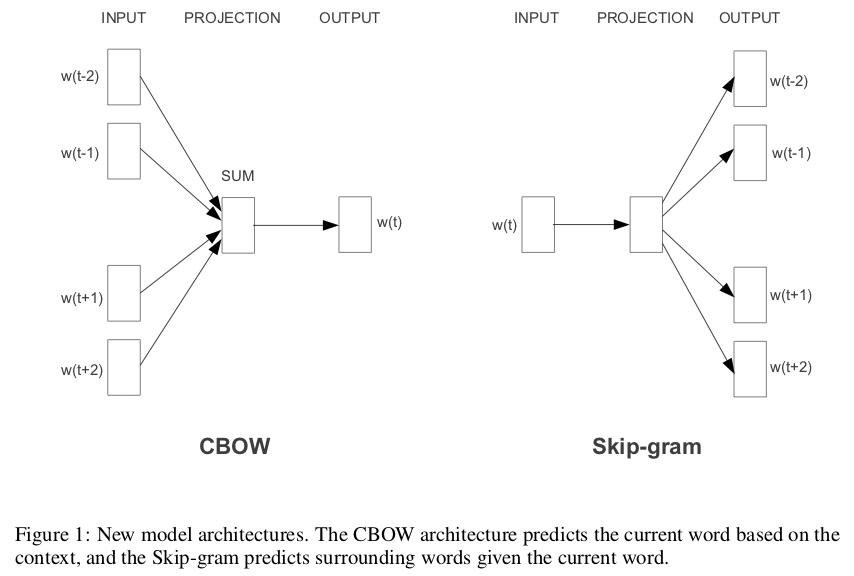
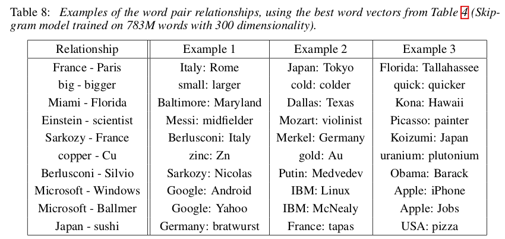
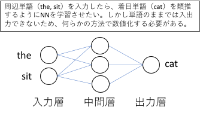
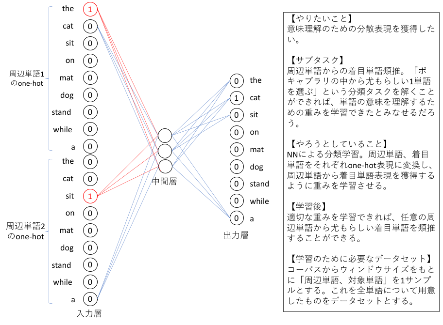
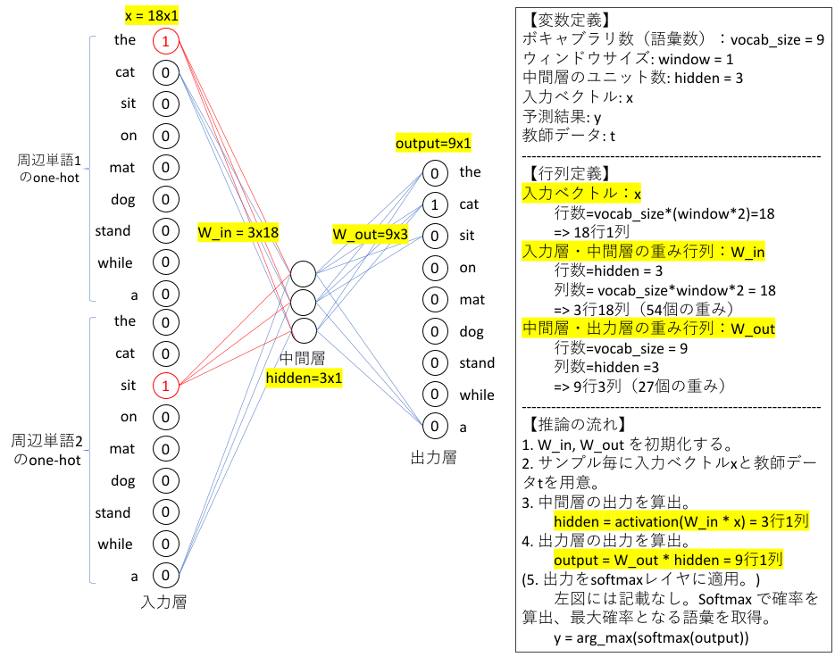

# 特徴量設計2：word2vecによる分散表現
- 参考文献
  - [ディープラーニング入門 Chainer チュートリアル](https://tutorials.chainer.org/ja/13_Basics_of_Neural_Networks.html)
  - [word2vecによる自然言語処理](https://www.oreilly.co.jp/books/9784873116839/)
    - [Github: word2vec](https://github.com/tmikolov/word2vec)
    - [Word2Vec：発明した本人も驚く単語ベクトルの驚異的な力](https://deepage.net/bigdata/machine_learning/2016/09/02/word2vec_power_of_word_vector.html)
    - [絵で理解するWord2vecの仕組み](https://qiita.com/Hironsan/items/11b388575a058dc8a46a)
  - [ゼロから作るDeep Learning ❷ ――自然言語処理編](https://www.oreilly.co.jp/books/9784873118369/)
  - [gensim](https://radimrehurek.com/gensim/)
  - [fastText](https://fasttext.cc)

---
## ニューラルネットワークの基礎
- Chainerチュートリアルの[ニューラルネットワークの基礎](https://tutorials.chainer.org/ja/13_Basics_of_Neural_Networks.html)参照。

---
## アプローチの違いに伴う特徴
[特徴量設計1](./nlp1.md)にて、単語の意味を表現するためのアプローチを大別すると (1)シソーラスによる手法、(2)カウントベースの手法、(3)推論ベースの手法があることを述べた。NNは反復法に基づく推論ベースの手法である。具体的な手法毎に差異はあるが、大きな傾向としては次に示す特徴があることが多い。

| 項目 | シソーラス | カウント | 推論 |
| :--- | :--- | :--- | :--- |
| 厳密さ | ◎ | ○ | ○ |
| 柔軟さ | △ | ○ | ◎ |
| スケーラビリティ | △ | ○ | ◎ |

シソーラスは単語間の関係を異表記・類義語・上位下位といった関係性を用いて関連付ける。このため人手で緻密に設計された概念地図の範囲内であれば厳密な解釈のもとで利用することができる。しかしながら明示された単語・関係しか扱うことができず、そこに存在しない単語・関係については考慮することすらできない。加えて過不足なく整合の取れた概念地図の構築はとても高コストであり、また同じ理由のために概念地図を拡張していくことも困難である。なお、古くは[Wikipediaマイニング](https://ci.nii.ac.jp/search?q=wikipedia+マイニング&range=0&count=20&sortorder=7&type=0)、最近だと[森羅プロジェクト](http://shinra-project.info)のように概念地図を自動構築しようとする試みは数多くある。これらの多くは拡張に成功しているものの、同時にノイズも数多く含んでしまうことから強みであるはずの厳密さが損なわれることも少なくない。

カウントベースの手法は上記の問題点を受けたアプローチであるため、主に欠点と考えられていた柔軟さとスケーラビリティの改善に取り組まれているケースが多い。この時点で文書分類タスクのような比較的シンプルな問題においては精度が大きく改善されるケースが増えた。その一方で、単語の出現回数を元に構築することから処理を自動化しやすくなったが、コーパスが追加・変更等されるとその度に大本のカウントをやりなおす（カウントデータに反映し直す）必要があり、かつ、大規模すぎるとそのカウントデータから後の処理に要するコストが大きすぎるため、敬遠されている部分も少なくない。しかしながらこれはあくまでもコーパスが変わる前提の話であり、一度用意したコーパスから大きな変更がないドメインにおいては十分高精度で処理できることも多いため、今でも採用されることが多い。

これらに対し推論ベースの手法は厳密性については安定しないことも多いが、他の手法と比べてどれだけコーパスが増えても処理しやすいスケーラビリティと、未知語に対してもそれなりに機能する柔軟さを備えていることが多い。以下では多くの推論における根幹といえる word2vec を取り上げる。

---
## word2vecとは（概要）
- 背景
  - Bag-of-Wordsのような、シンプルなカウントベースの特徴ベクトルでは単語の意味を含むことが困難。これに対し、分布仮説に基づいたシンプルな共起情報ベースの特徴ベクトルではある程度意味らしさを含むが、共起行列は極めて **疎な行列** であり、無駄が大きい。次元削減するにしてもコストが大きい。
- 問題意識
  - 従来以上に潜在的な意味を汲み取る方法は無いだろうか？　現実世界での意味的な距離をできるだけ保つような **密なベクトル** での表現方法はないだろうか？
  - SVDやPCAは次元削減に寄与するが、SVDやPCA自体の計算コストが高いため、大規模なコーパスに対しては現実的な解法になっていない。より適切な語彙情報を含めるためにはより大規模なコーパスに対して適用したいが、現実的な推論方法は無いだろうか？
- word2vec
  - Tomas Mikolovらによって提案されたニューラルネットワーク（CBOW, Skip-gram）を用いて単語を分散表現に変換する。分散表現は **単語埋め込み（word embedding）** とも呼ばれる。
  - 2種類の推論方法
    - CBOWモデルでは、着目単語に対する文脈（ウィンドウサイズで指定）が入力として与えられ、そこから着目単語を推定するように学習する。
    - Skip-gramモデルでは、着目単語が入力として与えられ、そこから文脈中の1単語を推定するように学習する。
    - 図：[Efficient Estimation of Word Representations in Vector Space](https://arxiv.org/abs/1301.3781)の Figure 1 より。
    - 
- 何がすごいのか？
  - ``Paris - France + Italy = Rome`` のように、単語ベクトルの引き算＋足し算で様々な「関係」を表現できた。シソーラス等の事前データ無しに、大量のテキストからこのような潜在的な語彙関係を内包する特徴空間に、単語ベクトルを写像できた。
  - 図：[Efficient Estimation of Word Representations in Vector Space](https://arxiv.org/abs/1301.3781)の Table 8 より。
  - 

````{admonition} Check your understading
疎なベクトルとは何だろうか？
```{dropdown}
とても次元数の大きなベクトルを想像しよう。例えば BoW で共起行列に基づいたベクトルを作ろうとすると、ユニークな単語総数を次元数とするベクトルを用意することになる。

より具体的には、[このサイト](https://tokushima-tsubasa.com/ace-striker/2019/01/03/小学生から国語を伸ばす習慣（１）/)を例に取るとたかだか中学3年生でも約2万語の語彙を獲得しており、それに応じた次元数を用意することになる。このときある文書、例えば新聞記事や教科書数ページのように「あるタスクで対象となる文書」をベクトルで表現することを考えてみよう。中学3年生が今日の授業で読む教科書には2万語が全て使われているかというと、絶対にそのようなことはない。文書によってはユニークな単語は数十語〜数百語程度であることも少なくない。このことを言い換えると **ある文書を共起ベクトルで表現しようとすると、2万次元中の数十次元〜数百次元だけに具体的な数値があり、それ以外の次元（1.1万次元程度）では全てゼロ** である。すなわち圧倒的に特徴量のある次元が少ない。このことを「疎なベクトル」と呼ぶ。
```
````

```{note}
CBOWやSkip-gramによる密ベクトルを学習する考え方は、深層学習でいうところの **Autoencoder** と呼ばれるものに似ている。Autoencoderでは入力ベクトルを圧縮し、再度元の次元に復元処理をするアルゴリズムである。元に戻すだけならば最初から入力ベクトルだけで良いはずだが、圧縮することにより重要な特徴量を抽出（抽出しないと圧縮できないand/or復元できない）している。

別の言い方をすると、「1000次元で表現されているベクトルを何とかして10次元で表現し直し、そこから復元できるできるようにせよ」という無理難題のようなタスクを解かせようとしている。それを何とかしようとすることで、one-hotエンコード上では等距離にあった単語集合（例えば犬と動物も、犬と車も等距離として扱われていた）が、周辺単語の出現頻度が似ている度合いを元にして類似している単語集合が近くなり、類似していない単語集合が遠くなるような密ベクトル空間を形作るように調整されていく。その結果が冒頭で述べた ``単語ベクトルの引き算＋足し算で様々な「関係」を表現`` である。

- [Building Autoencoders in Keras](https://blog.keras.io/building-autoencoders-in-keras.html)
- [オートエンコーダ（自己符号化器）とは](https://jp.mathworks.com/discovery/autoencoder.html)
```

---
## word2vecの簡易実装を通した推論学習
概要で見たとおり word2vec は「単語を密ベクトルとして表現（分散表現）」するための方法を学習する。本節では表現方法の学習、すなわち特徴量設計をどのように実現しているのかを掘り下げていく。

```{tip}
word2vecはBERT, GPT-3等さまざまな最新技術の基礎となっている。興味のある人は下記を参照するといいだろう。
- [word2vecによる自然言語処理](https://www.oreilly.co.jp/books/9784873116839/)
- [ゼロから作るDeep Learning ❷ ――自然言語処理編](https://www.oreilly.co.jp/books/9784873118369/)
- [一般向けのDeep Learning](https://www.slideshare.net/pfi/deep-learning-22350063), slideshare
```

---
### 問題設定
NNを用いて分散表現を学習するために次のような分類タスクを考えよう。

**分類問題：ある文脈を与えたとき、そこから推論される尤もらしい単語はどれか。**

例として「今朝はトーストと卵焼きを食べました。」という文章で考えてみよう。ここから任意の1単語を空欄に置き換え、文脈（空欄以外の部分）から空欄に入る単語が何なのかを推論するタスクを解くことになる。

- 設問例1: 今朝はトーストと``[空白]``を食べました。
- 設問例2: 今朝はトーストと卵焼きを``[空白]``ました。
- 設問例3: ``[空白]``はトーストと卵焼きを食べました。

設問例1を眺めてみると、何かしら食べられるもの（単語）ならば基本的には自然な文としては成立するはずだ。しかし「朝」食べるものとして一般的でないもの、例えばステーキだと違和感を感じる人が多いかもしれない。同様に設問例2ならば「食べ物を＊＊する」という動詞としてふさわしい単語ならば納得できる人が多いだろう。設問例3においては選択肢が広がり、「私」や「あなた」のような主体が入っても違和感が少ないだろう。

もし、あるシステムが「既にある自然文から一部分を取り除いた問題を用意し、そこから取り除いた部分を類推する」ことができたならば、そのシステムはこのタスクにおいては意味を理解したといえる。またその意味を理解するために必要なベクトル空間への写像を獲得したといえるだろう。NNによる分散表現の獲得とは、このように文脈から特定単語を推論することを学習することにより獲得することを指す。

---
### NNへの入出力（前処理、後処理）
NNで分類タスクを学習することで分散表現を獲得したい。このためにはNNへの入出力、NNの構造（モデル）、学習方法をそれぞれ検討する必要がある。まずここではモデルや学習方法はブラックボックスとしておき、入出力についてのみ確認していこう。

NN基礎で見てきたとおりモデルへの入力や出力は多次元のベクトルである。つまり、自然言語で記述された文書を何らかの方法で予めN次元ベクトルに変換しておく必要がある。これに加えて[分布仮設](./nlp1.md#distributional-hypothesis)を踏まえて入出力を用意したい。具体的な下記3件の文書で考えてみよう。

- sentence 1: ``the cat sat on the mat``
- sentence 2: ``the dog stood on the mat``
- sentence 3: ``the cat stood while a dog sat``

本来なら全ての単語についてデータセットを作成していく。以下では分かりやすいように ``cat`` に着目した場合について検討してみよう。ステミングしたユニークな語彙（ボキャブラリ）を列挙すると the, cat, sit, on, mat, dog, stand, while, a の9種類である。文書単語をこの9種類の単語に置き換え、``cat`` を着目単語とした状況を考えてみよう。``ウィンドウサイズ=1`` とすると系列データは以下のようになる。

- series 1: ``the cat sit``
- series 2: ``the cat stand``

この系列データから「周辺単語を入力とし、着目単語を出力とする」ようにデータセットを作成していこう。上記データを周辺単語と着目単語に分割すると次のようになる。

- series 1
  - context 1: ``the``, ``sit``
  - target 1: ``cat``
- series 2
  - context 2: ``the``, ``stand``
  - target 2: ``cat``



ここで各単語を「ボキャブラリを用いてone-hot表現」にしよう。

- series 1
  - context 1: ``1,0,0,0,0,0,0,0,0``, ``0,0,1,0,0,0,0,0,0``
  - target 1: ``0,1,0,0,0,0,0,0,0``
- series 2
  - context 2: ``1,0,0,0,0,0,0,0,0``, ``0,0,0,0,0,0,1,0,0``
  - target 2: ``0,1,0,0,0,0,0,0,0``

これでデータセットが構築できた。系列データ1は ``the``, ``sit`` という周辺単語から ``cat`` を推論しろというサンプルである。これを数値化したものがone-hot表現で記述した ``1,0,0,0,0,0,0,0,0``, ``0,0,1,0,0,0,0,0,0`` という18次元のベクトルから、``0,1,0,0,0,0,0,0,0`` という9次元ベクトルとなるように学習しろというサンプルに変換されている。



このように、分散表現を学習するためのデータセットは (1) 文を単語に分割し、(2) ウィンドウサイズで文脈を決め、(3) ボキャブラリによりone-hot表現に変換することで構築する。

```{tip}
実装上は、(a)文章に対して必要な前処理（文字統一、文分割、単語分割、単語集約等）を施し、(b) ユニークな単語をボキャブラリとして登録し、トークンIDに変換しておく。このトークンIDを「one-hot表現と解釈して処理」するライブラリが多い。例えば、前述した系列データ「the cat stand」ならば「0, 1, 6」というトークンID系列に置き換えて処理することになる。
```

---
### ネットワークの構造（CBOWモデル）
word2vecは2つのモデルが提案されている。まずはCBOWモデルを眺めていこう。

- CBOWモデル
  - $window\_size = 1$ のとき、$P(w_t|w_{t-1},w_{t+1})$ の確率が最大となるように学習する。$w_t$は「t番目の単語(word)」とする。このとき、$P(w_t|w_{t-1},w_{t+1})$ は **「単語 $w_{t-1}$ と単語 $w_{t+1}$ が与えられたときに、単語 $w_t$ が起こる確率」** を指す。不適切な単語 $w_t$ に対しては確率を下げ、適切な単語 $w_t$ に対しては確率を上げるような確率モデルPとなるように重みを学習していく。
  - サンプル毎の損失関数
    - 交差エントロピー誤差（式{eq}`cbow_loss`）。単語$w_t$を正しく推論できた（P=1）とき、0となる。

```{math}
:label: cbow_loss
L = -logP(w_t|w_{t-1},w_{t+1})
```



---
### ネットワークの構造（Skip-gramモデル）
- Skip-gramモデル
  - $window\_size = 1$ のとき、$P(w_{t-1}, w_{t+1}|w_t)$ の確率が最大となるように学習する。$P(w_{t-1}, w_{t+1}|w_t)$ とは、**「単語$w_t$が与えられたときに、単語$w_{t-1}, w_{t+1}$が同時に起こる確率」** を指す。
  - サンプル毎の損失関数
    - 交差エントロピー誤差（式{eq}`skipgram_loss`）。単語 $w_{t-1},w_{t+1}$ を正しく推論できたとき、0となる。

```{math}
:label: skipgram_loss
L = -logP(w_{t-1},w_{t+1}|w_t) \\
= -logP(w_{t-1}|w_t)P(w_{t+1}|w_t) \\
= -(logP(w_{t-1}|w_t) + logP(w_{t+1}|w_t))
```

---
### 簡易実装の例
- 旧コード
  - [train_momotaro.ipynb](./train_momotaro.ipynb)

---
### 実装上の工夫
今回示しているコードは動作を確認しやすくすることを優先しており、大規模なコーパスに対しては処理が重く、実用的ではない。これに対して[gensimのword2vec](https://radimrehurek.com/gensim/models/word2vec.html)等のライブラリでは高速で、メモリ消費を抑え、効果的な学習が行われるような工夫が行われている。

- CBOWでは、中間層の重みを文脈間で共有している。（共有する＝一種の制約条件を付与する）
  - 一般的なNN形式で「vocab_size=5, window_size=2, hidden_size=3」のNNを構築しようとすると、「3行10列の入力中間層重み行列(=30個のパラメータ)」を用意する必要がある。これに対しCBOWでは文脈間で重みを共有するため、「3行5列(15個のパラメータ)」で処理する。vocab_sizeが数十万〜百万規模になるとメモリが膨大に要求されるため、実用面では共有した方が低コストに抑えられる。また、必要以上にパラメータが大きいと過学習となる危険もあるため、可能な範囲でパラメータは押さえたほうが良いという側面もある。
- Skip-gramでも重みは共有している。
  - 共有にはデメリットもあり、単語の順番は無視される。例えば「$w_{t-2},w_{t-1},w_{t+1},w_{t+2}$」という順番で入力した場合と、「$w_{t+2},w_{t+1},w_{t-1},w_{t-2}$」とでは全く同一として扱われる。
- softmax => 階層型softmax => Negative Sampling。
  - 大規模なコーパスに対してはsoftmaxが重くなるため、これを別の計算で代替するアプローチ。softmaxでは多値分類を想定しているが、これを2値分類の組み合わせとして処理する。
  - さらなる高速化を目指して netative sampling を提案。出力層では正解ニューロンだけを更新する。ただし、ランダムな小数の負事例（= negative sampling）に対して出力が0.0に近づくようにも学習する。
- カウントベース手法との違い
  - 推論ベースでは、コーパスの一部を何度も見ながら学習（ミニバッチ学習）することができる。これは、新しい用語を増やす等、コーパスを追加したいときに柔軟に対応しやすいことを意味する。例えば新しく10語を追加したい場合、入力層を10個増やした上で学習済みの重みをコピーする（新規部分は乱数のママ）ことで、学習済み重みを初期値として利用した上で学習することができる。
  - カウントベースでは、共起行列を作成し直し、そこからPCA/SVD等による次元削減が必要になる。
  - ちなみに、[Improving Distributional Similarity with Lessons Learned from Word Embeddings](https://www.aclweb.org/anthology/Q15-1016/)によると、性能的には大きな差はないらしい。

---
### 振り返り
- そもそもモデルや損失関数（コスト関数）とは何だったか？
  - 事象の入出力をパラメータ付き数式で表現したものがモデル。CBOWやSkip-gramでは、前述したモデルをNNで表現しているが、中身は同様にパラメータ付き数式。NNにおけるパラメータは、中間層への入出力重み。初期値は乱数で設定する。その時点では誤りが大きい、でたらめな推測しかできない。
  - 誤り度合いを設定しているのがコスト関数。コスト関数が小さくなるように、勾配法でパラメータを調整する。NNのパラメータ更新は「誤差逆伝播法」と呼ばれており、出力層における誤差（交差エントロピー誤差）を元に出力層側から遡る形で更新していく。
    - 詳細は[ゼロから作る Deep Learning ❷](https://www.oreilly.co.jp/books/9784873118369/)おすすめ。
- 分散表現（単語埋め込み）で何が良くなるのか？
  - one-hotエンコードでは「あらゆる単語を等間隔で配置する」という大前提の元でベクトル化される。これはあまりにも強い制約であり、例えば *犬*, *動物*, *車* は全て等距離となるように配置される。これに対して、犬は動物の一種であるという点では ``distance(犬,動物) < distance(犬,車)`` となるように配置されて欲しいはずだ。
  - 分散表現獲得のためのタスク設計、モデル設計は多数提案されている。それらの起爆剤となったのが word2vec の「文脈から単語をNNで推定する」というアプローチである。one-hotと比べて低次元密ベクトルとしてある程度の関係性を保持できるため、その後のタスクに多数応用されている。

---
## チュートリアル例
- TensorFlow
  - [単語埋め込み (Word embeddings)](https://www.tensorflow.org/tutorials/text/word_embeddings?hl=ja)
- gensim
  - [Word2Vec Model](https://radimrehurek.com/gensim/auto_examples/tutorials/run_word2vec.html)
