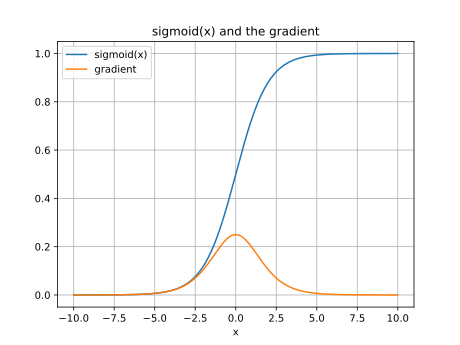

# 分散表現の発展
- 参考文献
  - [深層学習](https://www.kspub.co.jp/book/detail/1529021.html)
  - [ゼロから作るDeep Learning ――Pythonで学ぶディープラーニングの理論と実装](https://www.oreilly.co.jp/books/9784873117584/)
  - [ゼロから作るDeep Learning ❷ ――自然言語処理編](https://www.oreilly.co.jp/books/9784873118369/)
  - [転移学習とは | メリット・デメリット・ファインチューニングの意味](https://ledge.ai/transfer-learning/)
  - [Pre-Trained Models: Past, Present and Future](https://arxiv.org/abs/2106.07139)
  - [Applications of Deep Neural Networks](https://arxiv.org/abs/2009.05673)

---

(nn-history)=
## NNの歴史
初期のNNにおいてもそれなりに複雑な事象を学習できるモデルになり得たが、近年脚光を浴びている **深層学習（Deep Learning）** の実現にはいくつかのブレイクスルーが必要だった。とりわけ大きな問題の一つは **勾配消失問題(vanishing gradient problem)** と呼ばれている。下図は代表的な活性化関数であるシグモイド関数とその勾配を示している。勾配を観察すると最大でも $0.25$ である。これはパラメータを更新する際には最大でも0.25倍に小さくなった値で探索することを意味する。シグモイド関数を2つ用いる場合、すなわち中間層を2層重ねた場合には $0.25^2 = 0.0625$、3層重ねると $0.25^3 = 0.015625$ となり、ほとんど更新できなくなってしまう。モデルとしては中間層を多数重ねることで表現の自由度は増すが、適切なパラメータを求める手段がなかった。深層学習が現実的となってきた背景にはこの問題への取り組みがある。以下では代表的な改善策を眺めていこう。



```{note}
授業「データマイニング」としては機械学習の詳細アルゴリズムまでは踏み込まないが、特徴量設計やモデルの工夫という点で参考になる観点があるため紹介する。
```

---
### GD => SGD
まず1つ目の工夫として、勾配法(GD)を用いた最適解探索において広く用いられる改善策である **確率的勾配降下法（stochastic gradient descent; SGD）** がある。GDは全てのサンプルを対象とした損失関数の勾配に基づきパラメータ探索を行う。パラメータ数が1個ならば損失関数の勾配空間は谷は1つしか存在せず、適切な学習率を設定することで最適パラメータを求めることができる。しかしながら一般的にモデルの持つパラメータは複数であり、それらの組み合わせにより複数の谷ができてしまう。このため単純な勾配法だけでは局所的な極小解（以降、局所解と呼ぶ）にトラップされてしまうことがある。実際のトラップされやすさは問題の複雑さとモデルの複雑さに依存する。

GDの局所解への陥りやすさを改善するため、SGDにおいてはミニバッチとランダム・サンプリングを用いて勾配を求める。ここでいうバッチ(batch)とはサンプル集合全てを指す。これに対して **ミニバッチ(minibatch)** とはサンプル集合における部分集合を指す。またランダムサンプリングとは母集団からランダムにサンプルを抽出することを意味する。SGDではランダム抽出によりミニバッチを用意し、そのミニバッチに対して勾配法によりパラメータ更新を行う。このようなミニバッチ型の学習は **ミニバッチ学習(minibatch learning)** を呼ばれており、勾配法でミニバッチ学習を行うのがSGDである。

SGDのメリットは、(1)バッチ学習と比べてミニバッチ単位で処理するため計算資源を調整しやすく、(2)バッチ学習における勾配空間は固定されているために局所解へトラップされやすいが、ミニバッチ学習においてはその都度勾配空間が異なるためそのリスクが減少する。また、(3)バッチ学習よりもパラメータ更新の頻度が多くなるため結果として途中経過を観察しやすい。これらの利点は、ほぼミニバッチ学習そのものの利点でもあるため、他の反復法においても有効に機能しやすい極めて汎用性が高い工夫である。

---
### SGD => Momentum => AdaGrad => Adam
SGDはミニバッチごとに勾配空間が異なるため局所解へとラップされにくくなる。しかしながら「学習係数*勾配」により移動していることは一緒のため、[GDと同様にジグザグ挙動](https://en.wikipedia.org/wiki/Gradient_descent#Examples)をしてしまうため学習に時間がかかってしまう。詳細は前述リンク先のWikipediaを参照すると各々解説と出典が掲載されている。ここでは代表的なものをいくつか眺めていこう。

ジグザグ動作に対する第一の改善案が移動に速度の概念を導入した[モーメンタム(momentum; 運動量)](https://en.wikipedia.org/wiki/Stochastic_gradient_descent#Momentum)だ。モーメンタムでは重みの更新度合いを運動量として捉え、加算され続けるなら加速し、何もなければ減衰（空気抵抗や摩擦等の外部要因により停止）するように動作する。これによりSGDと比べるとジグザグ度合いがやや改善された動作になった。

Momentumとは異なるアプローチとして、学習係数を制御する方法も提案された。その一つ[AdaGrad](https://en.wikipedia.org/wiki/Stochastic_gradient_descent#AdaGrad)では、パラメータの要素ごとに適応的に学習係数を調整する。要素ごとに調整するために勾配を加算し続ける項（正確には勾配の二乗を加算し続ける項）を導入する。この項で移動量を乗算することにより、学習初期は加算した項がまだ小さく、移動幅が大きい。移動幅が大きい場合や、何度も移動を繰り返して加算項が大きくなってくると、移動幅が小さくなるように機能する。このような考え方は、古くは最適化の分野で焼き鈍し法と呼ばれている方法だが、それをより細かに調整している点、パラメータ毎に調整している点が新しい。

```{note}
さらにMomentumとAdaGradとを融合したような[Adam](https://en.wikipedia.org/wiki/Stochastic_gradient_descent#Adam)も提案されている。重要なのは「**銀の弾丸はない**」という点だ。ここで列挙した手法の中ではAdamが最新だが、問題により性能の良し悪しは異なり、今なおSGDが向いているケースは少なくない。言い換えるとSGDは時間がかかることが問題なのであって、他の手法はそれを省略しようとする工夫をしているためそれが有効に機能する範疇においては機能するが、そうでない場合には想定外の探索をしてしまい結果的に時間が長くなったり精度が劣化することもありうる。
```

---
### ReLU
勾配消失問題への大きな打開策となる一つが **正規化線形関数(rectified lineear function)** を活性化関数として用いた **Rectified linear units (ReLU)** だ。これは $f(x) = max(x, 0)$ というシンプルな非線形関数である。シグモイド関数では入力が小さすぎたり大きすぎたりすると勾配がほとんど0になってしまうが、ReLUでは入力が正ならば常に勾配は1であり、これにより学習効率が格段に向上した。

 by [Wikipedia:正規化線形関数](https://ja.wikipedia.org/wiki/正規化線形関数)

- ReLU
  - [V. Nair and G. E. Hinton. Rectified linear units improve restricted boltzmann machines. In Proc. ICML, 2010.](https://www.cs.toronto.edu/~fritz/absps/reluICML.pdf)

---
### autoencoder
ReLUと並ぶ勾配消失問題への取り組みが **自己符号化器(オートエンコーダ; autoencoder)** である。これはword2vecのような表現学習を積み重ねていくことで層を深くするというアプローチだ。例えば中間層1層のときには通常のword2vecのように表現学習を行う。そこで得たエンコード部分（入力層と中間層の間の重み）を残し、その中間層からの出力を新たな新たな入力として捉え中間層2つ目を学習する。以降同様に1層ずつ中間層を学習していくやり方は積層オートエンコーダと呼ばれている。オートエンコーダでは全ての中間層を一度に学習するのではなく、部分的に学習して重みを固定し、次の層における入出力として扱うことで「勾配消失問題」の解消に大きく貢献した。

 by [MathWorks:オートエンコーダ（自己符号化器）とは](https://jp.mathworks.com/discovery/autoencoder.html)

- autoencoder, pretraining
  - [G. E. Hinton, S. Osindero, and Y. Teh. A fast learning algorithm for deep belief nets. Neural Computation, 18:1527-1544, 2006.](https://www.cs.toronto.edu/~hinton/absps/fastnc.pdf)

---
### CNN
従来のNNにおいては入力データがベクトル、すなわち全ての特徴量が独立していることを前提としてていた。この名残りが「全結合層」によるネットワーク構成だ。これは、画像のように「本来なら2次元空間座標内における距離」に意味のあるデータであったとしても、入力をただのベクトルとして処理してしまっていることを意味する。このため「あるピクセルから横に10ピクセル分ほど類似した色が続いているため、横方向に繋がった直線だろう」という認識をしづらい（できなくはない）。

これに対し2種類の異なる結合方式を組み合わせ、次節で述べるdropoutも併用することで深層学習の脚光を浴びることになったのが **畳み込みニューラルネットワーク(Convolutional neural network)** である。その原型となったネオコグニトロンは1980年代に提案されており、文字認識で高い精度をあげた。CNNは畳み込み層・プーリング層と呼ばれる2種類の中間層を複数回繰り返し、最後に全結合層とsoftmaxというネットワーク構成を取ることが多い。

 by [Wikipedia:Convolutional neural network](https://en.wikipedia.org/wiki/Convolutional_neural_network)

 by [A Comprehensive Guide to Convolutional Neural Networks](https://towardsdatascience.com/a-comprehensive-guide-to-convolutional-neural-networks-the-eli5-way-3bd2b1164a53)

畳み込み層(convolutional layer)では、局所的な特徴を捉えるために (1) **入力データをベクトルではなくテンソルとして扱う**。テンソルとは行列のまとまりのようなものであり、今回の例である画像ならば ``縦x横`` の行列として各ピクセル上の色情報を保持する。ここで、色情報はRGBなど[3次元もしくは4次元の色空間](https://ja.wikipedia.org/wiki/色空間)の情報を持つため、同じサイズの行列が3つないし4つある。ここではRGBの3種あるとするならば、``縦x横x3``のテンソルとなる。テンソルのまま扱うことで「あるピクセルの付近にはこういう特徴がある」ということを検出しやすくなる。

局所的な情報を捉えるための次の一手として、畳み込み層による局所的な特徴抽出とプーリング層による位置情報のズレ緩和を行う。**畳み込み層(convolutional layer)** では、「画像の一部分だけを考慮するユニット（フィルタ(filter), 特徴マップ(feature map), 活性化マップ(activation map)等と呼ばれる）」を考える。このユニットは、ある画素を中心として例えば3x3マスの周囲のみと結合している。このように元の画像データにおける周囲という情報を加味して処理することにより、局所的な特徴を捉えようとする。**プーリング層(pooling layer)** では、入力された画像をより小さな画像へと縮小することで全体を概観しようとする。

- [A Comprehensive Guide to Convolutional Neural Networks](https://towardsdatascience.com/a-comprehensive-guide-to-convolutional-neural-networks-the-eli5-way-3bd2b1164a53)より引用
  - 
  - 

- CNN
  - [K. Fukushima. Neocognitron. Neocognitron: A self-organizing neural network model for a mechanism of pattern recognition unaffected by shift in position. Biological Cybernetics 36, 193-202, 1980.](https://link.springer.com/article/10.1007/BF00344251)
  - [Y. LeCunn, L. Bottou, Y. Bengio, and P. Haffner. Gradient-based learning applied to document recognition. Proceedings of the IEEE, 86(11): 2278-2324, 1998.](http://yann.lecun.com/exdb/publis/pdf/lecun-01a.pdf)

---
### RNN => LSTM
CNNがテンソルにより局所的な特徴を捉えることを実現していたように、ベクトルとは異なるアプローチで局所的な特徴を捉えようとしたアプローチが **再帰型ニューラルネットワーク(Recurrent Neural Network; RNN)** だ。RNNでは時間の経過とともに値が変化する時系列データを対象とする。自然言語も「ある文字列が出現する確率はどのぐらいか」「ある文字列の次にどの文字列が出現しやすいか」のように過去に出現した文字列に依存したデータであり、文字列生成（文章生成）を中心としたタスクにおいて頻繁に利用されている。

RNNでは時系列データにおける時刻変化を捉えるために、t時刻前における中間層の出力を加味して推論しようとする。ネットワーク構造としては、通常のNNやCNNが順伝搬方向のみにデータが流れて処理されるのに対し、RNNでは中間層の出力が中間層に再び入力される（再帰）構造を有する。単純なモデルとして書くと次のようになる。

```{math}
NN: out = hidden(input) \\
RNN: out_t = hidden(input_t, hidden_{t-1})
```

 by [再帰型ニューラルネットワークの「基礎の基礎」を理解する　～ディープラーニング入門｜第3回](https://www.imagazine.co.jp/再帰型ニューラルネットワークの「基礎の基礎」/)

上図のように、ある時刻$t$における出力$y_t$を求めるために、(a)入力$x_t$と、(b)入力$x_{t-1}$を入力したときの中間層の出力を利用する。1時刻前の中間層出力には、更にその前の時刻における情報が蓄積されていることを期待している。しかしながら長い系列、例えば100文字の文章といった場合には過去の情報ほど薄れてしまうため、事実上遡ること（遡って学習すること）が困難であった。

このRNNを特性を有しつつ長い系列データにおいても機能するよう拡張されたアイデアが **LSTM (Long Short Term Memory)** である。名前の通り長期記憶と短期記憶をモデル化しており、情報を記憶するメモリセルと時間経過による各要素の変化を制御する忘却ゲートを導入した。忘却ゲートは学習により「忘れるべき」と判断したメモリセルに対して勾配を小さくし、その反対に「忘れてはいけない」と判断した要素についてはその勾配を劣化させずに過去方向に伝える。これにより短期記憶・長期記憶を実現した。

 by [再帰型ニューラルネットワークの「基礎の基礎」を理解する　～ディープラーニング入門｜第3回](https://www.imagazine.co.jp/再帰型ニューラルネットワークの「基礎の基礎」/)

- LSTM
  - S. Hochreiter and J.Schmidhuber. Long short-term memory. Neural Computation, 9(8):1735-1780, 1997.
  - [再帰型ニューラルネットワークの「基礎の基礎」を理解する　～ディープラーニング入門｜第3回](https://www.imagazine.co.jp/再帰型ニューラルネットワークの「基礎の基礎」/)

---
### dropout
CNNの出現により多層の中間層を同時に学習することが現実的となってきた。この学習をより効果的に推し進めるため、精度向上と計算効率改善のためのアプローチが多数提案されている。その一つ **ドロップアウト(Dropout)** は、学習時に指定した確率でランダムにニューロンを一時的に消去しながら学習を行う。ここでいう消去とはそのニューロンを存在しないものとして扱い、それ以外の生きているニューロンだけで順伝搬・逆伝搬・パラメータ更新を行う。

ドロップアウトではニューロンが一時的に消去されるため、直接的にはパラメータ数削減による過学習の抑制効果も期待できる。本質的には「毎回異なる小さなネットワーク」で学習する点が大きい。すなわちドロップアウトとは、一つの大きなネットワークの中からミニバッチ毎に異なる小さなサブネットワークを切り出し、それだけでうまく答えられるように学習を行う。小さなサブネットワークでそれなりに答えられるようになるのであれば、全体としても精度が向上するはずだ。このような考え方を[アンサンブル学習](https://ipsj.ixsq.nii.ac.jp/ej/?action=pages_view_main&active_action=repository_view_main_item_detail&item_id=18021&item_no=1&page_id=13&block_id=8)と呼ぶ。

 by [第5回　画像認識を行う深層学習（CNN）を作成してみよう（TensorFlow編）](https://www.atmarkit.co.jp/ait/articles/1804/24/news134_2.html)

- Dropout
  - [N. Srivastava, G. E. Hinton, A. Krizhevsky, I. Stuskever, and R. Salakhutdinov. Dropout: A simple way to prevent neural networks from overfitting. Journal of Machine Learning Research, 15:1929-1958, 2014.](https://www.cs.toronto.edu/~hinton/absps/JMLRdropout.pdf)

---
### Batch Normalization
ここでいうnormalization(正規化)は、数値データに対する前処理で出てきたものと考え方は一緒だ。ただし入力データに適用するのではなく、ミニバッチ単位である中間層の出力に対して適用する点が大きく異なる。例えば、従来のネットワーク構造が ``input -> affine -> ReLU -> output`` のようになっていたとするなら、``input -> affine -> BN -> ReLU -> output`` のように中間層出力をスケーリングしてしまうように設置することが多い。これにより次のユニットに入力される値が適度に分布を持つ扱いやすい形になりやすくなる。

 by [Batch Normalization](https://medium.com/deep-learning-g/batch-normalization-af993b5d58b1)

- Batch Normalization
  - [Sergey Ioffe and Christian Szegedy. Batch Normalization: Accelerating Deep Network Training by Reducing Internal Covariate Shift. eprint arXiv:1502.03167, 2015](https://arxiv.org/abs/1502.03167)

```{tip}
Batch NormalizationはDropoutと併用して使うことは避けたほうが良い。[Understanding the Disharmony between Dropout and Batch Normalization by Variance Shift](https://arxiv.org/abs/1801.05134)のように ``Disharmony(調和しない)`` ことについて報告されている。なおここでいう併用とは同じ部分で使うことを避けるべきということであり、例えば10層ネットワークにおいて前段から8層目までをBatch Normalizationを指定し、残り2層分でDropoutするというように分けて利用する分には問題になりにくい。
```

---
## pretraining + fine-tuning
オートエンコーダやLSTMにより深層学習が現実的なものになりはじめると共に、あまりにも大きな計算資源を必要とする学習を何度もやり直すことの非現実さにも直面し始めた。

- [Xu Han and et. al., Pre-Trained Models: Past, Present and Future, arXiv:2106.07139](https://arxiv.org/abs/2106.07139) より引用。
  - 
  - 
  - 

このような問題意識から取り組まれているのが転移学習や、事前学習とファインチューニングと呼ばれる学習方式だ。これらはどちらも2段階の学習を行う点で共通している。明確な区分はなされてないが、ファインチューニング時に「ドメイン」「タスク」どちらか片方でも異なるケースを転移学習と呼ぶことが多い。ドメインとはある分野に関する知識を指しており、例えば「映画レビューにおける極性判定」をする際に必要なドメイン知識と「ニュース記事におけるクラス推定」をするためのドメイン知識とでは異なる知識が必要になるだろう。振り返ると、本当にやりたいこととは異なるドメイン知識もしくは異なるタスクにおいて予め事前学習を行い、その学習結果（学習で得られたパラメータ）を用いて本当にやりたいことを学習するという2段階の学習を行うのが転移学習である。

- 定義
  - [Wikipedia: Transfer learning](https://en.wikipedia.org/wiki/Transfer_learning)
    - "Transfer learning (TL) is a research problem in machine learning that focuses on storing knowledge gained while solving one problem and applying it to a different but related problem.[1] For example, knowledge gained while learning to recognize cars could apply when trying to recognize trucks."
- 転移学習の目指すアプローチ
  - 
  - 2種類のドメインとタスクに関する変数として、
    - 転移前（ソース）：Ds, Ts, hs
    - 転移後（ターゲット）：Dt, Tt, ht
  - がある状況を想定しよう。ここでDsとDt、TsとTtは互いに異なるものとする。
  - 通常の機械学習ではDsにおけるTsを実現するためのhs獲得を目指す。これに対し転移学習においては、「Ds, Tsの知識を用いて、DtにおけるTtを実現するためのht獲得を効率よく行う」ことを目指す。ここで、【Ds, Tsの知識】は学習済みモデル（hs）のことを指している。
- 関連
  - ドメイン適応（domain adaptation）
  - 
    - [Wikipedia: Domain adaptaion](https://en.wikipedia.org/wiki/Domain_adaptation)より引用。
- 特徴（理想状態）
  - 
    - [A Gentle Introduction to Transfer Learning for Deep Learning](https://machinelearningmastery.com/transfer-learning-for-deep-learning/)より引用。
  - 転移学習し始めた学習開始時点におけるパフォーマンスは、通常の単独の機械学習と比べると良くなる傾向にある。
  - 学習開始時点だけではなく、その後の学習もよりスムーズに改善しやすい傾向にある。
  - 最終的にも、単独の機械学習だけで学習し続けた場合よりもより良いパフォーマンスを発揮する傾向にある。

- autoencoder, pretraining
  - G. E. Hinton, S. Osindero, and Y. Teh. A fast learning algorithm for deep belief nets. Neural Computation, 18:1527-1544, 2006.
  - Y. Bengio, P. Lamblin, D. Popovic, and H. Larochelle. Greedy layer-wise training of deep networks. In Proc. NIPS, 2006.
  - [転移学習とは | メリット・デメリット・ファインチューニングの意味](https://ledge.ai/transfer-learning/)
  - [Applications of Deep Neural Networks](https://arxiv.org/abs/2009.05673)
  - [Xu Han and et. al., Pre-Trained Models: Past, Present and Future, arXiv:2106.07139](https://arxiv.org/abs/2106.07139)

---
## 転移学習の実応用例
### 画像処理での例
- [TRANSFER LEARNING FOR COMPUTER VISION TUTORIAL](https://pytorch.org/tutorials/beginner/transfer_learning_tutorial.html)
  - PyTorchの公式チュートリアル。コード付き。ImageNetで学習済みのResNet18を用いて、100枚程度の小数サンプルしか用意していないアリとハチの画像を分類する追加学習をする例。ResNet18の層は追加学習時には重みを変更しないよう固定してしまい、追加した層でのみ新たな学習をする。
- [Transfer learning and fine-tuning](https://www.tensorflow.org/guide/keras/transfer_learning)
  - TensorFlowの公式チュートリアル。コード付き。ImageNetで学習済みモデルを用いて犬猫分類する追加学習をしている。追加学習のtipsとして、BatchNomalization を含むモデルの場合、推論時と学習時との動作違いによるミスマッチへの対応するため、最初は学習済みモデルを固定して追加学習し、その後で学習率を下げて全体を微調整学習するという流れを例示しています。
- [Transfer learning with TensorFlow Hub](https://www.tensorflow.org/tutorials/images/transfer_learning_with_hub)
  - TensorFlowの公式チュートリアル。コード付き。各種学習済みモデルが登録されている TensorFlow Hub を利用する例。

---
### 自然言語処理での例
- [BERT](https://github.com/google-research/bert)
  - Masked LM, Next Sentence Predictionという2つのタスクで事前学習しておく。そこで得られたモデルを利用し、本当にやりたいタスクに適用。同じモデルで異なる2種類のタスクを学習することは、考えようによっては「どちらか片方だけに特化したモデル」になったり、「どちらにも不十分なモデル」になりそうであったり、何かしらデメリットが大きそうだ。しかし大前提として、言語モデルを構築するのに100次元とか200次元とかの密ベクトル空間は本当に必要十分なサイズかというと、実はそうではない（無駄が大きい）ということが一般的に言われています。
    - 蛇足：一方で、どのぐらいのサイズが必要なのか、どこが無駄なのかは分かっていない。
      - 参考：[人間が深層学習のAIを理解できないのには、理由がある](https://globe.asahi.com/article/12872410)
  - 同じサイズの空間内に、同じ事象を表現する力が多数備わっているとでも言えば良いでしょうか。あるタスクに対する局所解が多数存在する空間をイメージしてください。初期値の違いやハイパーパラメータの僅かな違いで収束する先が異なりますが、モデル全体としての表現力は似たりよったりという状況です。この状況は、 **「ある特定タスクに対して似たりよったりの表現力を持つモデル」** になっています。特定タスクに特化した学習を進行しているだけであり、それ以上でもそれ以下でもない特化モデルを獲得しようとしています。特化モデルとは、他のタスクは考慮していないという意味での特化です。特化した分だけそのタスクに対しては能力は秀でているかもしれませんが、柔軟性が低く、他には適用できない硬すぎるモデルになっている可能性があります。
  - 特化モデルに対し、BERTでは「言語モデルを必要とする異なる2種類のタスク」を同じモデルで学習している（できるような工夫も施している）点に特徴があります。異なるタスクですが、どちらでも言語的な理解を必要としています。もし、各々独立して学習させた場合には、以下のようなモデルを獲得できるでしょう。
    - タスク1だけで学習したモデルには、そのモデルで学べる理解がある程度含まれているはず。
    - タスク2だけで学習したモデルには、そのモデルで学べる理解がある程度含まれているはず。
  - これに対してBERTでは「特化したモデルが保有する特化した理解」の汎用化を目指して、2つのタスクを事前学習しています。言い換えると、**2つのタスクをうまく説明できるような言語モデルを学習するように強制した状況（制約のある状況）で学習するように、追い込んでいます**。2つのタスクをうまく説明できるのであれば、その分だけ特化モデルよりは汎用性が高いモデルを得られたと解釈することができるでしょう。このことを **「general language presentation」** と呼んでおり、その獲得のための手法が切磋琢磨されています。
- シンプルな転移学習例
  - 他の大規模コーパスからword2vec, fastText, BERT等でモデル構築（事前学習）するか、もしくは学習済みモデルを採用する。ここでの事前学習とは、大規模コーパスから構築した言語モデルを指す。
  - 学習済みモデルを用いて、別タスク向けのデータセットを構築し、学習（ファインチューニング）する。
  - コード例
    - 簡易版転移学習の例: [ [gensim版](./fine-tuning.ipynb) | [spacy版](./fine-tuning-spacy.ipynb) ]
      - ソースが異なり、タスクも異なる、unsupervised transfer learningの例。
      - ここでは事前学習の際に自前でコーパス用意することも想定した例ということで Wikipedia ダンプデータをわざわざローカルで学習していますが、動作確認するぐらいなら gensim, fastText, BERT等は学習済みモデルも公開しているので、そちらを使う方が楽です。ただし、Google Colabで学習済み fastText はメモリ不足のため動作しませんでした。
- 別例1：[Transfer Learning for NLP: Sentiment Analysis on Amazon Reviews](https://github.com/feedly/ml-demos/blob/master/source/TransferLearningNLP.ipynb)
  - アマゾンのレビュー評価付きテキストデータで、学習用300万サンプル、テスト用65万サンプル。事前学習なしでもそれなりに取り組めそうな規模です。
- 別例2：[BERT Tutorial on Colaboratory](https://colab.research.google.com/drive/1ywsvwO6thOVOrfagjjfuxEf6xVRxbUNO)
  - Colaboratory想定のため、環境構築はとっても楽。
  - ちなみに、BERTの事前学習自体に要する計算リソースはと〜〜〜〜〜っても高いです。公式曰く "Pre-training is fairly expensive (four days on 4 to 16 Cloud TPUs)"。
- 別例3: T5 (Text-To-Text Transfer Transformer)
  - [転移学習のサンプルコード](https://github.com/sonoisa/t5-japanese)

---
### 討論
- Q1：BERTの事前学習では、大規模なデータセットで2種類の異なるタスクを同一モデルでこなすように学習することで、より汎用性の高い言語モデルの獲得を目指している。ここでいう「汎用性の高い」状態とは、どのような状態だろうか？
- Q2：より大規模なデータセットと、より多数の異なるタスクを用意できれば、それで何も問題なく「良く」なるのだろうか？
  - 関連
    - https://twitter.com/kahajime/status/1199685614695661569
      - "AIの「分析」が「差別」を固定化する危険性については、アメリカではかなり議論されています。"
      - "たとえば、イギリスの警察では、再犯を犯す可能性の程度を予測するアルゴリズムが使用されていますが、[貧困地域に居住する者がより不利に判断されるという結果が生じている](https://www.wired.co.uk/article/police-ai-uk-durham-hart-checkpoint-algorithm-edit)、と問題となりました。"
    - [アップルのクレジットカードが「性差別」か　米当局が調査](https://www.bbc.com/japanese/50370810)
      - "「与信枠決定は顧客の信用度に基づいており、ジェンダーや人種、年齢、性的指向も、違法とされる基準も使っていない」"

---
## 実用的なライブラリや学習済みモデル例
- [gensim](https://radimrehurek.com/gensim/)
  - word2vec, doc2vec, fastTextの代表的な実装。
- [fastText](https://fasttext.cc)
  - Facebookが開発した軽量な分散表現学習器。基本的には文書分類タスクを想定。157言語の学習済みモデルを提供。
  - 
  - [Enriching Word Vectors with Subword Information](https://arxiv.org/abs/1607.04606)より引用。
  - 「Efficient learning for text classification」 by [facebook research](https://research.fb.com/fasttext/)
    - "To be efficient on datasets with very large number of categories, it uses a hierarchical classifier instead of a flat structure, in which the different categories are organized in a tree (think binary tree instead of list)."
    - "FastText also represents a text by a low dimensional vector, which is obtained by summing vectors corresponding to the words appearing in the text. In fastText, a low dimensional vector is associated to each word of the vocabulary. "
  - [How does fastText (Facebook) work? Is there any research paper or blog post explaining the theory behind its working?](https://www.quora.com/How-does-fastText-Facebook-work-Is-there-any-research-paper-or-blog-post-explaining-the-theory-behind-its-working)
    - "The gist of fastText is that instead of directly learning a vector representation for a word (as with word2vec), we learn a representation for each character n-gram. Each word is represented as a bag of character n-grams, so the overall word embedding is a sum of these character n-grams."
    - "As a simple example, if we set n=3, the vector for the word “where” would be represented by a sum of trigrams: <wh, whe, her, ere, re> (where <, > are boundary symbols denoting the beginning and end of a word)."
  - subwordという考え方
    - [Enriching Word Vectors with Subword Information](https://arxiv.org/abs/1607.04606)
    - [Subword Neural Machine Translation](https://github.com/rsennrich/subword-nmt)
    - 主なメリット
      - 文字繋がりで単語を表現するため、次元数を減らすことが可能。
      - 未知語・新語に対しても、その構成要素である文字群からある程度の推定が可能。（かなり強い恩恵。BoWベースやword2vecでは未知語に対応できない）
    - subwordの弊害
      - [fastTextのsubword(部分語)の弊害](http://studylog.hateblo.jp/entry/2016/09/20/103724)
      - 文字繋がりの影響が強すぎる。
- [Github: BERT](https://github.com/google-research/bert)
  - [Google AI Blog: Open Sourcing BERT: State-of-the-Art Pre-training for Natural Language Processing](https://ai.googleblog.com/2018/11/open-sourcing-bert-state-of-art-pre.html)
  - [paper: BERT: Pre-training of Deep Bidirectional Transformers for Language Understanding](https://arxiv.org/abs/1810.04805)
    - 
    - 上記 Table 2より引用。
  - 汎用的なタスク（general-purpose "language understanding" model）を想定した分散表現学習器。学習済みモデルも公開。
  - 2つのステップ
    - 1. pre-training
      - 一つのモデルに対し、複数の異なる教師なし学習で学習。論文では Masked LM（隠した単語の予測タスク）と、Next Sentence Prediction; NSP（隣接文の予測タスク）の2つで学習させたとのこと。この際に Transformer の双方向的（周囲全体）な学習を採用。
    - 2. fine-tuning
      - タスクに応じた学習。
  - Transformerという考え方
    - [Transformer: A Novel Neural Network Architecture for Language Understanding](https://ai.googleblog.com/2017/08/transformer-novel-neural-network.html)
    - [論文解説 Attention Is All You Need (Transformer)](http://deeplearning.hatenablog.com/entry/transformer)
    - [BERT解説：自然言語処理のための最先端言語モデル](https://ainow.ai/2019/05/21/167211/)
- BERT以降
  - [BERT以降の事前学習済みモデルのトレンドと主要モデルを紹介！ Part 1 学習方法編](https://elyza-inc.hatenablog.com/entry/2021/03/25/160727)
  - [【日本語モデル付き】2021年に自然言語処理をする人にお勧めしたい事前学習済みモデル](https://qiita.com/sonoisa/items/a9af64ff641f0bbfed44)
  - T5 (Text-To-Text Transfer Transformer)
    - [日本語T5事前学習済みモデル](https://huggingface.co/sonoisa/t5-base-japanese)
    - [転移学習のサンプルコード](https://github.com/sonoisa/t5-japanese)
  - GPT-3
    - [超汎化言語モデル GPT-3のライセンスを日本でいち早く取得して使ってみた話](https://dev.babel.jp/entry/2021/06/23/180135)
  - [Hugging Face/Transformers](https://huggingface.co/docs/transformers/index)
