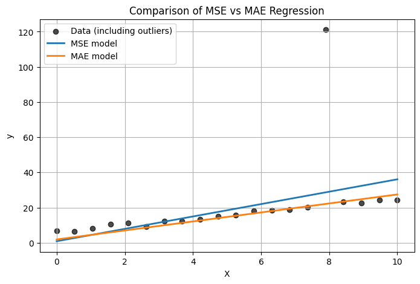
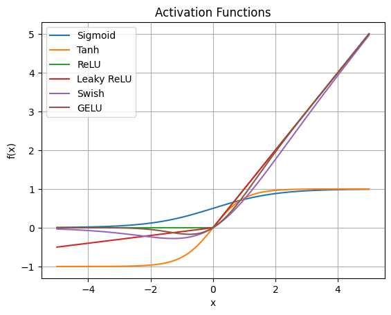
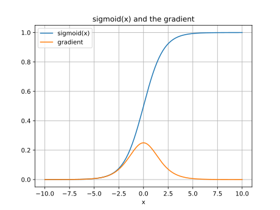
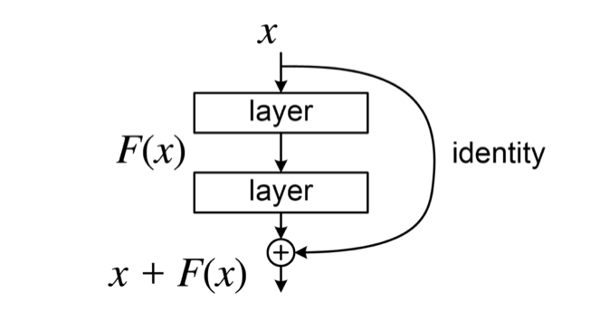

# 古典的機械学習から自己教師あり学習へ（深層学習パラダイムの基盤と展開）

## はじめに
機械学習 (Machine Learning, ML) はデータから学習し、未知のデータに対して汎化的な予測や判断を行うアルゴリズムの研究分野です。近年は計算資源の大幅な進歩と大規模データの蓄積を背景に、ニューラルネットワークを多層構造で運用する **深層学習 (Deep Learning)** が著しい成果を上げ、多くの領域で既存手法を凌駕する結果が得られるようになりました。また、人手によるラベル付けを必要としない **自己教師あり学習 (Self-Supervised Learning, SSL)** が自然言語処理などの分野で大きく進展し、モデル構築の効率化・高性能化に大きく寄与しています。

本資料では、古典的な機械学習の基礎からディープラーニングへの発展の流れを概観した上で、ニューラルネットワークにおける勾配降下法や活性化関数、学習を安定化させるための正規化手法や残差接続といった重要技術を紹介します。さらに、SSL に代表される **ラベル不要の学習パラダイム** が、どのように潜在的な特徴を捉えた強力な表現を可能にしているかを、word2vec を例に解説します。

なお、今日の深層学習を一変させた **Attention** や **Transformer** については本資料では扱いきれないため、別途用意している資料で取り上げる予定です。

---

## 機械学習の基礎（復習+α）
勾配降下法までは復習。その後の確率的勾配降下法だけが追加内容です。

### 機械学習とは
機械学習は、「明示的にプログラムを記述せずにデータから学習してタスクを解くアルゴリズムを構築する」ことを目的とした分野です。
- **教師あり学習 (Supervised Learning)**: 入力データと正解ラベルのペアを用意して学習する
- **教師なし学習 (Unsupervised Learning)**: 正解ラベルを持たず、データ構造を探る
- **自己教師あり学習 (Self-Supervised Learning)**: ラベルづけを人手で行わず、データそのものから自動的に学習用の「疑似ラベル」を生成する

```{note}
「データから学習する」というアプローチを取っているため、データ自体に誤りやバイアスが含まれている場合にはモデル自体が不適切な動作をしがちです。この問題については後日取り上げます。
```

### 機械学習とデータマイニング
統計的な手法やアルゴリズムを用いて、データからパターンを見いだす点で機械学習はデータマイニングの一部として位置づけられます。機械学習はデータマイニングの「モデル構築」を強力に支え、構造的・定量的な知見を得ることに役立ちます。

- 適用例
    - ECサイトのレコメンデーション: ユーザの閲覧履歴や購入履歴、年齢・性別などの属性データを大量に収集・解析し、機械学習モデルでユーザの嗜好や購買傾向を可視化・予測。その結果をもとに、個別に最適化した商品レコメンドを提示したり、販促キャンペーンを設計したりすることで、購買率の向上や在庫管理の効率化が期待できる。
    - 小売業の需要予測: 過去の販売実績や天候、季節要因、イベント情報などをデータマイニングし、売上数量を予測するモデルを構築。需要のピーク時期を事前に把握することで、在庫切れや余剰在庫を防ぎ、効率的なサプライチェーン管理に繋げることができる。
    - 製造業の品質管理・予知保全: 製造装置やセンサから得られる稼働データ・故障ログなどをデータマイニングし、機械学習モデルで異常の兆候や故障の原因を特定。稼働状況のパターンを把握することで、故障前の予知保全を適切なタイミングで行い、ダウンタイムの削減や生産性の向上に繋げることができる。
    - 医療データの解析による診断支援: 電子カルテや検査データを解析し、病気のリスクスコアや診断補助モデルを構築。患者の症状パターンや遺伝情報などをモデル化することで、より早期に重篤な病気を発見し、適切な治療方針の選択に役立てる。

---

## 線形回帰と損失関数（復習）

### 線形回帰モデル
機械学習の代表的な例として、入力 \( x \) と出力 \( y \) の関係を「重み \( w \) とバイアス \( b \)」で線形に近似する**線形回帰 (Linear Regression)** が挙げられます。
\[
\hat{y} = w_1 x_1 + \cdots + w_n x_n + b
\]
これは回帰（連続値の予測）タスクでしばしば用いられる基本的なモデルです。

### 損失関数 (Loss Function)
モデルの予測が正解データからどの程度ズレているかを定量化する指標が損失関数です。回帰タスクでは次のような例が用いられます。

| Loss type | Equation |
| --- | --- |
| $L_1 loss$ | $\sum \|actual - predicted\|$ |
| Mean absolute error (MAE; 平均絶対誤差) | $\frac{1}{N} \sum \|actual - predicted\|$ |
| $L_2 loss$ | $\sum (actual - predicted)^2$ |
| Mean squared error (MSE; 平均二乗誤差) | $\frac{1}{N} \sum (actual - predicted)^2$ |

```{tips}
「L1損失=MAE」「L2損失=MSE」とすることもあります。ここではMSEやMAEの本質的な違いが絶対値と平方にあることを強調するために分けて記述しています。
```

損失を最小化することが、モデルを最適化する大きな目標となります。MAEとMSEどちらを使うべきかはタスク依存のため一概には言えません（下図参照）。MSE は外れ値があるとその影響をより強く受け、MAE は外れ値に比較的ロバストな挙動を示すことが多いです。



コード例: [MAE vs MSE](./MAEvsMSE.ipynb)
```{tips}
上記コードでは[SGDregressor](https://scikit-learn.org/stable/modules/generated/sklearn.linear_model.SGDRegressor.html)を用いているが、これは直接的にMAEを指定することができない。代わりに[Epsilon-Insensitive](https://scikit-learn.org/stable/modules/sgd.html#mathematical-formulation)を使い、epsilon=0.0とすることで実質的にMAEと同じ動作をするようにした。
```

```{note}
一般的な分類問題（多クラス分類問題）においては交差エントロピー損失を用いることが多い。
- 参考
    - [CNNの損失関数(Loss Function) その(1): 交差エントロピーとMSE](https://cvml-expertguide.net/terms/dl/loss-function/loss-function-part1/)
    - [ゴリラで学ぶ交差エントロピー誤差](https://zenn.dev/yuto_mo/articles/56c3df58739d3d)
```

### 勾配降下法 (Gradient Descent, GD)
損失関数を最小化するための代表的な手法に **勾配降下法(Gradient Descent, GD)** があります。勾配降下法は、**損失関数 $L(\theta)$ を最小化するために、$\theta$（パラメータ）の勾配を用いて反対方向へ更新する手法** です。モデルのパラメータ（重みやバイアス）を少しずつ更新し、損失を減らす方向へ移動していきます。更新式は以下の通りです。ただし、$\eta$ は学習率、$\nabla_\theta L(\theta)$ は損失関数の勾配ベクトルです。
```{math}
:label: gd
\theta \leftarrow \theta - \eta \,\nabla_\theta L(\theta)
```

- ステップ1: パラメータを初期化
    - 基本的には乱数で設定するため、ランダムな値になります。
- ステップ2: 現在のパラメータで損失を計算
    - 最初はランダムな値のためモデルの出力結果も出鱈目です。損失はとても大きいでしょう。
- ステップ3: 損失の勾配（偏微分）をもとにパラメータを更新
    - 損失が下がるようにパラメータを更新します。損失が下がる方向は勾配で判断できます。
- ステップ4: 終了条件に達するまで繰り返す
    - パラメータの更新幅がとても小さくなったら（≒十分解が収束したら）、もしくは指定回数更新をし終えたら終了するように実装することが一般的です。

線形回帰では損失関数の形状が **凸 (convex)** になるため、局所最適解に陥ることなく大域的最適解を得られます。

```{tips}
大域的最適解が得られるのはあくまでも「線形回帰＋二乗誤差」の場合だけです。非線形モデル（例えばカーネルSVMで `kernel="rbf"`とした場合）ではパラメータ空間は凸ではありません（＝局所最適解が多数存在します）。このため単純にGDするというのではなく、後述する SGD (確率的勾配降下法) を用いることが多いです。
```

### 確率的勾配降下法 （Stochastic Gradient Descent, SGD)
パラメータ最適化を勾配降下法で行う際、実用場面ではそれを拡張した **確率的勾配降下法 （Stochastic Gradient Descent, SGD)** を用いることが一般的である。GDはデータセット全体の損失 $L(\theta) = \frac{1}{N}\sum_{i=1}^N L_i(\theta)$ の勾配を一度に計算し、パラメータを更新する。全てのサンプルを使って勾配を厳密に求めるため理論的には安定したパラメータ更新がしやすい。しかし大規模データの場合には1回の更新だけでも膨大な計算コストとメモリが必要である。メモリ不足の場合にはそもそも計算できず、パラメータ更新自体ができないことになる。

GDを拡張したSGDでは「1サンプルまたは小数のサンプル（**ミニバッチ**と呼ぶ）に対する損失の勾配を近似的に用いてパラメータを更新する」ように学習を行う。小数サンプルでパラメータを更新する学習方式を**ミニバッチ学習**と呼ぶ。データセット全体の勾配を計算せずに済むため、計算コストが抑えられ、高次元パラメータを持つモデルでも反復更新が行いやすい。ただし、勾配にはノイズが含まれるため、1ステップ毎の更新は不安定になりがちだが、この **「適度なノイズ」** が局所解や鞍点から抜け出しやすくする利点もある。

なお、厳密には単にミニバッチ毎に学習するだけではなく「エポック単位でデータセットをランダムにシャッフル」する。手続きとしてまとめると次のようになる。
- step 1: 学習データセットを用意する。
- step 2: 学習データセットをシャッフルする。
- step 3: シャッフルされた学習データセットに対し、冒頭からミニバッチ毎に分割する。
- step 4: ミニバッチ毎に損失、勾配を求め、パラメータを更新する。

step1〜4に基づいて1つのミニバッチに対してパラメータ更新する単位のことを **ステップ(step)** と呼ぶ。例えば1万サンプルのデータをバッチサイズ1000で分割すると、トータルのミニバッチは10件であり、10回パラメータを更新する（10ステップ学習する）ことになる。全てのサンプルを一通り学習する単位のことを **エポック(Epoch)** と呼ぶ。

```{tip}
近年は **学習率スケジューリング**（初期は大きめ、学習が進むにつれて小さくする）や **ウォームアップ**（最初の数epochだけ段階的に学習率を上げる）などのテクニックが導入され、より安定した学習が可能になっている。
- 参考
    - Step Decay (段階的減衰): 素朴なスケジューラ。エポックまたはイテレーション数がある一定の区切りを超えるたびに、学習率を一定比率（たとえば1/10）に減衰させる手法。[Deep Residual Learning for Image Recognition, 2016](https://www.cv-foundation.org/openaccess/content_cvpr_2016/papers/He_Deep_Residual_Learning_CVPR_2016_paper.pdf)
    - Linear Warmup: こちらも素朴なスケジューラ。学習初期（例: 5エポックや1000イテレーション程度）は学習率を小さな値から段階的に線形で上げ、その後本来のスケジューリングに移行する。[Accurate, Large Minibatch SGD: Training ImageNet in 1 Hour, 2018](https://arxiv.org/abs/1706.02677)
    - Gradual Warmup & Cosine Annealing: ウォームアップを行いながら、途中以降はCosine Annealingで学習率を下げていく手法。学習初期を安定化しつつ、後半で学習率を緩やかに減衰。[Universal Language Model Fine-tuning for Text Classification (ULMFiT), 2018](https://arxiv.org/pdf/1801.06146v5)
```

---

## ニューラルネットワーク

### ニューラルネットワーク概観
ニューラルネットワーク (NN) は、大量のデータから非線形なパターンを学習する強力な枠組みです。1つの入力に対して**重み付き和 + 活性化関数**を連鎖的に適用する層構造をもち、複雑な関数近似を行います。線形回帰では扱いきれなかった非線形関係を、活性化関数を通じてモデル化できる点が大きな特徴です。

ニューラルネットワークに限らず多くの非線形モデルは、線形モデルと比べると表現能力が大きく向上しました。しかし問題となったのは「その非線形モデルにおける最適なパラメータをどのように求める良いのか？」という根本的な問いです。複雑な非線形モデルにおいては局所的な極小値(局所解)や鞍点が多数存在するため、勾配降下法を用いても収束が難しい場合があります。また、大規模データを扱う場合には計算量が非常に大きくなるため、高速なアルゴリズム設計が不可欠です。

他のモデルでも計算グラフを用いるケースは増えてきましたが、NNではこの「計算グラフ」的な分割と合成がとりわけ馴染みやすく、深い層構造を効率的に学習するための誤差逆伝播法 (Backpropagation) が自然に適用できる、という点で大きく発展してきました。

### 脳神経細胞のモデル化から計算グラフへ
人工ニューロンやそれに基づく人工ニューラルネットワーク（Artificial Neural Network; ANN）が提案された当時（例えばMcCulloch & Pitts (1943) や[誤差逆伝播法 (1986)](https://www.nature.com/articles/323533a0)は、脳神経細胞のモデル化とそれを連鎖的に繋げた場合の学習方法に主眼を置いていました。このためユニット（脳神経細胞モデル）を「別のニューロンからの信号を受け取り、増減した上である閾値以上となったら発火する」といった具合にまとめて実装することが多かったです。

これに対し深層学習時代では「荷重和レイヤー」「活性化関数レイヤー」のように機能を分離した単一機能のレイヤーを用意し、それを連鎖的に繋げることで複雑なモデルを構築することが一般的になりました。言い換えるとNNを計算グラフとして捉えることが一般的となり、各レイヤーをノード、レイヤー間のデータ伝達をエッジとして扱うイメージです。

**計算グラフ**として捉えると、モデル全体は合成関数と見做すことができます。例えば「3入力1出力」で計算する単純な例として、以下のように関数 f, g を合成するとしましょう。どちらも2入力を受け取り1個の出力を返す微分可能な関数とします。

- $z = f(x_1, x_2)$
- $y = g(z, x_3)$
- まとめると: $y = g(f(x_1, x_2), x_3)$ となり、fとgの合成関数として書ける。

勾配法を適用するためには y の各入力（$x_1, x_2, x_3$）やモデルパラメータ（重み $w$。ここでは省略しています）に対する勾配 $\partial y / \partial x_1, \partial y / \partial x_2, \partial y / \partial x_3$ を求める必要があります。x_3については直接偏微分により $\partial y/ \partial x_3$ を求めることになります。しかし $x_1, x_2$ については関数gのの出力を通じて影響を及ぼすため、そのままでは勾配を求めることができません。そこで $x_1, x_2$ については連鎖率を用いることで次のように段階的に求めることができます。

- $\frac{\partial y}{\partial x_1} = \frac{\partial z}{\partial x_1} \frac{\partial y}{\partial z}$
- $\frac{\partial y}{\partial x_2} = \frac{\partial z}{\partial x_2} \frac{\partial y}{\partial z}$

これをレイヤー毎に行い、偏微分をリンクさせていく（逆方向に伝播させていく）ことで、モデル全体の勾配を効率よく計算するのが誤差逆伝播法の仕組みです。この枠組みによって、「膨大なパラメータをもつ深いネットワークでも、理論上は勾配情報を利用して学習が可能だ」という画期的な道筋が示されました。もちろん単純に層を増やすだけでは勾配消失などの問題で学習がうまく進まない場合もあります。非凸性による局所最適解のリスクや大規模化に伴う勾配消失問題などの課題については後述します。

```{tip}
計算グラフのより詳細な考え方について興味のある人は以下を参照ください。
- [ニューラルネットワークの実装 ─深層学習フレームワークの構成と Chainer の設計思想─](https://www.jstage.jst.go.jp/article/jjsai/31/2/31_216/_pdf/-char/ja)
- [13. ニューラルネットワークの基礎](https://tutorials.chainer.org/ja/13_Basics_of_Neural_Networks.html)
- [ゼロから作るDeep Learning ―Pythonで学ぶディープラーニングの理論と実装](https://www.oreilly.co.jp/books/9784873117584/)
```

### 演習：NNを動かしてみよう
[Neural networks Playground](https://playground.tensorflow.org/)にアクセスしてください。一般的なNNは階層型モデルとして実装することが多く、ここでは便宜上以下のように定義します。

- 入力層(input layer): 各サンプルの特徴ベクトルをモデルに入力するための層。
- 中間層(hidden layer): 「荷重和＋活性化関数」ユニットを縦に並べたもの。前の層からの出力を受け取り、「荷重和＋活性化関数」した結果を次の層に送ります。
- 出力(output): モデルの最終出力を2次元空間に可視化したもの。

モデルを用意したばかりの初期状態ではパラメータ（重み$w$）は全て乱数で設定されています。データセット、中間層の数・ユニット数・活性化関数などを変更して実行することができます。この演習では2値分類タスクを想定しています。OUTPUTにある青サンプルと赤サンプルがそれぞれクラスに該当するサンプルを表しており、これを綺麗に分類するモデルを構築することが目的です。

- 演習
    - step 1: 中間層を1層、活性化関数を線形(linear)とした状態で実行し、結果を観察してください。
        - 左上の▲ボタンで実行できます。実行ボタンをもう一度推すと一時停止したり、実行を続けることを切り替えることができます。
        - **Epoch（エポック）** とは学習データ全体を何回学習したかを表す数です。例えば100サンプルのデータをミニバッチ10個ずつに分けて学習することを考えると、1つ目のミニバッチを終えた時点を1ステップと呼び、10ステップ（合計100サンプル全て）に対する学習を終えた時点が1エポックとなります。
        - Outputの下に書かれている Test loss がテストデータに対する損失、Training lossが学習データに対する損失を表しています。学習中に増減するグラフはエポック毎の損失推移（テストデータ損失）を表しています。
    - step 2: 中間層のユニット数を2個以上に増やし、実行結果を観察してください。（中間層の層数を増やすのではないことに注意）
        - linearユニットの数を増やしたとしても、モデル全体としては線形モデルのままとなるため表現能力は実質的に増えていません。このためlinearユニット数増加だけでは今回のタスクに適応できません。
    - step 3: 非線形タスクに適応するため、活性化関数をlinear以外（relu, sigmoid, tanh）に変更し、実行結果を観察してください。
        - 非線形な活性化関数を設定することで表現能力が向上します。ユニット数が少ない場合でも非線形なエリア分割が可能となるコットを確認してください。
    - step 4: データを渦巻き状のサンプル集合に変更してください。任意のハイパーパラメータを変更し、可能な限りテスト損失が低くなるようなモデル構築を目指してください。

### 活性化関数 (Activation Function)
ニューラルネットワークの学習能力を高めるためには、**非線形**な活性化関数が必要です。代表的なものとして以下が挙げられます。

```{math}
:label: sigmoid
シグモイド関数: 
\mathrm{Sigmoid}(x) = \frac{1}{1 + e^{-x}}
```
```{math}
:label: tanh
ハイパボリックタンジェント: 
\mathrm{tanh}(x) = \frac{e^x - e^{-x}}{e^x + e^{-x}}
```
```{math}
:label: relu
Rectified\ Linear\ Unit: 
\mathrm{ReLU}(x) = \mathrm{max}(0,x)
```

シグモイドやtanhは伝統的なNN時代で用いられることが多く、深層学習時代では ReLU やそれを拡張した活性化関数（Leaky ReLU、Parametric ReLU、Swish, GELU など）が用いられることが多いです。ただしこれは単にシグモイドやtanhが古くさくて使えないということではなく、タスクやネットワーク構造によっては十分に機能することがあります。



- 参考: [activation_functions.ipynb](./activation_functions.ipynb)

### softmax関数による確率への変換
```{math}
:label: softmax
\mathrm{softmax}(x) = \frac{e^{x_i}}{\sum^K_j e^{x_j}}
```

NNの出力はそのままだと任意の値を取る実数（出力層のユニット数が複数の場合は実数配列）となる。回帰問題においては（条件がない場合には）問題ないが、分類問題においてはこのままだと扱いづらい。そこで分類問題に適用する際には、(1)クラス数と同じ数のユニットを出力層に用意し、(2)各ユニットが該当クラスに属する確率を表すようにネットワークを設計することが多い。例えば「入力された画像に犬が写っているかどうかを判別するモデル」ならば、出力層に「犬ユニット」「それ以外ユニット」の2つのユニットを用意し、それぞれの出力が正を取り、かつ、合計が1となるようにしたい。このときに用いられるのがsoftmax関数（softmax層）だ。

```{tip}
「犬ユニット」「それ以外ユニット」の2つのユニットを用意する例を示したが、2値分類の場合には出力ユニットを1つにした上でシグモイド関数を用いる設計もよく用いられる。
```

softmax関数はk個の実数からなるベクトルxを入力とし、それを入力数の指数に比例するk個の確率からなる確率分布に正規化する。ソフトマックスを適用する前は、ベクトル成分の中には負や1より大きいものがあり、合計が1にならないものもある。しかしソフトマックスを適用した後は、各成分は区間(0, 1)に入り、各成分の合計は1になるため、確率として解釈できるようになる。

```
元の実数列: [-5 -3  0  1 10]
ソフトマックス適用後: [3.05849905e-07 2.25994211e-06 4.53921506e-05 1.23388658e-04
 9.99828653e-01]
確率の総和: 1.0
```

```{tip}
`3.05849905e-07`は[指数表記の一種であるE表記](https://ja.wikipedia.org/wiki/指数表記)と呼ばれる書式を用いた数字表現です。例えば「2e-01」だと、$2 × 10^{-1} = 0.2$ を意味します。
```

- 参考: [softmax.ipynb](./softmax.ipynb)

なお、多クラス分類問題においてはsoftmaxと[クロスエントロピー損失 (Softmax Cross-Entropy)](https://ja.wikipedia.org/wiki/交差エントロピー)を組み合わせるのが定石です。

### 誤差逆伝播法による学習
典型的な全結合型のニューラルネットワーク (Feed-Forward NN) を例に、誤差逆伝播法の流れをざっくり示すと次のようになります。

1. **順伝播 (Forward Pass)**
   - 入力 $\mathbf{x}$ をネットワークに通し、各層で「線形変換（重み付き和） → 活性化関数」を適用しながら最終出力 $\mathbf{\hat{y}}$ を得る。

2. **損失の計算**
   - 予測出力 $\mathbf{\hat{y}}$ と正解ラベル $\mathbf{y}$ を比べて**損失関数** $L(\mathbf{\hat{y}}, \mathbf{y})$ を計算する。

3. **逆伝播 (Backward Pass)**
   - 出力層から順番に、連鎖率 (chain rule) を用いて**勾配**を計算する（各層のパラメータごとに $\frac{\partial L}{\partial w}$ や $\frac{\partial L}{\partial b}$ を得る）。
   - 順伝播時に保存した中間結果と、**次の層（出力側）から伝播される勾配**を用いて計算し、前の層へ逆向きに伝えていく。

4. **パラメータ更新 (SGD)**
   - 各層で得られた勾配を使って「**SGDの更新式**」に基づきパラメータを更新。
   - NNトレーニングフレームワークでは、「逆伝播による勾配の計算」と「勾配降下法 (SGDなど) によるパラメータ更新」は関数呼び出しとして分離されている場合が多い。

```{tip}
丁寧に誤差逆伝播法を理解したい人は、以下を覗いてみてください。

- [13.4.5. 誤差逆伝播法（バックプロパゲーション）](https://tutorials.chainer.org/ja/13_Basics_of_Neural_Networks.html#誤差逆伝播法（バックプロパゲーション）)
- [ニューラルネットワークの数学（逆伝播）](https://free.kikagaku.ai/tutorial/basic_of_deep_learning/learn/neural_network_basic_backward)
```

### 勾配消失問題とその対策
初期のNNにおいてもそれなりに複雑な事象を学習できるモデルになり得たが、近年脚光を浴びている **深層学習（Deep Learning）** の実現にはいくつかのブレイクスルーが必要だった。とりわけ大きな問題の一つは **勾配消失問題(vanishing gradient problem)** と呼ばれている。下図は代表的な活性化関数であるシグモイド関数とその勾配を示している。勾配を観察すると最大でも $0.25$ である。これはパラメータを更新する際には最大でも0.25倍に小さくなった値で探索することを意味する。シグモイド関数を2つ用いる場合、すなわち中間層を2層重ねた場合には $0.25^2 = 0.0625$、3層重ねると $0.25^3 = 0.015625$ となり、ほとんど更新できなくなってしまう。モデルとしては中間層を多数重ねることで表現の自由度は増すが、適切なパラメータを求める手段がなかった。深層学習が現実的となってきた背景にはこの問題への取り組みがある。




CNN系の画像生成AIモデルやRNN系のテキスト生成AIモデルの発展を通して、以下に示すテクニックが提案され、深層学習における安定した学習に寄与してきた。ここでは用語の紹介に留め、詳細は後述する。
- **ReLU や改良型活性化関数**: Leaky ReLU, GELU など
- **ドロップアウト (Dropout)**: ランダムにニューロンを無効化して過学習を抑制
- **正規化 (Normalization)**: Layer Normalization などにより学習を安定化
- **残差接続 (Residual Connection)**: 出力に入力を直接足し合わせる (ResNet 等)

```{tip}
これらの技術は深層学習におけるとても重要な役割を果たしているが、今なお要因不明で学習がうまくいかないことがある。興味のある人は以下を覗いてみてください。
- [Deep Networks: Understanding the Difficulty of Training, 2010](https://proceedings.mlr.press/v9/glorot10a/glorot10a.pdf): 多層ニューラルネットワークを学習する際における勾配消失や勾配爆発の問題を体系的に分析し、活性化関数やパラメータ初期化の選択が重要であることを示した研究。
- [Identifying and attacking the saddle point problem in high-dimensional non-convex optimization, 2014](https://ganguli-gang.stanford.edu/pdf/14.SaddlePoint.NIPS.pdf): 一見「局所極小」のように見える点でも実は[鞍点(あんてん; saddle points)](https://en.wikipedia.org/wiki/Saddle_point)であり、そこからの微妙なステップで急に大きく損失が変動する現象を可視化している例。鞍点は、勾配がゼロで極小値であってもある方向で見れば極大値となる点。鞍点近傍では勾配が小さくなるために学習が一時的に停滞したり、逆にわずかなノイズの影響で急に損失が大きく変動したりする場合があり、学習を不安定にする要因のひとつとされている。
- [Sharp Minima Can Generalize For Deep Nets, 2017](https://proceedings.mlr.press/v70/dinh17b/dinh17b.pdf): 規模バッチ学習で勾配が安定しすぎる（ノイズが少ない）場合、損失の谷が「シャープ(狭い)」な極小に陥りやすく、学習が不安定化する or 汎化性能が悪化するという報告。
```

---

## 自己教師あり学習と単語ベクトル

### 自己教師あり学習 (Self-Supervised Learning, SSL)
大量のデータから自動的に疑似ラベルを生成し、それをもとに学習するのが **自己教師あり学習(Self-Supervised Learningm; SSL)** です。疑似ラベルと書くと不適切なケースが存在することを想像するかもしれませんが、SSLにおける疑似ラベルは「元データに存在する一部分をそのまま疑似ラベルとして利用する」ように生成するため、仕組み上不適切なラベルは生成されません（ただしコーパス自体が不適切な場合を除く）。

SSLはラベル付けのコスト削減だけでなく、データがもつ本質的な特徴を捉えやすいという利点があります（後述）。

### word2vec
自然言語処理 (NLP) において、文章をベクトル表現に変換する初期の成功事例として **[word2vec](https://arxiv.org/abs/1301.3781) (2013)** が挙げられます。
- **CBOW (Continuous Bag-of-Words)**: 周囲の複数単語から中央の単語を推定
- **Skip-gram**: 中央の単語から周囲の単語を推定

word2vecにおける疑似ラベルは以下のように設計します。

- step 1: コーパス（生テキスト）を用意する。
- step 2: ハイパーパラメータである周辺領域サイズを設定する。
- step 3: コーパスから周辺単語と中央単語を自動抽出し、疑似ラベルを設定する。
    - CBOWの場合には周辺単語をinput、中央単語を疑似ラベルとして設定する。
    - Skip-gramの場合には中央単語をinput、周辺単語を疑似ラベルとして設定する。

このstep1〜3はテキストを用意して、周辺単語領域として扱うサイズ（context sizeもしくはwindow sizeと呼ばれることが多い）を決めれば自動的に疑似ラベル付きの学習データを生成することができます。CBOWで生成したデータ例を示します。

- step 1: "Word2vec is a technique in natural language processing (NLP) for obtaining vector representations of words."
- step 2: window size = 2.

| 周辺単語(入力) | 疑似ラベル |
| --- | --- |
| NA, NA, is, a | word2ec |
| NA, word2vec, a, technique | is |
| word2vec, is, technique, in | a |
| is, a, in, natural | technique |
| a, technique, natural, language | in |
| 以下同様のため省略 | |

CBOW は比較的高頻度語の学習に強みがあり、Skip-gram は低頻度語もしっかり学習できるなど特性が異なりますが、いずれも「単語と文脈の分布的特徴を学習する」という点では共通です。学習の際に **Negative Sampling** や **Hierarchical Softmax** を導入して大幅に高速化したことも、word2vec の普及を後押ししました。

自己教師あり学習によって語彙同士の意味的な類似度をうまく捉えることができ、たとえば有名な例として、

> Paris – France + Italy ≈ Rome

のような演算が可能になります。Parisに対応するベクトル、Franceに対応するベクトル、、、それぞれのベクトルを用意し、ベクトルの加算減算をするだけで答えに相当するベクトルを取得できるようになりました。<u>「首都 - 国 + 別の国 = 別の国の首都」という論理を直接プログラムしたわけではなく、「周辺単語と中央単語を相互に推定する」というタスクだけで学習データ（大量のテキスト）を与えられた結果、そうした関係性がベクトル空間に浮かび上がってきた</u>のが大きな特徴です。

なお、語形変化のパターン（“big → bigger” など）や、ある程度の文化的連想（“Japan → sushi”）が出る場合もあります。また実際には失敗例や解釈があいまいになるケースも多々存在します。それでも、明示的に「国」や「首都」の概念を教えずとも分散表現が学習できるという事実は、**自己教師あり学習 (Self-Supervised Learning)** の有用性を広く示す最初期の成功例となりました。word2vecの考え方は、後の GloVe や FastText、さらには大規模トランスフォーマーモデル (BERT, GPT など) にも通じる基盤となり、<u>今日の深層学習を支える基本的なパラダイムの1つ</u>として重要な位置づけにあります。

```{tip}
- word2vecでは同音異義語（bank=銀行 or 川岸）や語義の多様性、また短い頻度の少ない単語などはうまくベクトル化できない場合があります。
- word2vecにおける CBOW と Skip-gram の違いは学習方向のみではありません。より詳細は論文を読んでみてください。
- 参考
    - [Word2Vec：発明した本人も驚く単語ベクトルの驚異的な力](https://deepage.net/bigdata/machine_learning/2016/09/02/word2vec_power_of_word_vector.html)
    - [絵で理解するWord2vecの仕組み](https://qiita.com/Hironsan/items/11b388575a058dc8a46a)
```

### one-hot 表現（復習）
ところで、Parisのような単語をどのようにNNに入力すると良いでしょうか。疑似データ付きのデータセットを自動生成できたとしても、そもそもモデルへ入力することができなければ学習することもできません。この点についてはword2vec以前から用いられていたアプローチとして **one-hot 表現** が用いられていました。

- 参考: one-hot表現: {ref}`one-hot-encoding`

### word2vecにおける学習
- 参考: {ref}`word2vec-howtobuild`

### ここまでのサマリ
**NN + SSL** という枠組みは教師ラベルを人手で作成することなく疑似データのみで学習でき、その上で潜在的な特徴を捉えたベクトル空間を構築できることが極めて画期的であった。ただし機能的に十分ではなく、word2vecに提案された2013年当時のモデルでは、例えば以下のような欠点があった。

- 文脈依存性がない (bank = 銀行 or 川岸 を区別できない)
    - one-hot表現のため、多義語な単語を文脈に応じて区別することができない。
- 単語順序を明示的に扱わない
    - "Alice likes Bob." と "Bob likes Alice."を区別できない。
- 新出単語が扱えない (語彙外 OOV 問題)
    - one-hot表現のため、コーパスに存在しない単語は全て unknown として扱うことになる。

これら以外にもあるが、「モデル改善→残された課題」を繰り返していくことで今日のLLM/VLMに繋がっている。本資料では代表的な改善アプローチを紹介していく。

---

## ディープラーニングの進展と主要技術
NN + SSL により一定程度の潜在的特徴空間を構築することができるようになったが、適切に文脈を捉える力はまだ不足していた。NNの立場からすると「より適切に文脈を捉える」には「より層を積み重ねていく」ことを目指すことが素朴なアイデアである。しかしながら単純に層を積み重ねることは学習面での問題があり、なかなか実現しなかった。ここでは代表的な問題とその改善に繋がったアプローチ群を紹介する。

参考: {ref}`nn-history`

### サブワード分割による OOV 対策
下の表は学習時に #1 の文のみを用いたモデルに対し、異なるサンプル #2, #3 を入力するとどのようにベクトル化するかを示しています。学習データには alice, like (likesを原型処理したもの), bob の3単語しかありませんが、それ以外の単語が入力された場合に置き換える専用の単語として `UNK (unknown)` を加えた合計4語彙（ボキャブラリ）で処理することになります。Vector 1, Vector 2 が最終的な入力ベクトルです。学習時には存在しなかった単語は全て未知語 `UNK` として扱われます。このように NLP では、従来の「単語」単位の分割だと新出単語が未知語になりがちです。

| # | Data type | sentence | 1, Alice | 2, Like | 3, bob | 4, UNK | Vector 1 (One-hot vector) | Vector 2 (Token id series) |
| --- | --- | --- | --- | --- | --- | --- | --- | --- |
| 1 | training | Alice likes Bob | 1 | 1 | 1 | 0 | [1, 1, 1, 0] | [1, 2, 3] |
| 2 | unseen | Alice likes cat | 1 | 1 | 0 | 1 | [1, 1, 0, 1] | [1, 2, 4] |
| 3 | unseen | Alice likes NLP | 1 | 1 | 0 | 1 | [1, 1, 0, 1] | [1, 2, 4] |

**未知語問題（Out-of-vocabulary, OOV）** に対する最も素朴な解決策は「全ての文字種を1字ずつ登録しておくこと」です。これにより新たな文字が生まれない限りは未知語が発生しません。しかしこのアプローチでは、あらゆる文字列を「1文字ずつの列」としてしか扱えず、単語レベルやサブワードレベルでの情報を捉えづらいという問題が生じます。例えば「琉球大学」という単語を「琉 + 球 + 大 + 学」という4文字のシーケンスでのみ見ていると、「琉球大学」のような特定の複合語としてのまとまりや意味関係を学習しにくいです。

そこで、「全ての文字を登録する」だけでなく、「ある程度頻度の高い語や熟語をボキャブラリとして登録する」方針を併用します。例えば「琉球大学」を完全には登録しなくても、「琉球」「大学」は出現頻度が高い語として登録されるかもしれません。すると「琉球 + 大学」という2つのサブワードとして扱うことで、より効率的な意味表現が期待できます。こうした考え方をまとめて**サブワード**と呼びます。

- 他の例: “playing” → “play” + “ing”
    - 〜ingを単語別に登録する必要がなくなり、かつ、`ing`単語固有の特徴も適切に捉えやすくなる。

サブワード分割により未知語を減らし、適度な語彙サイズに抑えつつ柔軟な表現が可能になります。今日では多くのNLPモデルでサブワードが標準的に用いられており、未知語を丸ごと `UNK` とするのではなく、**サブワードの組み合わせ**としてモデルへ入力できます。

```{tip}
サブワードの狙いは、未知語対策だけでなく、処理効率・メモリ効率の向上にもあります。あらゆる語を単語レベルで登録してしまうと語彙が巨大化し、計算コストやメモリ使用量が膨大になります。一方、1文字単位のみでは意味単位を捉えにくいため、**「よく使われる語や接辞は1つの単位として登録し、頻度の低い部分は分割して対応する」**という折衷が必要になります。代表的なアルゴリズムには以下のものがあります。

- BPE (Byte Pair Encoding), 2016: [Neural Machine Translation of Rare Words with Subword Units](https://aclanthology.org/P16-1162/)
    - 最も有名なサブワード手法のひとつで、出現頻度の高い文字列ペアを統合する形で語彙を構築します。
- SentencePiece, 2018: [Subword Regularization: Improving Neural Network Translation Models with Multiple Subword Candidates](https://www.aclweb.org/anthology/P18-1007/)
    - 提案者による解説記事: [Sentencepiece : ニューラル言語処理向けトークナイザ](https://qiita.com/taku910/items/7e52f1e58d0ea6e7859c)

上記に限らず基本的にはコーパスに出現する頻度を根拠として利用するアプローチが主流です。これは統計学的には問題ないアプローチですが、言語学的に適切かどうかについては議論の余地があります。
```

### ReLU
勾配消失問題を大きく緩和する手段の一つとして、**Rectified Linear Unit (ReLU)** が挙げられます。これは $f(x) = \max(0, x)$ というシンプルな非線形関数です。シグモイド関数などでは入力が大きく正または負に振れると勾配がほぼ0になる（いわゆる飽和状態）ために勾配消失が起こりやすいのに対し、ReLUは **\(x>0\) の領域では勾配が1** と一定で飽和しないため、深い層でも学習効率が格段に向上しやすいのが特徴です。

一方で $x \le 0$ の領域では出力が0になり、勾配も0になります（“dead ReLU” と呼ばれる現象）。<u>それでも多くの場合、シグモイドのように正負両側で飽和する関数よりも勾配消失が生じにくく、学習が進みやすいことが実践的に確認</u>されています。

 by [Wikipedia:正規化線形関数](https://ja.wikipedia.org/wiki/正規化線形関数)

- ReLU
  - [V. Nair and G. E. Hinton. Rectified linear units improve restricted boltzmann machines. In Proc. ICML, 2010.](https://www.cs.toronto.edu/~fritz/absps/reluICML.pdf)

```{tip}
dead ReLUを緩和するため、Leaky ReLU や Swish等も提案されています。

- 参考
    - [ReLU とその発展型の活性化関数 [GELU, Swish, Mish など](https://cvml-expertguide.net/terms/dl/layers/activation-function/relu-like-activation/)
```

### Layer Normalization
深層ニューラルネットワークでは、層を重ねるほど「各層の出力分布」が不安定になりやすく、**勾配が極端に小さく（消失）** または **大きくなりすぎて（爆発）** 学習が失敗する原因となることがあります。

- 入力分布が微妙に変化すると、後段の層の活性化関数や勾配計算が大きく変動してしまう（内部共変量シフト：Internal Covariate Shift）。
    - - Layer Normalizationにより各層出力の平均・分散を揃えることで、活性化関数が飽和領域に入りにくくなり、勾配が極端に小さくなる事態を抑制しやすい。

各層の出力分布の安定化を図る目的で、**Batch Normalization (BN)** や **Layer Normalization (LN)** などの正規化技術が考案されました。

**Layer Normalization (LN)** では、**層（layer）の出力を特徴次元方向にまとめて正規化**します。具体的には、あるミニバッチ中の1サンプル \(\mathbf{x}\)（形状 \((d)\) のベクトル）の場合、次のように計算します。

1. 平均: $\mu = \frac{1}{d} \sum_{i=1}^{d} x_i$
2. 分散: $\sigma^2 = \frac{1}{d} \sum_{i=1}^{d} (x_i - \mu)^2$
3. 正規化: $\hat{x}_i = \frac{x_i - \mu}{\sqrt{\sigma^2 + \epsilon}}$
4. スケールとシフト (パラメータ $\gamma, \beta$): $y_i = \gamma \hat{x}_i + \beta$

- $\mathbf{x} = (x_1, x_2, \dots, x_d)$ は1サンプルに含まれる \(d\) 個の特徴量（またはニューロン出力）
- $\gamma$ と $\beta$ は学習可能なパラメータで、最終的にモデルの表現力を保持するための**スケール・シフト**を付与
- $\epsilon$ は数値安定のための小さな定数

LNは1サンプルに含まれる **すべての特徴量を一括で正規化する** ため、<u>ミニバッチのサイズや分布に依存せず適用できます</u>。LNにより入力分布がある程度均一化されるため、**初期化や学習率の選択に対する感度が低減**し、深い層でも勾配が届きやすくなります。

```{tip}
考え方としてはいわゆる[zスコア](https://ja.wikipedia.org/wiki/標準得点)と大凡似ています。大きな違いは、zスコアではサンプル集合全体で処理するのに対し、LNでは「各サンプル内の全ての特徴」を対象に処理している点にあります。自然言語処理では系列長の異なる文章が入力されることが一般的なため、異なるサンプル同士を跨いだ処理を直接行うことは困難です。これを避けるため各トークン毎に平均や分散を求める形を取っています。

- 参考
    - [レイヤー正規化 (layer normalization) [Transformerでよく用いるバッチ正規化層](https://cvml-expertguide.net/terms/dl/layers/batch-normalization-layer/layer-normalization/)
    - [Layer Normalization](https://paperswithcode.com/method/layer-normalization)
```

### Residual network
伝統的なニューラルネットワークでは、ある層が入力 $\mathbf{x}$ を受け取り、パラメータで定義される変換 $F(\mathbf{x})$ を適用して出力を得ます。しかし、深いネットワークにおいて層数を増やすほど **勾配消失** (あるいは爆発)が深刻化し、学習がうまく進まない問題が観測されていました。

残差接続を導入した **ResNet (Residual Network)** では、あるブロックの出力を次のように再定義します。

```{math}
:label: resnet
\mathbf{y} = F(\mathbf{x}) + \mathbf{x}
```

ここで、$\mathbf{x}$ はそのブロックの入力、$F(\mathbf{x})$ は通常の層（例えば複数の畳み込み + 活性化関数）の変換を表し、$\mathbf{y}$ がブロックの最終出力です。**つまり、入力 $\mathbf{x}$ をそのまま次の層の出力に足し合わせる “スキップ接続 (skip connection)”** を追加しています。この「$\mathbf{x}$ を残す」仕組みが「**残差 (residual)** を学習する」という発想につながっています。

通常の深いネットワークでは、層をまたぐごとにパラメータの乗算や非線形変換が積み重なり、**誤差逆伝播時に勾配が減衰**してしまう（勾配消失）ことが多くあります。ここで残差接続を加えると、逆伝播での勾配ルートが2本になります。

1. **通常経路**: $\mathbf{x} \to F(\mathbf{x}) \to \mathbf{y}$
2. **スキップ経路**: $\mathbf{x} \to \mathbf{x} \to \mathbf{y}$



逆伝播時にこれらの2つのルートがあることで **勾配が直接“スキップ”して前の層に伝わる** ことになり、深い層でも勾配が極端に小さくなりにくくなります。

```{tip}
ResNet での画期的成功をきっかけに、CNNやRNN、Transformerなどの様々なモデルに導入され、現在の深層学習モデルのほとんどで使われているといっても過言ではないほど標準的なテクニックとなっている。

- 参考
    - [Deep Residual Learning for Image Recognition](https://www.cv-foundation.org/openaccess/content_cvpr_2016/papers/He_Deep_Residual_Learning_CVPR_2016_paper.pdf)
```

### ここまでのサマリ
NN + SSL を拡張するために、計算機資源上の問題としてサブワード分割、勾配消失問題解消としてReLU, Layer Normalization, Residual Network を紹介してきた。あくまでも代表的なものをピックアップしただけでありこれら以外にも様々な技術が提案されてきている。このような積み重ねにより深層学習時代における多層ネットワークにおいても学習が安定しやすくなってきた。しかしこれらの技術は学習安定化が主な目的であったため、より深い文脈の理解が必要なタスクにおいてはまだ十分なモデルにはなっていないことが多かった。例えば以下のような理解を必要とするタスクは困難です。

- テキストにおける長距離依存性を必要とするタスク
    - 例
        - **He** does not have very much confidence in **himself**.
        - **She** does not have very much confidence in **herself**.
    - 最後の代名詞は主語によって一意に定まるが、距離が大きく離れているため理解することが難しい。
- より複雑なタスク
    - 例
        - The trophy would not fit in the brown suitcase because <u>it</u> was too **big**.
        - The trophy would not fit in the brown suitcase because <u>it</u> was too **small**.
    - 違いは最後の単語のみ。bigの時は it がトロフィーを指しており、smallの時は it がスーツケースを指す。ということは文章上どこにも明示的には現れておらず、常識を踏まえた解釈が必要。

このような長距離依存性や深い文脈理解を必要とするタスクに対しては、Transfomrerで導入されたAttentionの導入が大きく寄与しました。Attentionについては別資料で説明します。

---

## まとめ
1. 機械学習は「データからのパターン学習」を扱う分野で、線形回帰などの基本モデルや勾配降下法によるパラメータ最適化が基礎となる。
2. 深層学習ではニューラルネットワークを多層化し、活性化関数や残差接続・正規化などの手法で勾配消失を抑えつつ複雑なパターンを学習する。
3. 自己教師あり学習 (SSL) により、大量データの潜在的な特徴表現を獲得することが可能になった。word2vec はその先駆けだが課題もあり、より高度な手法が研究されてきた。
4. NN + SSL により潜在的な特徴表現獲得が可能となったが、NNアーキテクチャの問題で多層に積み重ねた深層学習はそのままでは学習できないことが多かった。
5. 深層学習を安定して学習しやすくするためのブレイクスルーとなった代表的技術として ReLU, Layer Normalization, Residual Network 等がある。
6. 自然言語処理の場合は未知語問題もあり、これについてはサブワード分割が突破口となった。
7. 長距離依存性や深い文脈理解を必要とするタスクに向けて、Attentionを搭載した Transformer が提案された。

---

## 参考文献
- [1] Ian H. Witten, Eibe Frank, et al. *Data Mining: Practical Machine Learning Tools and Techniques (4th ed.)*, Morgan Kaufmann, 2017.
- [2] Google, *Machine Learning Crash Course*, [https://developers.google.com/machine-learning/](https://developers.google.com/machine-learning/)
- [3] Mikolov, T. et al. “Efficient Estimation of Word Representations in Vector Space,” arXiv:1301.3781 (2013).
- [4] Bahdanau, D. et al. “Neural Machine Translation by Jointly Learning to Align and Translate,” arXiv:1409.0473 (2014).
- [5] Vaswani, A. et al. “Attention Is All You Need,” arXiv:1706.03762 (2017).
- [6] CMU, *Advanced NLP Spring 2024*, [https://phontron.com/class/anlp2024/](https://phontron.com/class/anlp2024/)
- [7] 得居 誠也, "ニューラルネットワークの実装 ─深層学習フレームワークの構成と Chainer の設計思想─," (2016), [https://www.jstage.jst.go.jp/article/jjsai/31/2/31_216/_pdf/-char/ja](https://www.jstage.jst.go.jp/article/jjsai/31/2/31_216/_pdf/-char/ja)
