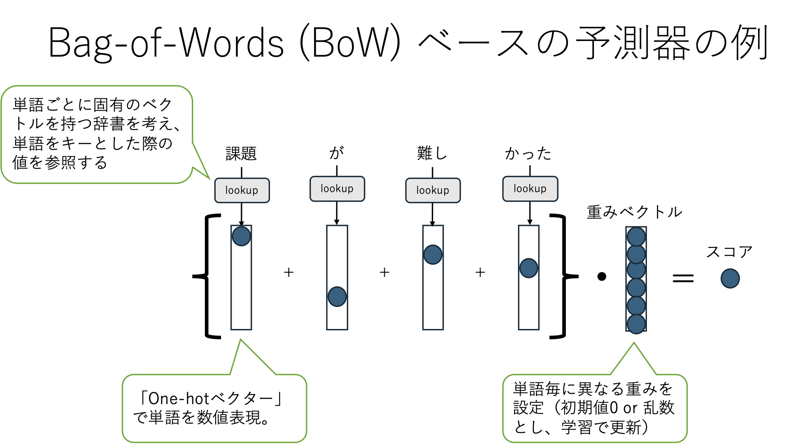

# NLPシステムの作り方（導入編）
自然言語で書かれた文書の扱い方を体感するため、ここではレビュー文の極性分析（ネガポジ判定）タスクを例に概観します。

演習1のルールベース方式では、主観でネガポジ判定するモデルを構築していきます。

演習2の Bag-of-Words方式では、文書を BoW によりベクトル空間で表現し、各単語に対する重みを学習データで調整（学習）する形を取っています。

どちらもとてもシンプルなアプローチですが、目的によっては十分に機能します。これで十分な精度が得られるならば計算機資源も低コストで済むことがあるでしょう。

```{tip}
BoW方式は語彙数が増え得るとそれだけ次元数が増えます。テキストサイズが増えるとそれだけ語彙数も増加傾向にあるため、その場合には深層学習で採用することが多いサブワードの導入を検討すると良いかもしれません。
```

## NLPシステムの作り方（大別）
- case 1: ルールベース
    - ルール自体を自動生成することはあるが、多くは人手で設計する。（今回はこれ）
```python
def classify(x: str) -> str:
   sports_keywords = ["野球", "サッカー", "テニス"]
   if any(keyword in x for keyword in sports_keywords):
       return "スポーツ"
   else:
       return "その他"
```
- case 2: プロンプト（ChatGPT以降）
    - データといっしょにやって欲しい作業を文章として用意し、回答させる。（授業では扱いません）
```
以下の文章がスポーツについて述べられているならば “スポーツ” と答えてください。それ以外の場合には “その他” と答えてください。

{x}
```
- case 3: ファインチューニングを含む学習ベース
    - 入力xと出力yをペアで用意し、機械学習によりモデルを構築する。深層学習以前からあるアプローチであり、様々なデータセットとモデルを用意して学習が行われている。

---
## システム構築の流れ：レビュー文に対する極性分析を例に
### タスク説明
映画レビュー文が用意されているとします。レビュー文xを与えられたときにその極性（ポジティブ(1)、ネガティブ(-1)、どちらでもない(0)）を推定するモデルを作りたい。

| sentence | score |
| --- | --- |
| I hate this movie | negative (-1) |
| I love this movie | positive (1) |
| I saw this movie | neutral (0) |

### 推定モデル構築のステップ
- step 1: 特徴抽出 (feature extraction)
    - ラベル推定に役立つ顕著な特徴を抽出する。
    - 定式化： $h = f(x)$
        - ただし、$x$ = テキスト。$h$ = 特徴ベクトル。
- step 2: 点数計算 (score calculation)
    - ラベル毎の可能性（点数）を計算する。
    - 定式化
        - binary（2値分類）：$s = w * h$
        - multi-class（多値分類）：$s = Wh$
        - ただし、$w$ = 重みベクトル。$W$ = 重み行列。$s$ = ラベル毎の可能性（点数）。
- step 3: 意思決定関数 (decision function)
    - 一つのラベルに絞り込む。
    - 定式化
        - $y = decide(s)$

```{tip}
実応用の際には、上記に加えて「step 4: 精度計算」「step 5: エラー分析」を含めることが多い。
ルールベースでは、step 1の特徴抽出や、step 2の点数計算も手動で調整することが多い。
```

## 演習1：ルールベースでレビュー文分類を実行し、エラー分析して精度改善してみよう
- コード例: [rule_based.ipynb](./rule_based.ipynb)
    - レビュー文に書かれている内容がポジティブかネガティブかどちらでもないかを識別する分類器の構築。ただしルールベース（ルールを手動構築）で。
- step 1: 特徴抽出 => B
    - ポジティブ単語とネガティブ単語を登録しておき、それらの出現回数をカウント。このカウント数を特徴量とする。ポジティブ単語に対するカウント数、ネガティブ単語に対するカウント数があるので2次元ベクトルとなる。
- step 2: 点数計算、step 3: 意思決定関数 => C
    - 各カウントに重みを掛けて足し合わせたものをスコアとする。
    - スコアに対して閾値を適用することで意思決定する。
- 上記とは別に性能評価(D)、失敗分析(E)も実装あり。

演習内容
- Eの失敗分析まで実行する。
- 学習データにおける失敗事例を観察し、性能向上のためにどのような工夫が行えそうか検討し、仮説を立案してみよう。またその仮説を実際に検証してみよう（コードを修正し、結果を観察してみよう）。

補足
- 仮説とは
    - 例えば、失敗例の中に「positiveな言葉が入っているがnegativeだと判断されている」ケースがある状況を考えてみよう。この状況ならその「positiveな言葉」を good_words として指定すると改善できるかもしれない。これが「仮説」だ。
- 一度に多くの仮説を試すのは避けよう。
    - 仮説1, 仮説2, 仮説3,,,をまとめて一度に反映した実験をするのは避けよう。実は仮説1だけで十分かもしれないし、仮説2が悪さしているかもしれない。仮説の影響を観察するために、一度の試行では一つの修正（一つの仮説検証）に限定しよう。
- 実験記録を残そう。
    - まず未修正のままでの精度を記録しよう。記録する際には「実験条件、結果」の2点を忘れずに。条件だけでも結果だけだと不十分です。
- 修正案1を考えたら、それをコードとして書き下し、その状態での精度を記録しよう。
- 演習の趣旨は「仮説立案=>検証」を体験することです。結果的に精度が下がってしまっても構いません。
- ただし、テストデータを用いて要因分析するのはNGです。それはリーク（Data Leakage）になります。リークを避けるため、Eの失敗分析では学習データに対する失敗事例をランダム抽出しています。ランダム抽出にしているのは「全ての失敗事例を見るのは時間的に厳しい」ため少数ケースを抽出していることと、「失敗した事例を頭から5件」のように固定してしまうと偏った事例のみを参照してしまうことになりがちなためです。

## 自然言語処理に基づいた機械学習
閉鎖的な環境（ほぼ新たな用語が出ず、決められた表現が用いられる環境）ならルールベースで頑張って構築することは可能だし、実際そうしているケースは多々ある。しかしながら多くのそうではない環境（新しい用語や表現が日々生まれるような環境）ではコスト的に辛く、矛盾のない巨大なルールベース・システムを構築するのは現実的ではない。だからデータから学習させよう。



## 演習2：レビュー文分類をBoWモデルで構築してみよう
- コード例: [ml_bow.ipynb](./ml_bow.ipynb)

主な変更点
- Step 1の関数fを、単語の出現回数（Bag-of-Words）として実装。
- Step 2の重みベクトルを、全ての単語に対する重みとして実装。
    - 重みは簡易的な学習で調整する。

演習内容
- 流れを理解したうえで実行し、結果を観察する。
- Eの失敗事例を観察し、要因と対策案を検討する。（検討のみ）
