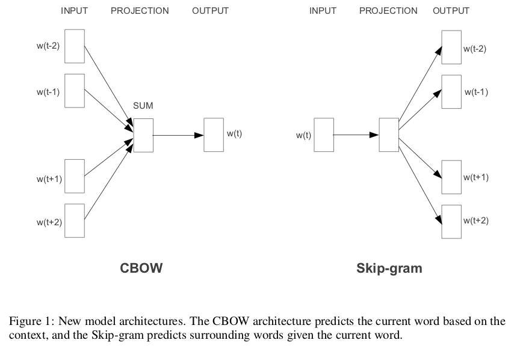
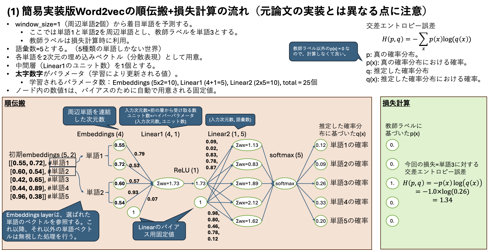
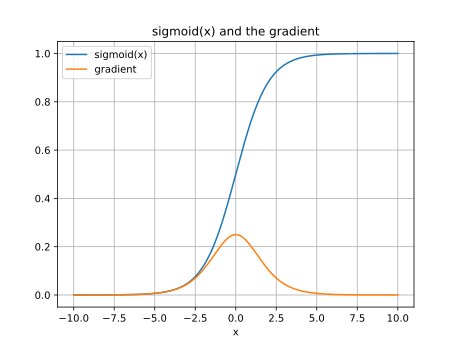
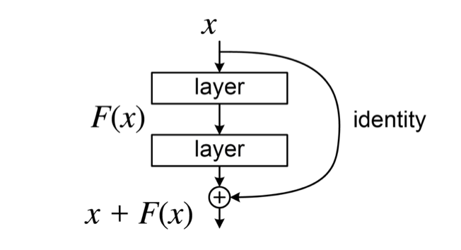

# 特徴量設計の進化：word2vecから深層学習への道

---

## この資料の位置づけ

この資料はNN基礎（前回まで）の知識を前提に、 **自己教師あり学習・word2vec・深層学習安定化技術** の流れを解説します。各節は「前の節で生まれた問い」を引き継いで展開するように構成されています。最終的に「なぜ Transformer が必要だったのか」を自分の言葉で説明できることが目標です。

---

## 学習目標

1. 自己教師あり学習（SSL）の仕組みと、なぜ大規模データに有効かを説明できる。
2. word2vec が「文脈から単語を推定する分類タスク」として分散表現を学習する仕組みを説明できる。
3. word2vec の 3 つの主要な限界（文脈非依存・語順無視・OOV）を挙げ、それぞれへの対処を説明できる。
4. ReLU・Layer Normalization・Residual Network が深層学習においてどのような問題を解決するかを説明できる。
5. サブワード分割がなぜ未知語問題を解決できるかを説明できる
6. これらの技術でも解けない問題の具体例を挙げ、Transformer への動機を説明できる

4番以降は時間の都合上次回に回す可能性があります。

---

## 振り返り：特徴量設計の進化史

### 今日の位置づけ

これまでの授業で扱ってきた特徴量設計を振り返ると、「機械がどれだけ特徴量設計に関与するか」という軸で整理できます。

| フェーズ | アプローチ | 特徴量の設計者 | 授業回 |
|:---|:---|:---|:---|
| 手動（数値・カテゴリ） | 正規化、one-hot エンコードなど | 人間 | 第 5〜6 回 |
| 手動（テキスト意味） | BoW、TF-IDF など | 人間 | 第 7〜9 回 |
| **半自動（コーパスから学習）** | **word2vec** | **モデル** | **第 10 回（今回）** |
| 自動（end-to-end） | Transformer、BERT | モデル | 第 11〜14 回 |
| メタ設計 | アーキテクチャ設計そのもの | 研究者・設計者 | 第 15 回 |

今回が大きな転換点です。「人が特徴量を設計する」フェーズから、「 **モデルがデータから特徴量の表現自体を学習する** 」フェーズへ移行します。

---

### Bag-of-Words アプローチの限界

BoW は「文書中の単語の出現に基づいてベクトルを作る」手法で、シンプルで実装しやすい利点があります。しかし本質的な問題を 2 つ抱えています。

**問題 1：疎なベクトル（Sparse Vector）**

BoW で文書をベクトル化すると、次元数はボキャブラリ（語彙）の総数になります。たとえば中学 3 年生レベルの語彙は約 2 万語あります。1 本の新聞記事を BoW でベクトル化すると、2 万次元のうち実際に登場する単語は数十〜数百語程度です。2 万次元中の 1.9 万次元以上がゼロになります。このように「ほぼゼロが並ぶ」ベクトルを **疎なベクトル（sparse vector）** と呼びます。

疎なベクトルには次の問題があります。
- メモリ効率が悪い
- 類似度計算や次元削減（SVD、PCA）のコストが大きい
- 大規模コーパスになるほど問題が深刻になる

**問題 2：意味的距離が反映されない**

one-hot エンコードや BoW では、すべての単語が等距離に配置されます。「犬」と「動物」の距離も、「犬」と「車」の距離も同じです。しかし直感的には「犬は動物の一種」なので、

$$
\text{distance}(\text{犬},\ \text{動物}) < \text{distance}(\text{犬},\ \text{車})
$$

となるべきです。BoW はテキスト中の単語出現をカウントしているだけで、 **潜在的な意味的関係** を捉えていないためこうなります。

> **問い** ：より少ない次元で、意味的な距離を保った「密なベクトル（dense vector）」を作れないだろうか？

この問いへの答えが word2vec です。

---

### 3つのアプローチの比較

単語の意味を表現するアプローチは大別すると 3 種類あります。

| アプローチ | 代表手法 | 厳密さ | 柔軟さ | スケーラビリティ |
|:---|:---|:---:|:---:|:---:|
| **シソーラス** | WordNet など | ◎ | △ | △ |
| **カウントベース** | BoW、共起行列 | ○ | ○ | ○ |
| **推論ベース（NN）** | word2vec | ○ | ◎ | ◎ |

- **シソーラス** ：人手で構築した概念地図に基づくため厳密ですが、新語への対応や大規模化が困難です。また概念地図の作成・維持コストが非常に高くなります。
- **カウントベース** ：自動化できますが、コーパスが変わるたびに共起行列を再計算する必要があります。大規模データでは計算コストが膨大になります。
- **推論ベース** ：大量テキストをミニバッチ学習できるため、スケーラビリティと柔軟さに優れています。コーパスを追加したい場合も、既存の重みを初期値として使って追加学習できます。

今回の主役 word2vec は推論ベースの代表例です。

---

### 分布仮説：密ベクトルへの理論的根拠

word2vec の背景にある重要な考え方が **分布仮説（Distributional Hypothesis）** です。

> 「ある単語の意味は、その単語が現れる文脈（周辺語）によって特徴づけられる。」
> *(Firth, 1957)*

たとえば次の 2 文を比べてください。

```
sentence 1: "the cat sat on the mat"
sentence 2: "the dog stood on the mat"
```

"cat" と "dog" は、"sat/stood" や "on the mat" といった似たような文脈に現れます。これは両者が「動物」という意味的に近いカテゴリに属していることを反映しています。

**分布仮説が示すこと** : 「大量のテキストを集め、各単語の周辺語パターンを学習すれば、意味的に近い単語は近いベクトルに、遠い単語は遠いベクトルになる空間が作れる」はずです。これを NN で実現したのが word2vec です。

---

## word2vec：自己教師あり学習による分散表現

デモ
- 手動構築するデモ: [word2vec 体験アプリ](https://ie.u-ryukyu.ac.jp/~tnal/2026/oc/README.html)
- 学習済み単語埋め込みを操作するデモ: [Word Embedding Demo](https://www.cs.cmu.edu/~dst/WordEmbeddingDemo/)　＊ダウンロードに時間かかります。

### 自己教師あり学習（SSL）とは

通常の教師あり学習では、学習データに人手でラベルを付ける必要があります（例：スパムメール判定なら「スパム / 正常」のラベル）。これはコストが高く、大規模データへの対応が難しいです。

**自己教師あり学習（Self-Supervised Learning, SSL）** では、ラベルを人手で付ける代わりに、 **データそのものから自動的に疑似ラベル（pseudo-label）を生成** します。

word2vec での疑似ラベル生成はシンプルです。

```
step 1: コーパス（大量のテキスト）を用意する。
step 2: ウィンドウサイズ（context size）を設定する。
step 3: テキストを窓でスライドさせ、周辺単語と中央単語の対を自動抽出する。
```

例として "Word2vec is a technique in natural language processing." という文に、window_size=2 で CBOW 用データを生成すると次のようになります。

| 周辺単語（入力） | 中央単語（疑似ラベル） |
|:---|:---|
| NA, NA, is, a | word2vec |
| NA, word2vec, a, technique | is |
| word2vec, is, technique, in | a |
| is, a, in, natural | technique |
| a, technique, natural, language | in |
| （以下省略） | |

ポイントは **人が一切ラベルを付けていない** ことです。テキストを用意してウィンドウサイズを設定するだけで、学習データが自動生成されます。この仕組みにより、インターネット上に存在する膨大なテキストをそのまま学習データとして使えます。

```{note}
SSL の疑似ラベルは「元データの一部をそのまま使う」ため、ラベル付けミスが原理的に発生しません（コーパス自体が不適切な場合を除く）。これも SSL の重要な利点の一つです。
```

---

### CBOW と Skip-gram の直感

word2vec には 2 種類のモデルがあります。

**CBOW（Continuous Bag-of-Words）**

「周辺単語の文脈が与えられたとき、中央の単語を推測する」タスクです。

> 「今朝はトーストと **＿** を食べました。」

"トースト" と "食べた" という文脈があれば、何かしら食べられるものが入ることが推測できます。"卵焼き"・"ご飯"・"バナナ" はどれも自然に感じられます。数式で書くと、$P(w_t \mid w_{t-1}, w_{t+1})$ を最大化するように学習します（ウィンドウサイズ = 1 の場合）。

**Skip-gram**

「中央の単語が与えられたとき、周辺単語を推測する」タスクです。CBOW とは入出力が逆です。

> 「"卵焼き" の前後に来やすい単語は？」

"食べ"・"朝"・"おかず" などが前後に来やすいと推測できます。数式で書くと、$P(w_{t-1}, w_{t+1} \mid w_t)$ を最大化するように学習します。



```{tip}
一般的に、Skip-gram の方が CBOW より低頻度語の学習に優れています。一方で CBOW は学習が速い傾向があります。タスクや計算資源に応じて選択します。
```

どちらも「似た文脈で使われる単語が似たベクトルになる」という性質を持つ密ベクトル空間を、大量データへの繰り返し学習によって構築していきます。

---

### ネットワーク構造と埋め込み層

**one-hot ベクトルの問題点**

素朴にone-hotベクトルでCBOWを実装すると、疎なベクトルとなり無駄が多い。

実装イメージ: [one-hotベクトルでの実装イメージ](word2vec-howtobuild)

---

CBOW のネットワーク構造を具体的に見てみましょう。

**one-hot ベクトルから密ベクトルへ**

ボキャブラリサイズを $V$、埋め込み次元を $D$ とします（$D \ll V$）。

```
入力:  周辺単語の one-hot ベクトル（V 次元）× N 個
       ↓ 重み行列 W_in ∈ R^{V×D}
D 次元の密ベクトル（各周辺単語の埋め込み表現）
       ↓ 平均（N 個をまとめる）
中間表現（D 次元）
       ↓ 重み行列 W_out ∈ R^{D×V}
出力: V 次元のスコア
       ↓ softmax
各単語が中央単語である確率分布（V 次元）
```

この $W_{in}$ の各行（行番号 = 単語インデックス）が、その単語の D 次元密ベクトルに相当します。one-hot ベクトルと $W_{in}$ の行列積は「該当行を取り出す操作」と等価で、これが現代でいう **埋め込み層（embedding layer）** のアイデアの起源です。

学習完了後の $W_{in}$ の各行を取り出したものが、各単語の **分散表現（distributed representation）** あるいは **単語埋め込み（word embedding）** です。



**実装上の工夫**

CBOWは、実際には「学習パラメータを持つ中間層」はありません。中間層に見える層では取り出した単語埋め込みを平均化する操作のみ（非線形変換もしていない）を行っており、このことを projection（投影、射影）と呼んでいます。このため実際に学習するパラメータは $W_{in}$ のみになります。

CBOW では N 個の周辺単語に対して $W_{in}$ を **共有** します。これにより：
- パラメータ数を $1/N$ に削減できる
- 大語彙（V が 10 万〜100 万規模）でもメモリ・計算コストを抑えられる

副作用として **語順情報が失われます** 。"Alice likes Bob" と "Bob likes Alice" は周辺単語の集合が同じなので、CBOW は両者を区別できません。

中間層パラメータなし、重みの共有といった学習効率マシマシ構成であったにも関わらず「それらしい分散表現を獲得できた」のが word2vec の素晴らしい成果でした。

---

### 分散表現で何が変わるか

word2vec で学習した分散表現は、次のような性質を持ちます。

$$
\text{Paris} - \text{France} + \text{Italy} \approx \text{Rome}
$$

$$
\text{king} - \text{man} + \text{woman} \approx \text{queen}
$$

「パリはフランスの首都である」という関係を明示的にプログラムしたわけではありません。「周辺単語から中央単語を推定する」という単純なタスクを大量テキストで繰り返し学習した **副産物** として、そうした意味的関係がベクトル空間に自然に浮かび上がったのです。

これが word2vec の革命的な点です。

> **大量のテキストさえあれば、人が意味を定義しなくても、意味的な関係を内包したベクトル空間を自動構築できる。**

この考え方は BERT、GPT などのモデルに通じる、現代深層学習の基本的なパラダイムの一つとなっています。

```{admonition} Check your understanding
次の計算を考えてください。word2vec で学習した分散表現があるとして、

$$
\text{日本} - \text{東京} + \text{ロンドン}
$$

はどの単語のベクトルに最も近くなると予想されますか？また、なぜそうなると思いますか？

（ヒント：東京は日本の **首都** 、ロンドンは __ の首都。）
```

---

### 高速化のための工夫（概念のみ）

実用上、大規模コーパスに対応するためにさらなる工夫があります。

**Softmax の問題**

出力層では語彙数 $V$ 個の確率を計算する softmax を使います：

$$P(\text{target} \mid \text{context}) = \frac{\exp(\text{score}(\text{target}))}{\sum_{w \in V} \exp(\text{score}(w))}$$

分母の $\sum_{w \in V}$ が問題です。$V = 100$ 万語なら、 **1 回の更新で 100 万単語分のスコアと勾配を計算** しなければなりません。

**Negative Sampling**

$V$ 値分類を「本物か偽物か」の **2 値分類** に置き換えます。1 つの訓練例 (context, "Italy") に対して：

| サンプル | ラベル | 説明 |
|:---|:---:|:---|
| (context, "Italy") | 1（本物） | ウィンドウから取った正解単語 |
| (context, "banana") | 0（偽物） | ランダムに選んだ **負例** |
| (context, "cloud") | 0（偽物） | ランダムに選んだ **負例** |
| (context, "table") | 0（偽物） | ランダムに選んだ **負例** |
| (context, "run") | 0（偽物） | ランダムに選んだ **負例** |

更新するのはこの **$k + 1$ 個（正例 1 ＋ 負例 $k$）** の埋め込みベクトルだけです。$V = 100$ 万でも $k \approx 5$〜$20$ で済みます。

- **正例** の score を上げる方向に更新 → 正しい文脈パターンを学ぶ
- **負例** の score を下げる方向に更新 → 無関係な単語は低スコアに

これを大量に繰り返すことで、softmax の正規化計算なしでも「似た文脈の単語が近いベクトルになる」構造が学習されます。

```{note}
負例は完全なランダムではなく、**出現頻度の $\frac{3}{4}$ 乗に比例したサンプリング** を使います。"the" や "a" のような超高頻度語ばかり選ばれることを防ぐための工夫です。
```

gensim などのライブラリの word2vec 実装では、この Negative Sampling が標準で使われています。

---

## word2vec の限界

SSL と密ベクトルを組み合わせた word2vec は大きな前進でしたが、以下の 3 つの問題が残ります。

| # | 問題 | 具体例 | 原因 |
|:---:|:---|:---|:---|
| 1 | **文脈非依存（Static Embedding）** | "bank" = 銀行？川岸？ | 単語に静的な 1 つのベクトルしか割り当てられない |
| 2 | **語順を扱わない** | "Alice likes Bob" ≈ "Bob likes Alice" | 重み共有で語順情報が消える |
| 3 | **OOV（Out-of-Vocabulary）** | "loved" が学習時未登場 → UNK 扱い | one-hot がボキャブラリ外の単語に対応できない |

それぞれ確認しましょう。

**問題 1：文脈非依存**

word2vec の埋め込みは **静的** です。"bank" という単語は、文脈が銀行の話であっても川の話であっても、常に同一のベクトルになります。

```
"I went to the bank to deposit money."  →  bank のベクトル = 同一
"The children played on the river bank." →  bank のベクトル = 同一
```

文脈に応じてベクトルが変化する **動的な埋め込み** は、word2vec では実現できません。

**問題 2：語順を扱わない**

重み共有により、周辺単語の「順序」ではなく「集合」しか扱えません。

```
"I love this movie"       → {I, love, this, movie} の集合
"I don't love this movie" → {I, don't, love, this, movie} の集合
```

"don't" が "love" を否定しているという **依存関係** は、BoW と同様に word2vec でも捉えられません。

**問題 3：OOV（未知語）**

```
学習データ: "I love this movie"
テストデータ: "I loved this movie"
                   ↑
              学習時に未登場 → UNK（unknown）として処理
```

活用語（love / loves / loved）、スペルミス、新語が全て未知語になります。これは現実のテキストでは頻繁に発生します。

---

## 深層化への道

前節の 3 つの問題（特に問題 1・2）を解決するには、より深く文脈を理解できる NN が必要です。素朴なアイデアは「より多くの層を積み重ねる」ことです。しかし実際には **深い NN を学習することには技術的な障壁** がありました。本節ではその障壁と解決策を順番に見ていきます。

---

### 勾配消失問題（復習）

誤差逆伝播法では、出力層から入力層へ向かって連鎖率で勾配を伝播させてパラメータを更新します。問題は、 **層を重ねるほど勾配が小さくなっていく** ことです。

シグモイド関数 $\sigma(x) = \dfrac{1}{1+e^{-x}}$ の勾配（微分）の最大値は **0.25** です。



中間層が 3 層のとき、入力層近くのパラメータに届く勾配は：

$$
0.25 \times 0.25 \times 0.25 = 0.016
$$

元の誤差が $\mathbf{1/64}$ に縮小して届きます。10 層なら $0.25^{10} \approx 10^{-6}$ で、事実上学習不能です。

深い NN は表現力が高いはずなのに、 **学習する手段がなかった** のです。これが **勾配消失問題（vanishing gradient problem）** です。

```{note}
逆に「勾配が大きくなりすぎる」 **勾配爆発（gradient explosion）** という問題もあります。こちらも深層学習では対処が必要です。Layer Normalization や Residual Network はこの両方に対して効果があります。
```

---

### ReLU：勾配消失を緩和する活性化関数

**ReLU（Rectified Linear Unit）** は次のシンプルな関数です。

$$
\text{ReLU}(x) = \max(0,\ x)
$$

$x > 0$ では出力がそのまま $x$、$x \leq 0$ では出力が 0 になります。

**なぜ勾配消失を緩和できるか**

ReLU の勾配は $x > 0$ の領域で **常に 1** （定数）です。sigmoid と異なり、正の入力では勾配が飽和しません。100 層積み重ねても $x > 0$ の範囲では「$1 \times 1 \times 1 \times \cdots$」となるため、理論上は勾配が消えません。

| 活性化関数 | 3 層後の勾配倍率（最大） | 10 層後の勾配倍率（最大） |
|:---|:---:|:---:|
| Sigmoid | $0.25^3 \approx 0.016$ | $0.25^{10} \approx 10^{-6}$ |
| **ReLU** ($x>0$) | $1^3 = 1$ | $1^{10} = 1$ |

**Dead ReLU 問題**

$x \leq 0$ では勾配が 0 になります（Dead ReLU）。一度 $x \leq 0$ になったニューロンは、以降永遠に更新されない可能性があります。これを緩和する改良版が提案されています。

| 関数 | $x \leq 0$ の挙動 | 採用例 |
|:---|:---|:---|
| Leaky ReLU | $0.01x$（小さい勾配） | 汎用 |
| GELU | 滑らかな曲線 | Transformer（BERT 等） |
| Swish | $x \cdot \sigma(x)$ | EfficientNet 等 |

**歴史的背景**: ReLU は 2010 年頃から積極的に使われ始め、word2vec が登場した 2013 年と同時期に急速に普及しました。これらは「深層学習元年」と呼ばれる時期の重要な技術的ブレイクスルーです。

---

### Layer Normalization：学習を安定化する正規化

深い NN では「各層の出力分布が学習中に変動する」問題があります。ある層の出力分布が変わると、後続の層はそれに合わせてパラメータを再調整し続けることになり、学習が不安定になります。これを **内部共変量シフト（Internal Covariate Shift）** と呼びます。

**Layer Normalization（LN）** はこの問題に対処するため、各層の出力を正規化します。直前の層から受け取る全出力（ただしサンプル単位） $\mathbf{x} = (x_1, \ldots, x_d)$ に対して次の手順で計算します。

$$
\mu = \frac{1}{d} \sum_{i=1}^{d} x_i \qquad (\text{平均})
$$

$$
\sigma^2 = \frac{1}{d} \sum_{i=1}^{d} (x_i - \mu)^2 \qquad (\text{分散})
$$

$$
\hat{x}_i = \frac{x_i - \mu}{\sqrt{\sigma^2 + \epsilon}} \qquad (\text{正規化})
$$

$$
y_i = \gamma \hat{x}_i + \beta \qquad (\text{スケール・シフト})
$$

ここで $\gamma, \beta$ は学習可能なパラメータ（モデルが適切な分布に再調整するための自由度）、$\epsilon$ は数値安定のための小さな定数です。

**直感的な理解** : 統計学の [z スコア](https://ja.wikipedia.org/wiki/標準得点)をイメージしてください。ただし z スコアが「データセット全体」で計算するのに対し、LN は「直前の層から受け取る全出力（ただしサンプル単位）」に対して計算します。

**NLP との相性が良い理由** : 自然言語処理では文の長さがサンプルごとに異なります。LN はバッチサイズや系列長に依存しないため、NLP に非常に適しています。Transformer でも標準的に採用されています。

```{tip}
似た技術として **Batch Normalization（BN）** があります。BN はミニバッチ内の全サンプルにわたって正規化しますが、バッチサイズに依存するため系列長が可変な NLP では使いにくいことがあります。LN はこの問題を解決しています。
```

---

### Residual Network：深い層への勾配の直通路

**残差接続（Residual Connection）** はシンプルなアイデアです： **入力をそのまま出力に加算します** 。

通常の層では $\mathbf{y} = F(\mathbf{x})$ ですが、残差接続では：

$$
\mathbf{y} = F(\mathbf{x}) + \mathbf{x}
$$

$\mathbf{x}$ をそのまま出力に加算する「スキップ接続（skip connection）」を追加します。



**なぜ深い層（入力に近い層）への勾配が届くようになるか**

逆伝播時に、勾配は 2 つの経路で前の層に届きます。

1. **通常経路** ：$F(\mathbf{x})$ を通る経路（勾配が小さくなる可能性あり）
2. **スキップ経路** ：$\mathbf{x}$ を直接通る経路（ **勾配がそのまま届く** ）

スキップ経路があることで、深い層にも勾配の情報が直接届くようになります。

```{tip}
$\mathbf{y} = F(\mathbf{x}) + \mathbf{x}$ を $\mathbf{x}$ で微分すると：

$$\frac{\partial \mathbf{y}}{\partial \mathbf{x}} = \frac{\partial F(\mathbf{x})}{\partial \mathbf{x}} + \mathbf{I}$$

連鎖率で損失 $L$ の勾配を展開すると：

$$\frac{\partial L}{\partial \mathbf{x}} = \underbrace{\frac{\partial L}{\partial \mathbf{y}} \cdot \frac{\partial F(\mathbf{x})}{\partial \mathbf{x}}}_{\text{通常経路（減衰する可能性あり）}} + \underbrace{\frac{\partial L}{\partial \mathbf{y}}}_{\text{スキップ経路（係数 = 1 のまま届く）}}$$

第 2 項はどれだけ層を重ねても $\frac{\partial L}{\partial \mathbf{y}}$ が **係数 1 のまま加算** されます。$F(\mathbf{x})$ 側の勾配がゼロに近づいても、この「$+\mathbf{I}$」の項が生き残るため、入力に近い層にも必ず勾配の情報が届くようになります。
```

**効果** ：2016 年の ResNet は 152 層という当時記録的に深いネットワークで ImageNet の分類精度を大幅に向上させました。現在の深層学習モデル（Transformer を含む）のほぼ全てにこの構造が採用されています。

```{admonition} Check your understanding
残差接続 $\mathbf{y} = F(\mathbf{x}) + \mathbf{x}$ において、もし「最適な変換がほぼ恒等写像（入力をそのまま出力する）」に近い場合、$F(\mathbf{x})$ は何に近い値を学習することになるでしょうか？

（ヒント：$F(\mathbf{x}) + \mathbf{x} \approx \mathbf{x}$ になるためには $F(\mathbf{x}) \approx$　？）

これが「残差（residual）を学習する」と呼ばれる理由です。
```

---

### サブワード分割：未知語問題への対処

ReLU・LN・ResNet は主に「深い NN を安定して学習するための技術」です。NLP には別の固有問題として **OOV（Out-of-Vocabulary）問題** がありました。

**問題の確認**

学習データに "love" のみ含まれている場合、テスト時に "loved"・"loves"・"loving" が現れると全て `UNK`（未知語）として処理されます。

| # | データ種別 | 文 | "Alice" | "like" | "bob" | "UNK" | トークン ID 系列 |
|:---:|:---|:---|:---:|:---:|:---:|:---:|:---|
| 1 | 学習 | Alice likes Bob | 1 | 1 | 1 | 0 | [1, 2, 3] |
| 2 | 未知 | Alice likes cat | 1 | 1 | 0 | 1 | [1, 2, 4] |
| 3 | 未知 | Alice likes NLP | 1 | 1 | 0 | 1 | [1, 2, 4] |

サンプル 2 と 3 は全く異なる文ですが、"cat" も "NLP" も同じ `UNK` に置き換えられるため、モデルはこの 2 文を区別できません。

**素朴な解決策：全文字を登録する？　全単語/フレーズを登録する？**

全文字を 1 字ずつ語彙登録すれば、新たな文字が生まれない限り未知語はゼロになります。しかし「1 文字単位の列」では単語・フレーズ単位の意味を捉えにくいです。"大学" を "大"+"学" として処理すると、"大学" というまとまりとしての意味が失われます。一方で全ての「意味のあるまとまり（単語、フレーズ等）」を登録しようとすると、「琉球」「琉球大学」「琉球大学工学部」それぞれ全く異なる語として登録する羽目になり、ボキャブラリが天井知らずになってしまうと共に別々の語として学習せざるを得ないため非効率でもあります。そこで提案されたアプローチがサブワード分割です。

**サブワード分割（Subword Tokenization）**

「単語」と「文字」の中間を取ります。よく出現する部分文字列（サブワード）を語彙として登録し、頻度が低い部分は分割して対応します。

```
"playing"      →  "play" + "##ing"
"loved"        →  "love" + "##d"
"unhappiness"  →  "un" + "##happi" + "##ness"
"東京大学"      →  "東京" + "大学"   （頻度の高い熟語はそのまま）
```

（"##" はサブワードの接続を示す記号。ただし実装により異なり、上記は [WordPiece](https://huggingface.co/learn/llm-course/chapter6/6) で採用されている記法です）

この方法により：
1. 活用語・複合語がサブワードの組み合わせで表現できる
2. 語彙サイズを管理可能な規模（通常 3〜10 万語）に保てる
3. 未知語をほぼ排除できる

**代表的なアルゴリズム：BPE（Byte Pair Encoding, 2016 年）**

BPE はシンプルなアルゴリズムです。

```
step 1: 全文字を単独で語彙登録した状態からスタート
step 2: コーパス中で最も頻繁に隣接する文字ペアを 1 つの単位として統合
step 3: 目標の語彙サイズに達するまで step 2 を繰り返す
```

言語学的な知識を一切使わず、コーパスの統計だけから適切な単位を自動的に発見します。GPT-2、GPT-3、RoBERTa など多くの現代的モデルで使われています。

```{tip}
BPE の進化形として **SentencePiece（2018 年）** があります。空白も含めて全バイト列をサブワードとして扱い、テキストを分かち書きする前処理（日本語の形態素解析など）が不要になります。BERT や T5 など多くのモデルが採用しています。
```

---

## まとめと次回へ

### 今日の技術マップ

今回学んだ技術と「何を解決したか」を整理します。

```
[Before: 第 7〜9 回]
BoW（疎ベクトル・意味なし）
         │
         │ 問い: 密で意味的な表現は作れないか？
         ↓
[今回の主役]
word2vec: SSL + 密ベクトル学習
  → 分布仮説に基づき、意味的距離を持つベクトル空間を自動構築
  → Paris − France + Italy ≈ Rome

[word2vec の限界と対処]
  ├── OOV（未知語）        → Subword 分割で解決
  ├── 勾配消失             → ReLU で大幅緩和
  │                        → Layer Normalization で学習安定化
  │                        → Residual Network でさらに安定化
  └── 文脈非依存・語順無視  → まだ未解決 → 次回へ
```

| 技術 | 解決した問題 | キーアイデア |
|:---|:---|:---|
| word2vec (CBOW / Skip-gram) | 疎ベクトル・意味なし表現 | SSL で密ベクトルを分類タスクとして学習 |
| Subword 分割（BPE 等） | OOV（未知語） | 頻出サブワードを語彙登録・分割処理 |
| ReLU | 勾配消失 | $x > 0$ で勾配が 1（飽和なし） |
| Layer Normalization | 学習の不安定性 | サンプル内で特徴を正規化 |
| Residual Network | 深い層への勾配消失 | スキップ接続で勾配の直通経路を作る |
| **Transformer（次回）** | 長距離依存・深い文脈理解 | Attention 機構 |

---

### それでも解けない問題

word2vec をベースに ReLU・LayerNorm・ResNet で層を深くしていく手法でも、まだ解決できない問題があります。

**長距離依存性（Long-range Dependency）**

```
"He  does not have very much confidence in himself."
"She does not have very much confidence in herself."
```

最後の代名詞（himself / herself）は主語（He / She）によって一意に決まりますが、両者の距離が大きいため、固定サイズのウィンドウで文脈を扱う word2vec はもちろん、通常の深い NN でも正確に捉えることが困難です。

**常識的知識が必要な指示解決**

```
"The trophy won't fit in the suitcase because it was too big."
"The trophy won't fit in the suitcase because it was too small."
```

2 文の違いは最後の 1 語（big / small）だけです。しかし "it" が指すものが変わります。

- "too big" → トロフィーが大きすぎて入らない → **it = trophy**
- "too small" → スーツケースが小さすぎて入らない → **it = suitcase**

どちらが参照先かは、文全体の内容と常識的知識から判断する必要があります。

これらの問題を解決するには、「文中の任意の位置から任意の位置への関係を **動的に** 計算する」仕組みが必要です。これが次回以降で扱う **Attention / Transformer** の核心です。

---

## 演習問題

**Q1** ：「疎なベクトル」と「密なベクトル」の違いを、具体的な数値例を使って説明してください。また、word2vec はなぜ密なベクトルを生成できるのですか？

**Q2** ：CBOW と Skip-gram のモデルの違いを、「入出力が何か」という観点から説明してください。どのような状況でそれぞれを選ぶと良いでしょうか？

**Q3** ：word2vec で "bank" に対して得られる分散表現には「銀行」と「川岸」の 2 つの意味が混在しています。これはなぜですか？また、この問題を解決するためにはどのような方向性が考えられますか？

**Q4** ：ReLU の勾配消失緩和効果を sigmoid と比較して数値で示してください。5 層積み重ねた場合、sigmoid と ReLU（$x > 0$ 領域）それぞれで入力層近くに届く勾配の最大倍率を計算してみましょう。

**Q5** ：以下の単語を BPE アルゴリズムの考え方でサブワード分割した場合、どのようになると予想されますか？

- "running"
- "unhappiness"
- "tokenization"

**Q6** ：残差接続 $\mathbf{y} = F(\mathbf{x}) + \mathbf{x}$ において、もし「最適な変換が恒等写像（$\mathbf{y} = \mathbf{x}$）に近い」場合、$F(\mathbf{x})$ はどのような値を学習することになりますか？また、それが「残差を学習する」と呼ばれる理由を説明してください。

---

## 参考文献

- Mikolov, T. et al. "[Efficient Estimation of Word Representations in Vector Space](https://arxiv.org/abs/1301.3781)," arXiv:1301.3781 (2013).　← word2vec 原論文
- Nair, V. and Hinton, G.E. "[Rectified Linear Units Improve Restricted Boltzmann Machines](https://dl.acm.org/doi/10.5555/3104322.3104425)," ICML (2010).　← ReLU 提案論文
- He, K. et al. "[Deep Residual Learning for Image Recognition](https://ieeexplore.ieee.org/document/7780459)," CVPR (2016).　← ResNet 提案論文
- Sennrich, R. et al. "[Neural Machine Translation of Rare Words with Subword Units](https://aclanthology.org/P16-1162/)," ACL (2016).　← BPE 提案論文
- Ba, J.L. et al. "[Layer Normalization](https://arxiv.org/abs/1607.06450)," arXiv:1607.06450 (2016).　← Layer Normalization 提案論文
- 斎藤 康毅「[ゼロから作るDeep Learning ❷ ──自然言語処理編](https://www.oreilly.co.jp/books/9784873118369/)」O'Reilly Japan (2018).　← word2vec の日本語詳細解説
