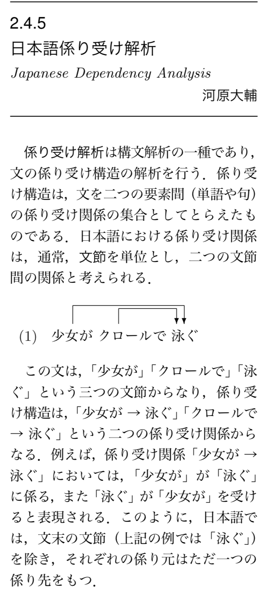

# 代表的な自然言語処理; 日本語編

## 参考文献（参考ツール）
### 前提
英語のようなスペース区切りの文章と違い、日本語の文章は句読点や改行以外には明示的な区分記号がないため「単語」のようなものがそもそも不明瞭である。例えば「琉大知能情報コースは2017年度から始まった新しいコースです。」という文章においてどれが単語に相当するだろうか。「琉大知能情報コース」を1つの単語として見做したいこともあれば、「琉大、知能情報コース」のように区切られた単語として見做したいこともある。これは区切った後にどのように利用したいかというタスク依存の話であるため、どのような場合でもこれで良いという区切り方は定義できない。

このためツールやオプション設定毎に分割のされ方が異なる。例えば「おじいさん」を「お、じい、さん」のように分割するものもある。また分かち書き結果が異なることから、係り受け関係についてもツール毎に傾向が異なる。

課題ではどのツールを使っても構わないが、どんな感じで分かち書きしているのかをざっくりと眺めてみることを強く勧める。

```{tip}
**「単語」を定義できないなら定義しなければいいじゃない！** を地で行く手法（多くはsubwordと呼ばれる）もあり、実際うまく行っている部分も多くある。これについては後日取り扱う。興味のある人は調べてみよう。
```

---
### (従来のツール) mecab, Juman, KNP
- [MeCab: Yet Another Part-of-Speech and Morphological Analyzer](https://taku910.github.io/mecab/)
- [日本語構文・格・照応解析システム KNP](http://nlp.ist.i.kyoto-u.ac.jp/index.php?KNP)
  - [KNPの基本的な出力の読み方](http://cr.fvcrc.i.nagoya-u.ac.jp/~sasano/knp/format.html)
  - [pyknp: Python Module for JUMAN++/KNP](https://pyknp.readthedocs.io/en/latest/)
- [Python による日本語自然言語処理](http://www.nltk.org/book-jp/ch12.html)
  - Python 2.x時代のコード。関連ライブラリも当時のもののため、そのままでは動作しないコード例あり。自然言語処理における代表的なタスクや取組事例として参考にしよう。

---
### (比較的新しいツール) GiNZA, spaCy
- GiNZA
  - [GiNZA公式サイト](https://megagonlabs.github.io/ginza/)
  - GiNZAチュートリアル
    - [はじめての自然言語処理 第4回 spaCy/GiNZA を用いた自然言語処理](https://www.ogis-ri.co.jp/otc/hiroba/technical/similar-document-search/part4.html)
    - [自然言語処理ライブラリGiNZAをインストールして簡単に動かすまでの手順](https://www.virment.com/how-to-install-ginza-and-use/)
    - [自然言語処理ライブラリのGiNZAを使って係り受け解析を試す](https://www.virment.com/ginza-dependency-parse/)
    - [GiNZA version 4.0: 多言語依存構造解析技術への文節APIの統合](https://www.megagon.ai/jp/blog/ginza-version-4-0/)
- spaCy
  - [spaCy公式サイト](https://spacy.io)
  - spaCyチュートリアル
    - [spaCyを使った先進的な自然言語処理](https://course.spacy.io/ja)

---
### ツール比較例
- [形態素解析器比較 Sudachi vs Mecab+Neologd](http://tdual.hatenablog.com/entry/2020/07/13/162151)
- [2019年末版 形態素解析器の比較](https://qiita.com/hi-asano/items/aaf406db875f1c81530e)
- [yasuokaの日記： 日本語係り受け解析器「2020年の総ざらえ」](https://srad.jp/~yasuoka/journal/643631/)

---
## 全体の流れ
- 背景＆補足説明
- 環境構築
- 形態素解析する
	- 文章全体をまとめて処理する
	- ノード毎に処理する
- 文章の特徴を眺める
	- KWIC（もしくはKWIC index）
	- コロケーション（collocations）
  - 単語の出現頻度と条件付き出現頻度
	- 係り受け解析

---
## 背景＆補足説明
[テキストデータに対する特徴量設計1（シソーラス、カウントと推論に基づいた設計）](./nlp1.md)を通して、文章を特徴ベクトルに変換するいくつかの考え方を眺めてきた。これらは最初から機械学習で処理する、もしくはあるN次元空間に写像することでその後の処理をしやすくするために生まれた考え方である。

ここでは、(1) 日本語に特化したツールである MeCab, KNP を例に形態素解析ならびに係り受け解析の例を示すとともに、(2) 特徴ベクトルとは異なる観点から文章の特徴を眺める際の代表的な手法として KWIC, collocations の例を示す。また (3) 同等機能について spaCy と GiNZA で実装したコード例についても眺めていく。

---
## 環境構築（Google Colab編）
- [コード例1(mecab, KNP)](./typical_methods_mecab.ipynb)の環境構築セルを実行しよう。10分程度かかります。
- [コード例2(spacy)](./typical_methods_spacy.ipynb)。環境構築数分。

---
## 環境構築（macOS編）
- 想定環境
  - macOS Mojave 10.15以降
  - Python 3.7系 or 3.8系
  - brew
- 環境構築
  - mecab
    - ``brew install mecab``
  - 主な辞書
    - IPA辞書：きれいな文書向け
      - ``brew install mecab-ipadic``
    - [UniDic辞書](https://ja.osdn.net/projects/unidic/)：話し言葉に強め？
      - ``brew install mecab-unidic``
    - [NEologd](https://github.com/neologd/mecab-ipadic-neologd/blob/master/README.ja.md)
      - 毎週2回の更新。新語に強い。
      - 設定例: [MacにMeCabを利用できる環境を整える](https://qiita.com/paulxll/items/72a2bea9b1d1486ca751)
  - CaboCha
    - 2019年10月現在、macOS 10.14以降の command line toolsではインストール不可。古いcommand line toolsをインストールする必要がある。（のでここでは扱わない）
  - KNP
    - ``brew tap uetchy/nlp``
    - ``brew install knp`` #KNP本体
    - ``brew install jumanpp`` #Juman++
    - ``pip install pyknp`` #Pythonバインディング
      - [pyknp: Python Module for JUMAN++/KNP](https://pyknp.readthedocs.io/en/latest/)
  - GiNZA, spaCy
    - ``pip install -U ginza``
- 動作確認（MeCab）
  - Pythonインタプリタを起動し、以下のコードを実行してみよう。
  - MeCab.Tagger()時の引数は、mecabコマンドのオプションに対応している。ターミナルから ``mecab --help`` でオプションを確認しよう。
    - 辞書を設定したいなら ``Mecab.Tagger('-d 辞書の場所')`` と書く。
  - tagger.parse() の結果は、分かち書きした文字列の最後に半角スペースが追加され、最後に改行も含んでいる点に注意。

```Python
import MeCab

#tagger = Mecab.Tagger('-Owakati -d /usr/local/lib/mecab/dic/mecab-ipadic-neologd')
tagger = MeCab.Tagger('-Owakati') # 分かち書きオプション
sentence = "すもももももももものうち"
result = tagger.parse(sentence)
print(result)
# => "すもも も もも も もも の うち \n"
```

---
## 形態素解析する
### 文章全体をまとめて処理する
- MeCab.Tagger() 時の出力フォーマットのオプション指定（-Ochasen, -Owakati等）により、parse() 結果が変わる点に注意。
- フォーマット指定をしていないデフォルト状態では、mecabでparse()すると、「表層形\t品詞,品詞細分類1,品詞細分類2,品詞細分類3,活用型,活用形,原形,読み,発音」が得られる。表層系と品詞の間はただのスペース区切りではなくタブ区切り。それ以降はカンマ区切り。なお、parse()自体は「結果をまとめて文字列として返す」点に注意。単語単位で処理するには不向き。
  - ``-Ochasen`` オプション付きで MeCab.Tagger を用意すると、すべての項目がタブ区切りになる。ただし出力順序が変わる点に注意。

---
### ノード毎に処理する
- parseToNode() を用いると、分かち書きされた形態素単位で処理しやすくなる。
  - 冒頭と最後にsurfaceが空、featureがBOS/EOSとなっているノードがある点に注意。BOS = Begin Of Sentence, EOS = End Of Sentence. 複数の文をまとめて形態素解析できるため、文の区切りを判別するために使用される。不要なら除外しよう（以下のコード例では確認用に出力している）。

---
## 文章の特徴を眺める
### KWIC（もしくはKWIC index）
- KWIC（keyword in context）は、索引の一種。指定したキーワードがどのような文脈で用いされるかを抽出するために用いられることが多い。

---
### コロケーション（collocations）
- 一般的には、2個以上の複数の単語が1文中に頻出することを指す。（頻出する2単語を探す）

---
### 単語の出現頻度と条件付き出現頻度
- 単純に出現頻度を眺めるなら、nltk.FreqDist()。
- 条件付き出現頻度（nltk.ConditionalFreqDist()）は、例えば「n-gram (2-gram) での出現頻度」をベースとして、その中で「単語Aと単語Bがどのような単語と出現しやすいか」を眺めることができる。

---
### KNPによる係り受け解析
- 係り受けとは、言葉と言葉の関係の一つ。
  - 
  - 日本語係り受け解析（デジタル言語処理学事典, p.178より）
