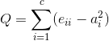

# グラフマイニング
- 参考資料
  - [Title: Graph and Tensor Mining for Fun and Profit](https://www.cs.cmu.edu/~christos/TALKS/18-08-KDD-tut/), Tutorial at KDD 2018
  - [グラフマイニング技術とその応用](https://www.ieice.org/~asn/201501_sogo/201503_tutorial_onizuka.pdf), 大阪大学 大学院情報科学研究科 ビッグデータ工学講座 鬼塚真教授, 2015
  - [グラフベースデータマイニングの基礎と現状](https://ipsj.ixsq.nii.ac.jp/ej/?action=repository_action_common_download&item_id=65233&item_no=1&attribute_id=1&file_no=1), 2005
  - [世界でもっとも強力な9のアルゴリズム](https://www.amazon.co.jp/dp/482228493X)
  - [Newman アルゴリズムによるソーシャルグラフのクラスタリング](https://www.slideshare.net/komiyaatsushi/newman-6670300)
  - [日本の中心はどの県だ？グラフ理論（ネットワーク）の基本的な諸概念](https://www.ajimatics.com/entry/2018/01/30/133238)
  - [Graph Neural Networks](https://hhaji.github.io/Deep-Learning/Graph-Neural-Networks/)

---
## グラフを扱う背景や動機
なぜグラフなのか？

- 例1：ショッピングサイトが有する記録
  - Aさんが商品1を購入した。（who-buys-what）
  - ショップBが商品2を売り出した。（who-sells-what）
  - Cさんが商品3についてレビューした。（who-reviews-what）
  - Dさんが商品4のレビューをクリックした。（who-click-what）
- 例2：SNSが有する記録
  - Aさんがメッセージ1を書いた。（who-writes-what）
  - BさんがAさんをフォローした。（who-follows-who）
  - Cさんはコミュニティ2に入った。（who-joins-what）

つまり、様々な「関係」は、グラフとして表現できる。だからグラフから特徴抽出したい。

---
## グラフの例
- [Social circles: Facebook](http://snap.stanford.edu/data/ego-Facebook.html)
  - J. McAuley and J. Leskovec. [Learning to Discover Social Circles in Ego Networks](http://i.stanford.edu/~julian/pdfs/nips2012.pdf). NIPS, 2012.
  - Nodes: 4,039
  - Edges: 88,234
  - 
  - 知識に繋がる種の例
    - Q1: 重要な人物は？
    - Q2: コミュニティはどこ？
    - Q3: 情報はどう伝達された？
    - Q4: 繋がりはどう発展した？する？
- [Twitter (ICWSM)](http://konect.uni-koblenz.de/networks/munmun_twitter_social)
  - Nodes: 465,017 (users)
  - Edges: 834,797 (follows)
  - 
- [Air Traffic control](http://konect.uni-koblenz.de/networks/maayan-faa)
  - Nodes: 1,226
  - Edges: 2,615
  - 

---
## 可視化の良し悪し
- Good!
  - 大まかにでも全体把握することが、その後の意思決定に役立つことがある。
    - Q: 他に「全体把握する楽な方法」はないのか？
- Bad!
  - 出力要素があまりにも膨大だと、直接可視化しても良くわからない。
    - どうする？
- Tips: 可視化の工夫
  - 可視化したい「対象」と「関係」を明確にする。
    - 適したグラフ種別を選ぶ or 新たな作図方式を検討。
  - 要素数が膨大な場合には、抽象化するか、もしくは条件付き作図することを検討。
    - 抽象化＝微細な部分をカットする方式を検討。
    - 条件付き＝ある条件に満足する要素だけを作図。
    - 「抽象化 x 条件付き」
  - Q: 他に代替案は？　そもそも何を観察したいのか？

---
## グラフとは？
- [Wikipedia: Graph theory](https://en.wikipedia.org/wiki/Graph_theory) より。
  - "In mathematics, **graph theory** is the study of graphs, which are mathematical structures used to model pairwise relations between objects. A graph in this context is made up of **vertices** (also called nodes or points) which are connected by **edges** (also called links or lines). A distinction is made between **undirected graphs**, where edges link two vertices symmetrically, and **directed graphs**, where edges link two vertices asymmetrically"
  - グラフ G = (V, E)
    - 頂点:  V  a set of vertices
    - 辺:  E ⊆ {{x, y} | (x, y) ∈ V2 ∧ x ≠ y} a set of edges
    - 次数: degree, ある点を端点とする辺の本数。
- グラフにおける特徴例
  - 多重辺
  - ループ
  - 有向グラフ、無向グラフ
  - 歩道(walk): 連結した辺の列。
  - 道(path): 歩道の一種。どの点もたかだか一度しか現れない歩道。
  - 閉路(cycle): 道の一種。出発点に戻ってくる道。
  - 連結グラフ、非連結グラフ

---
## 静的なグラフにおける特性の例

### Q: 実際のグラフは、ランダムか？
- [スモールワールド現象](https://ja.wikipedia.org/wiki/スモール・ワールド現象)
  - Six degrees of separation（6次の隔たり）　**＊仮説＊**
  - *「全世界」が小さいかどうか疑問があるにせよ、全世界のなかには小さい世界が数多く存在することはほとんど疑いの余地がない。*
- A: ランダムではない。何らかのパターンが存在する。

### Q: 1ノードあたりの平均エッジ数は、（例えば正規分布のような）釣鐘型の分布か？
- A: ガウシアン分布ではない。
- => 指数的に減少（logスケールで線形傾向）
  - [Zipf's law](https://en.wikipedia.org/wiki/Zipf%27s_law)
    - Wikipedia30ヶ国語版における最頻出1千万語の順位(rank)と出現頻度の間には ``順位 x 頻度 ≒ 定数`` となる法則があることが分かっている。
    - 
    - "Zipf's law was originally formulated in terms of quantitative linguistics, stating that given some corpus of natural language utterances, the frequency of any word is inversely proportional to its rank in the frequency table. Thus the most frequent word will occur approximately twice as often as the second most frequent word, three times as often as the third most frequent word, etc.: the rank-frequency distribution is an inverse relation."
  - [Zpifの法則](http://www2.phys.cs.is.nagoya-u.ac.jp/~tokita/tokiwiki/?Zipf%A4%CE%CB%A1%C2%A7)
  - [統計的テキスト解析(5)～統計法則と指標～, ジップの法則](https://www1.doshisha.ac.jp/~mjin/R/60/60.html)
- エッジ数が少ないノードほど多く、エッジ数が多いノードは少ない。
  - [PEGASUS: A Peta-Scale Graph Mining System - Implementation and Observations](http://www.cs.cmu.edu/~ukang/papers/PegasusICDM2009.pdf). U Kang, Charalampos E. Tsourakakis, and Christos Faloutsos. (ICDM) 2009, Miami, Florida, USA.Best Application Paper (runner-up).

###  Q: 三角形の数はある特徴を表している？
- A: SNSにおけるfollow関係を例に上げると、AさんとBさんは友達。BさんとCさんも友達。CさんとAさんも友達。3人共繋がっている強い関係が三角形となる。
- [Spectral Analysis for Billion-Scale Graphs: Discoveries and Implementation. ](http://datalab.snu.ac.kr/~ukang/papers/HeigenPAKDD2011.pdf), Best Paper Award in Pacific-Asia Conference on Knowledge Discovery and Data Mining (PAKDD) 2011.
  - 厳密にカウントするのは辛いので、近似計算することが多い。SVDによる固有値や固有ベクトルを求めて利用するアルゴリズムが多いが、これらはスケールしなかったり、他にも細かな問題があるらしい。これらに変わる新たなアルゴリズムを提案し、アノマリー検出としてやってみたとのこと。
  - 度数あたりの三角形出現分布から観察できる特別なコミュニティの存在。 

---
## 重要なノードはどれ？
- [世界でもっとも強力な9のアルゴリズム](https://www.amazon.co.jp/dp/482228493X)、3章より。
- 背景
  - リンクを含むWebページ（＝有向グラフ）を想定する。キーワードマッチや関連語マッチ、もしくは単語ベクトル・文書ベクトル等による類似度検索によるページ検索をした結果、多数のページが発見できた。マッチング数や類似度合いだけでは必ずしも良いスコアとは限らない。よりよいスコアは無いだろうか？
- ハイパーリンクトリック
  - 
  - メリット
    - 内容を解釈することなく、リンク情報のみで算出可能。
  - デメリット
    - 必ずしも「参照する」という行為がGoodを意味するとは限らない。
    - 簡単にリンク数を増やすことができる。
- オーソリティトリック
  - 
  - メリット
    - 適切な判断価値を利用することで、ロボット型リンクを除外したり、badな意味での参照を低評価とすることができる。
  - デメリット
    - 相互参照に限らず、第三者を介した循環を含め、循環参照のあるグラフにおいては計算が収束しない。
    - そもそも「権威のあるサイト（ページ）」というのは自動判定困難。
- ランダムサーファーモデル
  - 
  - メリット
    - 循環参照のあるグラフにおいても機能する。
    - 権威情報を予め用意することなく、シミュレーションのみでスコアを算出可能。
  - デメリット
    - ある程度スケールさせることはできるが、Webページのような大規模グラフにおいてはシミュレーションを必要としている時点でコストが高い。
- PageRank
  - [The Anatomy of a Large-Scale Hypertextual Web Search Engine](http://snap.stanford.edu/class/cs224w-readings/Brin98Anatomy.pdf)
  - [The Google Pagerank Algorithm
and How It Works](https://www.cs.princeton.edu/~chazelle/courses/BIB/pagerank.htm)
  - ランダムサーファーモデルを簡略化したモデル。Webページのリンク行列を正規化し、その行列の固有ベクトルを用いた計算で算出。
  - [Wikipedia: PageRank](https://en.wikipedia.org/wiki/PageRank)

---
## コミュニティ検出（community detection）
- Timelineを眺める頻度が高く、参加メンバの多くが更新＆参照しているネットワークにおいては、速く情報や噂話が広まる。論文で適切な参照をしながら新たな論点を書き下している場合には、過去に遡ってどのような討論を経てそこに辿り着いたのかを把握しやすい。このように、ネットワークには何かしらの「繋がりの強さ、適切さ」を有することが多い。その一方で、ネットワークの参加者らは一部の繋がり（全参加者が互いに同じぐらい有機的に結合しているケースは稀）しか持たないことが殆どであり、このことが「コミュニティ」の創出に繋がりやすい。では、ネットワークが与えられたとき、どのようにコミュニティを検出したら良いだろうか？
- 評価軸の例
  - 下記のモジュラリティにせよ、中心性にせよ、個々の評価軸そのものについて多様な提案がなされており、その上で組み合わせも考慮していくため、「コミュニティらしさ」には様々な定義がある。
  - モジュラリティ（modularity）の例。
    - [Wikipedia: modularity](https://en.wikipedia.org/wiki/Modularity_(networks))
    - 
      - $e_{ii}$: 総エッジ本数に対する、コミュニティi内部における「ノード毎のエッジ本数の総和」の割合。
      - $e_{ij}$: 総エッジ本数に対する、「コミュニティiからコミュニティjに張られているエッジ本数」の割合。
      - $a_i$: 「総エッジ本数」に対する、「コミュニティiから他のコミュニティに向けて張られているエッジ本数」の割合。
    - 上記の値（0 &le; Q &le; 1）が1に近いほど、適切なコミュニティ分割と見做す。
      - $e_{ii}$ が大きいほど、つまりコミュニティ内のエッジ本数が多いほど、良質であるという評価に繋がる。
      - $a_{i}$ が小さいほど、つまり他コミュニティから独立しているほど、良質であるという評価に繋がる。
  - 中心性（Betweenness centrality）
    - [Wikipedia: Betweenness centrality](https://en.wikipedia.org/wiki/Betweenness_centrality)
    - 
      - $σ_{st}$: ノードsからノードtへの、最短パス総数。
      - $σ_{st}(v)$: ノードsからノードtへの最短パスの中で、ノードvを通る数。
      - グラフ内の全ての頂点から他のすべての頂点への最短経路を考える。このとき、より多くの最短経路に含まれているノードを「中心性が高い」と判断する。

---
## グラフマイニングの例
- [networkxによるグラフマイニングの例](./graph_example.ipynb)
  - Facebookのego networkを読み込み、次数カウント、Ziph則確認。
  - 小さなネットワークでページランク、ランダムサーファーモデル・シミュレーション、モジュラリティ確認。
- [DGLによるグラフマイニングの例](https://docs.dgl.ai/tutorials/basics/1_first.html)
  - 空手クラブのインストラクター・顧客のネットワークに対し、半教師あり学習（一部のみ教師データ付与）でコミュニティ抽出。
  - [他チュートリアル](https://docs.dgl.ai/tutorials/blitz/index.html)
    - ノード分類、リンク予測（次にどのようなリンクが生成されそうか）、グラフ分類ぐらいが紹介されています。
