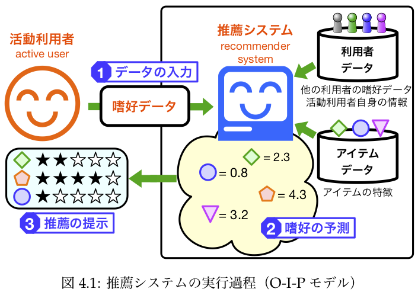
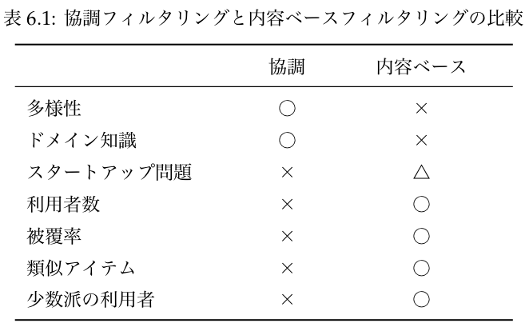

# 推薦システム
- 参考資料
  - [協調フィルタリング](https://www.ai-gakkai.or.jp/whatsai/AItopics2.html) by 人工知能学会
  - [Two Decades of Recommender Systems at Amazon.com](https://www.computer.org/csdl/magazine/ic/2017/03/mic2017030012/13rRUB6SpQq)
  - [推薦システムのアルゴリズム](https://github.com/tkamishima/recsysdoc) by 神嶌先生
  - [fastFM](https://ibayer.github.io/fastFM/)
  - [特集「推薦システム」](https://jsai.ixsq.nii.ac.jp/ej/index.php?action=pages_view_main&active_action=repository_view_main_item_snippet&index_id=663&pn=1&count=20&order=7&lang=japanese&page_id=13&block_id=23) by 学会誌「人工知能」, Vol.34, No.3, 2019
  - [YouTubeの推薦アルゴリズムの変遷を追う〜深層学習から強化学習まで〜](https://medium.com/eureka-engineering/youtube-recommender-algorithm-survey-341a3aa1fbd6?)
    - [Deep Neural Networks for YouTube Recommendations](https://research.google/pubs/pub45530/), 推薦システムへのDeep Learningの適用（RecSys 2016）
      - DLベースの推薦は、再現できないケースが少なくないと指摘している論文もある模様。
        - "In this work, we report the results of a systematic analysis of algorithmic proposals for top-n recommendation tasks. Specifically, we considered 18 algorithms that were presented at top-level research conferences in the last years. Only 7 of them could be reproduced with reasonable effort. For these methods, it however turned out that 6 of them can often be outperformed with comparably simple heuristic methods, e.g., based on nearest-neighbor or graph-based techniques." by [Are We Really Making Much Progress? A Worrying Analysis of Recent Neural Recommendation Approaches](https://arxiv.org/abs/1907.06902)
    - [Latent Cross: Making Use of Context in Recurrent Recommender Systems](https://research.google/pubs/pub46488/), 推薦システムへのRNNの適用と、コンテキスト情報の効率的な入力（WSDM 2018）
    - [Top-K Off-Policy Correction for a REINFORCE Recommender System ](https://research.google/pubs/pub47647/), 推薦システムへの強化学習の適用（WSDM 2019）

---
## 推薦システムの背景と関連技術
- 背景＆概要
  - 個人や団体が容易かつ低コストで情報を発信できるようになり、かつ、それらの情報へのアクセスも容易となったことで選択肢は膨大となった。これらの要因が、情報を参照できる状態にあるにも関わらず、適切な情報を参照できない状況を生み出している。膨大にある選択肢（情報過多/情報爆発/情報洪水）の中から、嗜好を考慮して適切な選択肢を選びたい。日常的にも口コミ、レビュー、ガイドブック等、他人からの推薦に頼る一連の行為が行われているが、このような行為を補助したり、促進したりするシステムを推薦システムと呼ぶ。
- Wikipedia
  - [Recommender system](https://en.wikipedia.org/wiki/Recommender_system)
    - "A recommender system or a recommendation system (sometimes replacing 'system' with a synonym such as platform or engine) is a subclass of **information filtering system** that seeks to predict the "rating" or "preference" a user would give to an item."
    - "Recommender systems usually make use of either or both collaborative filtering and content-based filtering (also known as the personality-based approach),[7] as well as other systems such as knowledge-based systems. **Collaborative filtering** approaches build a model from a user's past behavior (items previously purchased or selected and/or numerical ratings given to those items) as well as similar decisions made by other users. This model is then used to predict items (or ratings for items) that the user may have an interest in.[8] Content-based filtering approaches utilize a series of discrete, pre-tagged characteristics of an item in order to recommend additional items with similar properties.[9] Current recommender systems typically combine one or more approaches into a hybrid system."
  - [Information filtering system](https://en.wikipedia.org/wiki/Information_filtering_system)
    - "An information filtering system is a system that removes redundant or unwanted information from an information stream using (semi)automated or computerized methods prior to presentation to a human user. Its main goal is the management of the information overload and increment of the semantic signal-to-noise ratio. To do this the user's profile is compared to some reference characteristics. These characteristics may originate from the information item (**the content-based approach**) or the user's social environment (**the collaborative filtering approach**).""
  - [Collaborative filtering](https://en.wikipedia.org/wiki/Collaborative_filtering)
- 推薦システムを構成する主技術
  - HCI（Human Computer Interface）
    - 人間から必要な情報を収集し、対話を扱う機能。
  - 推薦そのもの
    - 収集したデータから推薦情報を生成し、それを目的に応じて変換する。
  - DB、並列計算などの基盤技術

---
## 推薦システムの分類と目的
- ref: [推薦システムのアルゴリズム](https://github.com/tkamishima/recsysdoc)
  - 第2章　推薦システムの分類と目的
- 個人化の度合い
  - 非個人化（no personalization）
    - 全ての利用者に対して同じ推薦をする。
  - 一時的個人化（ephemeral personalization）
    - その時点での情報源を元に推薦する。
  - 永続的個人化（persistent personalization）
    - 現時点での情報源に加え、過去の履歴等も考慮し、推薦する。
- 運用目的からの分類
  - 概要推薦（broad recommendation）
    - システムを利用し始めたばかりか、ごくまれにしか利用しないような利用者を対象とし、そのような利用者が自身の要求との関連性を見出してシステム利用を続けてもらえるように、大まかな情報を提供をする。
  - 利用者評価（user comments and rating）
    - 広告業等経由でのPRと比べると、第三者ではあってもより身近な他者、すなわち他利用者からの推薦の方が好ましいことがある。レビューサイト等。
  - 通知サービス（notification service）
    - 利用者がシステムを操作していないときに、電子メールなどで推薦を配送するケース。
  - 関連アイテム推薦（item-associated recommendation）
    - 注目しているアイテムの比較候補を示して、購入の決断を促す場合や、補足的な商品などを提示してcross-sellingを促すケース。
  - 緊密な個人化（deep personalization）
    - システムが積極的に利用者の情報を能動的に収集したり、過去の行動の情報を蓄積し、それらに基づいて推薦を行うケース。
- 予測タスクの分類
  - 適合アイテム発見（finding some good items）
    - 利用者が自分の嗜好に適合するものを、何か見つけ出す。
  - 評価値予測（predicting ratings）
    - 利用者がアイテムに付けるであろう評価値を予測する。
  - 適合アイテム列挙（finding all good items）
    - 利用者が自分の嗜好に適合するものを、網羅的に見つけ出す。（適合しないものを排除する）
  - 効用最適化（optimizing utility）
    - 適合アイテム発見を一般化したタスク。何らかの効用関数を設定し、それを最適化するようなアイテムを探す。
- 利用場面基準：前者のタイプほど、既知のアイテムに近い推薦をすることが望まれる。
  - 備忘録（reminder）
  - 類似品（more like this）
  - 新規アイテム（new items）
  - 視野を広げる（broden my horizon）
- 評価の方向性
  - 事象の類似性
    - 薦める：似ている事象を探し出し、ポジティブな評価として利用する。
    - 薦めない：似ていない事象を探し出し、ネガティブな評価として利用する。

---
## 評価基準の困難さ
- ref: [推薦システムのアルゴリズム](https://github.com/tkamishima/recsysdoc)
  - 第3章　推薦システム設計の要素
- 一般的な評価基準
  - 正答率（accuracy）
  - 精度（precition）と再現率（recall）
  - 平均絶対誤差（mean absolute error）
  - 順位相関（rank correlation）
- 本質的には例外処理だらけの世界
  - 当たり前すぎるものを推薦しても、殆ど意味がない。
    - e.g., ハリー・ポッターを見て楽しんだ人に、その続編を薦める。
  - 一度購入したら不要なものを推薦すると、逆効果。
    - e.g., PCを購入した人に、別のPCを薦める。
  - 流行等の外部要因含めて、嗜好そのものが移り変わる可能性。
    - e.g., 異世界転生モノ好きだったが、食傷気味。
- 推薦に求められる評価指標の例
  - 目新しさ基準
    - 目新しさ（novelty）
      - 関心があることに加えて、わかりきったものではないこと。
    - セレンディピティ（serendipity）
      - novelty + 思いがけなさ/意外性
      - 重要性は分かるが、評価は困難。
    - 多様性（diversity）
      - 推薦リストに含まれる候補が互いに似ていないこと。
  - システム側の評価指標
    - 被覆率（coverage）
      - 全アイテムのうち、評価値の予測が可能なアイテムの割合。
        - e.g., 協調フィルタリングでは、他の利用者の評価値を利用する。すると、誰にも評価されていないアイテムは評価の対象にできない（関連：コールドスタート問題）。
    - 学習率（learning rate）
      - 嗜好データの増加に伴って予測精度は向上するが、その向上の度合いを学習率と呼ぶ。

---
## 推薦システムの実行過程
- ref: [推薦システムのアルゴリズム](https://github.com/tkamishima/recsysdoc)
  - 第4章　推薦システムの実行過程
- 

---
## 嗜好の予測
- ref: [推薦システムのアルゴリズム](https://github.com/tkamishima/recsysdoc)
  - 第6章　嗜好の予測
- 代表的な予測手法
  - 内容ベースフィルタリング（content-based filtering）
  - 協調フィルタリング（collaborative filtering）
- 

---
## 協調フィルタリング
- ref: [推薦システムのアルゴリズム](https://github.com/tkamishima/recsysdoc)
  - 第8章　協調フィルタリング
- メモリベース法
  - 利用者DBを直接利用して、活動利用者の嗜好を推定する。推薦システムが利用される以前には何もせず、ただ利用者DBを保持しておき、利用時に参照して嗜好推定＋推薦を行う。必要なタイミングでのみ処理を行うため、その時時に応じた想定通りの推薦を行いやすいが、事前にモデルを構築しておかないため処理時間が遅い。
- モデルベース法
  - 予めモデルを構築をしておき、モデルと嗜好データに基づいて予測する。利用時にはモデル構築が不要なため処理が早いが、モデル更新されていない間に行われたDB更新については処理困難となりがち。

---
### メモリベース型協調フィルタリング
- ref: [推薦システムのアルゴリズム](https://github.com/tkamishima/recsysdoc)
  - 第9章　メモリベース型協調フィルタリング
- 手法
  - 利用者間型メモリベース法
    - 活動利用者と嗜好パターンが似ている利用者をまず見つけ、彼らが好むものを推薦する。
  - アイテム間型メモリベース法
    - 活動利用者が好むアイテムと類似したアイテムを推薦する。
  - 大きな違い
    - アイテムは特性が変化せず静的なものとして扱えるため、アイテムベースのプロファイルは信用しやすいか、そこまでいかなくともモデルを収束させやすい。これに対し、ユーザは特性が変化することがあるため、ユーザベースの推薦はプロファイル自体の精度が問題となったり、モデルの収束に時間を要することがある。
- 計算手順
  - 活動利用者間の類似度計算
    - 嗜好パターンがどれくらい似ているかを定量化したもの。活動利用者と標本利用者がともに評価しているアイテムについて、Pearson相関で測る。共通評価アイテム数が1以下の場合は計算できないため、類似度を0とする。
  - 活動利用者の未評価アイテムへの評価値予測
    - 他者評価の利用
      - 正の相関のある標本利用者評価を、positiveに評価。
        - 「相関係数」と「平均評価に対する差分」から算出。
      - 負の相関のある標本利用者評価を、negativeに評価。
    - 「自身の平均評価」と「他者評価の加重平均」の和を評価予測値とする。
      - 処理コストやメモリ節約のため、[Slope One](https://en.wikipedia.org/wiki/Slope_One)のように簡略化した手法も。

---
### 協調フィルタリング：モデルベース法
- ref: [推薦システムのアルゴリズム](https://github.com/tkamishima/recsysdoc)
  - 第10章　メモリベース型協調フィルタリング
- 回帰問題に帰着させる方法
  - 推定評価値を線形モデルとして定義（近似）。
  - 誤差が小さくなるパラメータを決める問題（回帰問題）として解く。
    - ただし、単純にパラメータ数が十分にある線形モデルとして解くと、嗜好パターンの要約ではなくただの観測データのコピーとなる。そのため、パラメータ数はユーザ数やアイテム数と比較して十分小さい数とした上で解く。
    - また実際には欠損値が多い。
      - 潜在変数とみなして[EMアルゴリズム](https://ja.wikipedia.org/wiki/EMアルゴリズム)で推定してから解く。
      - 全員が必ず評価するアイテム集合を利用する。
      - 平均値などで補完する。
      - 欠損した要素は無視する。
  - 全体を1つの線形モデルで表現するのではなく、類似利用者単位（クラスタ単位）で線形モデルを用意する。

---
## 推薦システムの実装例
- 基本となるアプローチ
  - 何らかの方法で「ユーザ間類似度」もしくは「アイテム間類似度」を計算する。（コード例では異なる方法でユーザ間類似度を算出）
  - 視聴履歴や類似度に基づいて映画評価を推定するモデルを構築する。
  - 対象ユーザの未視聴映画集合を用意する。
  - 未視聴映画集合に対して評価を予測する。
  - 上位N件を推薦する。
- コード例1: [映画レビューデータを通したデータ処理演習](https://ie.u-ryukyu.ac.jp/~tnal/2021/dm/static/2-ml-intro/data_wrangling.html)、part 2 のpandas演習。
  - ユーザ間類似度算出し、最大類似度となるユーザを抽出。
  - 最大類似ユーザと対象ユーザの視聴履歴から未視聴映画集合を抽出。
  - 未視聴映画集合において最大類似ユーザが高評価をしている映画を推薦。
- コード例2: [推薦システムのコード例](./recommendation_nn.ipynb)
  - ユーザと映画をembeddingレイヤーで準備し、tf.tensordot で演算するモデルを用意。
  - dot演算結果が視聴履歴に近くなるようにモデルを学習。
  - 対象ユーザの未視聴映画集合を用意。
  - 未視聴映画集合に対して学習済みモデルで予測。
  - 上位N件を推薦する。
